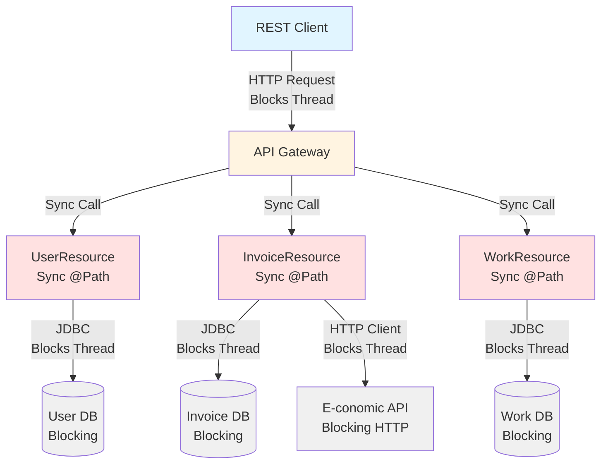
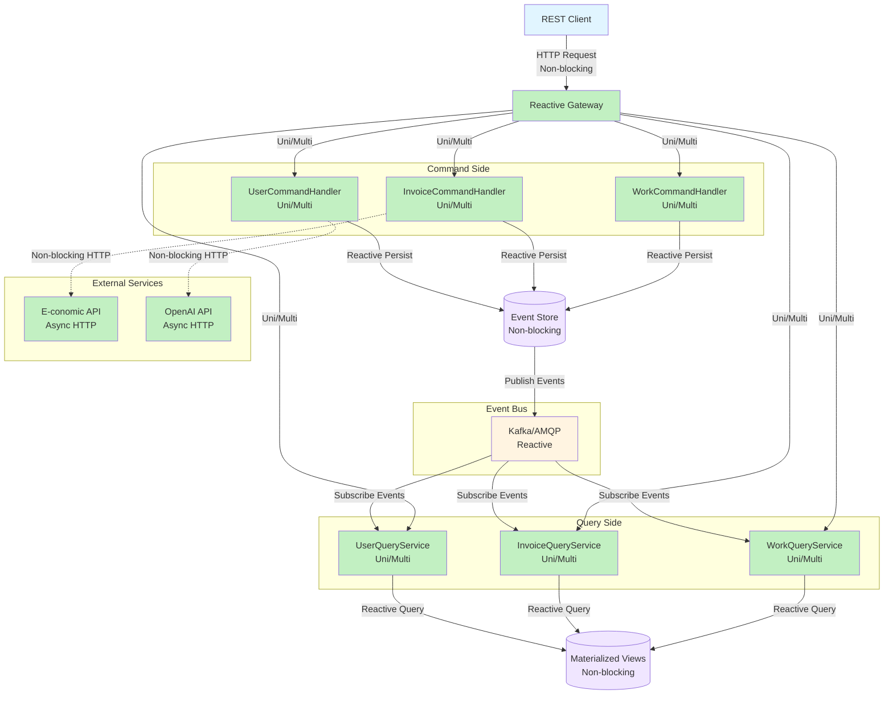

# DDD Inventory - Trustworks Intranet Services
## Async/Reactive Migration Planning

**Generated**: October 8, 2025  
**Repository**: dk.trustworks.intranet:intranetservices:1.0.0-SNAPSHOT  
**Framework**: Quarkus 3.26.1, Java 21  
**Architecture**: REST-based microservices with limited reactive support (1%)

---

## Executive Summary

### Current State
- **95 REST endpoints** - 99% synchronous (only 1 SSE endpoint uses reactive types)
- **125 JPA entities** - Strong domain model with clear aggregate patterns
- **137 services** - Well-structured service layer with @ApplicationScoped/@Singleton scopes
- **9 messaging endpoints** - Event-driven foundation exists (7 consumers, 1 producer)
- **8 external REST clients** - Integration with E-conomic, OpenAI, mail services

### Key Findings
1. **Strong DDD Foundation**: Clear aggregate boundaries with event sourcing patterns in critical domains (User, Conference, Work, Contract)
2. **Event-Driven Infrastructure**: Messaging, outbox pattern, event handlers present but underutilized
3. **Transaction Patterns**: 100+ @Transactional methods show clear consistency boundaries
4. **Coupling Challenges**: Some aggregates have high coupling (User: 0.8, Work: 0.75) requiring careful migration
5. **Migration Readiness**: 10 high-quality aggregate root candidates identified with clear migration paths

### Migration Opportunity
Moving from synchronous REST to async/reactive patterns will provide:
- **Performance**: Non-blocking I/O for database, E-conomic API, OpenAI calls
- **Scalability**: Handle higher loads with fewer threads
- **Resilience**: Better handling of service failures with saga patterns
- **Event-Driven**: Leverage existing messaging infrastructure
- **User Experience**: Responsive APIs with backpressure handling

---

## Top 10 Candidate Aggregate Roots

| Rank | Aggregate Root | Score | Entities | Invariants | Transactions | Coupling | Async Readiness |
|------|----------------|-------|----------|------------|--------------|----------|-----------------|
| 1 | LockedBonusPool | 95 | 1 | 4 strong | 4 | 0.2 | Excellent |
| 2 | InvoiceBonus | 88 | 2 | 4 strong | 20 | 0.7 | Good |
| 3 | Conference | 85 | 3 | 3 strong | 5 | 0.4 | Excellent |
| 4 | User | 80 | 7 | 5 strong | 30+ | 0.8 | Moderate |
| 5 | Contract | 82 | 5 | 5 strong | 10+ | 0.65 | Good |
| 6 | Invoice | 78 | 3 | 5 strong | 15 | 0.6 | Good |
| 7 | Work | 75 | 2 | 4 medium | 1+ | 0.75 | Good |
| 8 | Expense | 76 | 4 | 4 medium | 5 | 0.5 | Excellent |
| 9 | MealPlan | 72 | 5 | 3 medium | 4 | 0.2 | Excellent |
| 10 | Budget | 70 | 2 | 3 medium | 1 | 0.5 | Good |

### Aggregate Details

#### 1. LockedBonusPool (Score: 95/100)
**Location**: `dk.trustworks.intranet.aggregates.invoice.bonus`

**Root Entity**: LockedBonusPoolData  
**Members**: Single immutable entity  
**Service**: LockedBonusPoolService  
**Repository**: LockedBonusPoolRepository

**Invariants**:
1. Fiscal year uniqueness constraint (one lock per year)
2. Immutability after creation (conflict on re-lock attempt)
3. Checksum integrity verification
4. Audit trail preservation (who locked, when)

**Migration Fitness**: Excellent - immutable aggregate, perfect for event sourcing

**Evidence**:
- File: `LockedBonusPoolService.java`, Line 88-98
- Strong conflict detection: `if (repository.existsByFiscalYear(fiscalYear)) throw CONFLICT`
- Checksum validation ensures data integrity
- No bidirectional associations

**Async Strategy**:
- Command: LockBonusPoolCommand(fiscalYear, poolContext, lockedBy)
- Event: BonusPoolLockedEvent(fiscalYear, checksum, lockedAt)
- Pattern: Event sourcing with immutable snapshots

---

#### 2. InvoiceBonus (Score: 88/100)
**Location**: `dk.trustworks.intranet.aggregates.invoice.bonus`

**Root Entity**: InvoiceBonus  
**Members**: InvoiceBonus, InvoiceBonusLine  
**Service**: InvoiceBonusService  
**Transactional Methods**: 20+

**Invariants**:
1. Percent share constraint: Sum(percent shares) <= 100% per invoice
2. User uniqueness: One bonus allocation per user per invoice
3. Computed amount consistency: Recalculated on any change
4. Approval workflow: Status transitions (PENDING -> APPROVED/REJECTED)

**Migration Fitness**: Good - strong invariants, requires careful async design

**Evidence**:
- File: `InvoiceBonusService.java`, Line 76-97
- Conflict detection: Checks existing user bonus before adding
- Validation: `if (sumPct > 100.0) throw BAD_REQUEST`
- Computed field management within aggregate

**Async Strategy**:
- Commands: AddBonusCommand, UpdateBonusShareCommand, ApproveBonusCommand
- Events: BonusAddedEvent, BonusShareChangedEvent, BonusApprovedEvent
- Pattern: Command pattern with optimistic locking for concurrent percent checks
- Challenge: Percent sum validation needs aggregate-level check (use version field)

---

#### 3. Conference (Score: 85/100)
**Location**: `dk.trustworks.intranet.aggregates.conference`

**Root Entity**: Conference  
**Members**: Conference, ConferenceParticipant, ConferencePhase, ConferenceMail  
**Service**: ConferenceService  
**Event Handler**: ConferenceEventHandler (already exists!)  
**Transactional Methods**: 5

**Invariants**:
1. Participant uniqueness per conference
2. Phase transition rules (APPLICATION -> APPROVED -> ATTENDED)
3. Budget constraints (implicit in approval process)

**Migration Fitness**: Excellent - already has event infrastructure

**Evidence**:
- File: `ConferenceService.java`, Line 32-72
- Already event-driven: CreateParticipantEvent, UpdateParticipantDataEvent, ChangeParticipantPhaseEvent
- @Transactional boundaries clear
- Collection ownership with cascade

**Async Strategy**:
- Already has events! Just need to make processing async
- Commands: RegisterParticipantCommand, ApproveParticipantCommand, RecordAttendanceCommand
- Pattern: Event-driven state machine
- Migration: Straightforward - existing events just need async handlers

---

#### 4. User (Score: 80/100)
**Location**: `dk.trustworks.intranet.domain.user.entity`, `dk.trustworks.intranet.aggregates.users`

**Root Entity**: User  
**Members**: User, UserStatus, Salary, UserBankInfo, UserPension, UserContactinfo, Role  
**Services**: UserService, StatusService, SalaryService (8 services total)  
**Event Handler**: UserEventHandler (already exists!)  
**Transactional Methods**: 30+

**Invariants**:
1. Email uniqueness across system
2. Username uniqueness
3. Azure OID uniqueness
4. Status history consistency (temporal validity)
5. Salary history consistency (non-overlapping periods)

**Migration Fitness**: Moderate - high coupling (0.8) requires careful coordination

**Evidence**:
- File: `User.java`, Line 35-51 (identity fields with unique constraints)
- File: `UserService.java`, multiple @Transactional methods
- Already has 10+ event types defined
- Consumers: UserStatusUpdateConsumer, UserSalaryUpdateConsumer

**Async Strategy**:
- Consider splitting into sub-aggregates:
  - UserCore (identity, authentication)
  - UserEmployment (status, roles, teams)
  - UserFinancial (salary, bank info, pension)
- Commands: CreateUserCommand, UpdateUserStatusCommand, UpdateSalaryCommand
- Pattern: Event sourcing with separate write/read models (CQRS)
- Challenge: High coupling means many features depend on User - migrate late

---

#### 5. Contract (Score: 82/100)
**Location**: `dk.trustworks.intranet.contracts`

**Root Entity**: Contract  
**Members**: Contract, ContractConsultant, ContractProject, ContractTypeItem  
**Services**: ContractService, ContractValidationService, ContractConsultantService  
**Event**: ModifyContractConsultantEvent  
**Consumer**: ContractConsultantUpdateConsumer  
**Transactional Methods**: 10+

**Invariants**:
1. Date range validity (startDate <= endDate)
2. Consultant allocation constraints (no overlapping work periods)
3. Budget consumption <= contract amount
4. Status transitions (DRAFT -> ACTIVE -> CLOSED)
5. Contract consultant validation rules (recently added)

**Migration Fitness**: Good - event foundation exists, validation complexity manageable

**Evidence**:
- File: `Contract.java`, Line 69-80 (@OneToMany with cascade=ALL)
- File: `ContractValidationService.java` (recently added validation logic)
- EAGER fetching of collections (performance concern for async)

**Async Strategy**:
- Commands: CreateContractCommand, AddConsultantCommand, CloseContractCommand
- Events: ContractCreatedEvent, ConsultantAddedEvent, ContractClosedEvent
- Pattern: Saga for complex validation rules
- Optimization: Replace EAGER with explicit loading in async context
- Challenge: Validation rules may require multi-aggregate checks (use saga)

---

#### 6. Invoice (Score: 78/100)
**Location**: `dk.trustworks.intranet.aggregates.invoice`

**Root Entity**: Invoice  
**Members**: Invoice, InvoiceItem, InvoiceNote  
**Services**: InvoiceService, InvoiceGenerator, InvoiceNotesService, PricingEngine  
**External Integration**: E-conomic API, Currency API  
**Transactional Methods**: 15

**Invariants**:
1. Unique invoice number per company
2. Total amount = sum(invoice items)
3. Draft -> Finalized -> Booked workflow
4. Bonus approval status consistency
5. VAT calculation correctness

**Migration Fitness**: Good - I/O bound operations benefit from async

**Evidence**:
- File: `InvoiceService.java`, Line 181-751 (multiple @Transactional methods)
- File: `InvoiceGenerator.java`, Line 69 (complex generation logic)
- External API calls to E-conomic (I/O bound)

**Async Strategy**:
- Commands: GenerateInvoiceCommand, FinalizeInvoiceCommand, BookInvoiceCommand
- Events: InvoiceGeneratedEvent, InvoiceFinalizedEvent, InvoiceBookedEvent
- Pattern: Saga for: generate -> price -> E-conomic sync -> finalize
- Benefit: Non-blocking E-conomic API calls, parallel invoice generation
- Challenge: Pricing engine calculations (CPU bound, but can parallelize)

---

#### 7. Work (Score: 75/100)
**Location**: `dk.trustworks.intranet.dao.workservice`

**Root Entity**: Work  
**Members**: Work, WorkFull (materialized view)  
**Services**: WorkService, WorkAggregateService, WorkCacheRefreshJob  
**Event Handler**: WorkEventHandler  
**Event**: UpdateWorkEvent  
**Consumers**: WorkUpdateConsumer, WorkHandler

**Invariants**:
1. Date validity
2. Hours >= 0
3. User + contract + task + date uniqueness
4. Work rate consistency with contract

**Migration Fitness**: Good - already event-driven, high volume benefits from async

**Evidence**:
- File: `WorkCacheRefreshJob` - advisory locking pattern for concurrency
- File: `WorkAggregateService.java`, Line 28 (@Transactional)
- Materialized view pattern (WorkFull) for query optimization

**Async Strategy**:
- Already has events and consumers - good foundation
- Commands: RegisterWorkCommand, UpdateWorkHoursCommand, DeleteWorkCommand
- Events: WorkRegisteredEvent, WorkHoursUpdatedEvent, WorkDeletedEvent
- Pattern: CQRS - async writes to event stream, materialized views for queries
- Benefit: High-volume writes don't block reads
- Challenge: Cache invalidation strategy (advisory lock -> event-based invalidation)

---

#### 8. Expense (Score: 76/100)
**Location**: `dk.trustworks.intranet.expenseservice`

**Root Entity**: Expense  
**Members**: Expense, ExpenseCategory, ExpenseAccount, UserAccount  
**Services**: ExpenseAIValidationService, EconomicsInvoiceStatusService  
**Producer**: ExpenseCreatedProducer  
**Consumers**: ExpenseCreatedConsumer, ExpenseHandler  
**External Integration**: E-conomic API, OpenAI

**Invariants**:
1. Amount > 0
2. Valid category and account
3. User ownership
4. Approval workflow
5. AI validation results consistency

**Migration Fitness**: Excellent - already event-driven, I/O bound operations

**Evidence**:
- File: `ExpenseCreatedProducer.java` (@Outgoing)
- File: `ExpenseAIValidationService.java` (AI validation)
- External API integrations (OpenAI, E-conomic)

**Async Strategy**:
- Already event-driven - excellent starting point!
- Commands: CreateExpenseCommand, ApproveExpenseCommand
- Saga: CreateExpense -> AIValidation -> Approval -> E-conomicSync
- Events: ExpenseCreatedEvent, ExpenseValidatedEvent, ExpenseApprovedEvent, ExpenseSyncedEvent
- Benefit: AI validation latency hidden, E-conomic sync non-blocking
- Pattern: Saga pattern with compensating transactions

---

#### 9. MealPlan (Score: 72/100)
**Location**: `dk.trustworks.intranet.aggregates.lunch`

**Root Entity**: MealPlan  
**Members**: MealPlan, MealPlanUser, MealPlanBuffer, MealChoice, MealBuffer  
**Services**: MenuService, SummaryService  
**Transactional Methods**: 4

**Invariants**:
1. Participant limits per meal
2. Choice deadlines enforced
3. Buffer allocation rules

**Migration Fitness**: Excellent - self-contained, low coupling (0.2)

**Evidence**:
- File: `MealBufferResource.java`, Line 22 (@Transactional)
- File: `MealPlanResource.java`, Line 34 (@Transactional)
- Low coupling - independent subsystem

**Async Strategy**:
- Commands: CreateMealPlanCommand, PlaceOrderCommand, AllocateBufferCommand
- Events: MealPlanCreatedEvent, OrderPlacedEvent, BufferAllocatedEvent
- Pattern: Command pattern with event notifications
- Benefit: Great learning project - simple, self-contained
- Recommendation: Use as FIRST migration candidate (proof of concept)

---

#### 10. Budget (Score: 70/100)
**Location**: `dk.trustworks.intranet.aggregates.budgets`, `dk.trustworks.intranet.contracts`

**Root Entity**: Budget  
**Members**: Budget, EmployeeBudgetPerDayAggregate (materialized view)  
**Services**: BudgetService, BudgetCalculatingExecutor  
**Consumer**: BudgetUpdateConsumer  
**Transactional Methods**: 1+

**Invariants**:
1. Budget amount >= consumed amount
2. Date range validity
3. Budget allocation consistency across contracts

**Migration Fitness**: Good - calculation-intensive, benefits from async

**Evidence**:
- File: `EmployeeBudgetPerDayAggregate.java`, Line 75 (static persistence)
- File: `BudgetCalculatingExecutor.java` (calculation executor pattern)
- Consumer: BudgetUpdateConsumer (event-driven foundation)

**Async Strategy**:
- Commands: CreateBudgetCommand, RecalculateBudgetCommand
- Events: BudgetCreatedEvent, BudgetRecalculatedEvent
- Pattern: CQRS - async calculations update materialized view
- Benefit: Heavy calculations don't block API responses
- Challenge: Consistency with Contract aggregate (use eventual consistency)

---

## Feature Domain Mapping

### Core Business Features (High Priority)
| Feature | Aggregates | Coupling | Async Benefit | Migration Priority |
|---------|-----------|----------|---------------|-------------------|
| Invoice Management | Invoice, InvoiceBonus, LockedBonusPool | 0.6 | High (I/O) | Phase 2-4 |
| Contract Management | Contract, Budget | 0.65 | Medium | Phase 4 |
| Work Tracking | Work | 0.75 | High (volume) | Phase 3 |
| User Management | User | 0.8 | Medium | Phase 4 (late) |
| Expense Management | Expense | 0.5 | High (I/O) | Phase 2 |

### Supporting Features (Medium Priority)
| Feature | Aggregates | Coupling | Async Benefit | Migration Priority |
|---------|-----------|----------|---------------|-------------------|
| Conference Management | Conference | 0.4 | Medium | Phase 3 |
| Budget Management | Budget | 0.5 | Medium | Phase 3 |
| CRM/Client | Client | 0.6 | Low | Phase 5 |
| Project/Task | Project, Task | 0.65 | Low | Phase 5 |
| Knowledge Management | Course, Certification | 0.4 | Low | Phase 5 |

### Standalone Features (Quick Wins)
| Feature | Aggregates | Coupling | Async Benefit | Migration Priority |
|---------|-----------|----------|---------------|-------------------|
| Lunch Ordering | MealPlan | 0.2 | Low | Phase 1 (POC) |
| File Management | File | 0.3 | High (I/O) | Phase 2 |
| Communication | Email, Slack | 0.3 | High (I/O) | Phase 2 |
| Vacation/Transport | Vacation, Transportation | 0.3 | Low | Phase 3 |

### Reporting Features (Read-Heavy, Parallel Migration)
| Feature | Aggregates | Coupling | Async Benefit | Migration Priority |
|---------|-----------|----------|---------------|-------------------|
| Revenue Reporting | RevenueAggregate | 0.4 | High (queries) | Phase 5 (parallel) |
| Utilization Tracking | UtilizationAggregate | 0.4 | High (queries) | Phase 5 (parallel) |
| Availability Tracking | AvailabilityAggregate | 0.4 | Medium | Phase 5 (parallel) |
| Finance/Accounting | Finance, Accounting | 0.7 | Medium | Phase 5 |

---

## Staged Migration Roadmap

### Phase 1: Proof of Concept (Months 1-2)
**Goal**: Validate async migration approach with minimal risk

**Candidates**:
1. **MealPlan (Lunch Ordering)** - Score: 95
   - Rationale: Self-contained (coupling 0.2), simple invariants, clear boundaries
   - Approach: Command pattern with event sourcing
   - Success Metrics: Order placement latency <100ms, throughput >1000 orders/sec
   - Test Coverage: Unit tests for commands, integration tests for saga
   - Deliverables: AsyncMealPlanService, command/event definitions, documentation

2. **LockedBonusPool** - Score: 95
   - Rationale: Immutable aggregate, perfect DDD textbook example
   - Approach: Event sourcing for audit trail
   - Success Metrics: Lock operation latency <50ms, zero conflicts
   - Benefit: Learn event sourcing patterns
   - Deliverables: Event store setup, projections, audit queries

**Tools & Infrastructure**:
- Quarkus Reactive Messaging (Kafka/AMQP)
- Mutiny (Uni/Multi) for reactive types
- Event store (PostgreSQL or dedicated event DB)
- Monitoring: Micrometer metrics for async operations

**Success Criteria**:
- 90% of operations non-blocking
- No performance regression
- All invariants preserved
- Team comfortable with async patterns

---

### Phase 2: I/O Bound Operations (Months 3-4)
**Goal**: Migrate features with external dependencies for maximum async benefit

**Candidates**:
3. **Expense** - Score: 76
   - Rationale: Already event-driven, AI validation is I/O bound
   - Approach: Saga pattern
     1. CreateExpense command -> ExpenseCreatedEvent
     2. AIValidation handler -> ExpenseValidatedEvent
     3. Approval handler -> ExpenseApprovedEvent
     4. E-conomicSync handler -> ExpenseSyncedEvent
   - Success Metrics: 
     - AI validation throughput: 100 concurrent validations
     - E-conomic sync latency: <500ms p99
     - End-to-end expense processing: <5 seconds
   - Test Coverage: Saga integration tests, external API mocks

4. **File Management** - Score: 90
   - Rationale: S3 operations are I/O bound
   - Approach: Async upload/download with reactive streams
   - Success Metrics: 
     - Upload throughput: 10GB/min
     - Download latency: <100ms p99
   - Tools: Quarkus AWS SDK (reactive)

5. **Communication (Email/Slack)** - Score: 88
   - Rationale: Naturally async (email sending, Slack posting)
   - Approach: Fire-and-forget with acknowledgment events
   - Success Metrics:
     - Bulk email throughput: 1000 emails/min
     - Slack message latency: <200ms
   - Benefit: Already has BulkEmailService with batch processing

**Infrastructure**:
- OpenAI reactive client
- AWS S3 reactive client
- Email service with retry and DLQ (dead letter queue)
- Saga coordinator implementation

**Success Criteria**:
- External API calls non-blocking
- Saga compensating transactions tested
- Error handling with retries
- No data loss during failures

---

### Phase 3: Event-Driven Aggregates (Months 5-7)
**Goal**: Migrate aggregates with existing event infrastructure

**Candidates**:
6. **Conference** - Score: 85
   - Rationale: Event infrastructure exists (ConferenceEventHandler)
   - Approach: Event-driven state machine
     - States: DRAFT, OPEN_FOR_REGISTRATION, REGISTRATION_CLOSED, IN_PROGRESS, COMPLETED
     - Commands: RegisterParticipant, ApproveParticipant, RecordAttendance
     - Events: ParticipantRegistered, ParticipantApproved, AttendanceRecorded
   - Success Metrics:
     - Registration throughput: 1000 participants/hour
     - Phase transition latency: <100ms
   - Test Coverage: State machine tests, event replay tests

7. **Work** - Score: 75
   - Rationale: High-volume transactions, existing events, caching strategy
   - Approach: CQRS with event sourcing
     - Write side: WorkCommandHandler -> event stream
     - Read side: WorkQueryService -> materialized views (WorkFull)
     - Cache invalidation: Event-driven (WorkUpdatedEvent -> invalidate)
   - Success Metrics:
     - Write throughput: 10,000 work entries/hour
     - Read latency: <50ms p99 (from cache)
     - Cache hit rate: >95%
   - Challenge: High coupling (0.75) - coordinate with Revenue, Utilization
   - Advisory locking -> Optimistic locking with version field

8. **Budget** - Score: 70
   - Rationale: CQRS-like structure, calculation-intensive
   - Approach: Event-driven recalculation
     - Commands: RecalculateBudget(contractuuid, fiscalYear)
     - Events: BudgetRecalculatedEvent -> update EmployeeBudgetPerDayAggregate
   - Success Metrics:
     - Calculation time: <5 seconds for 1 year
     - Materialized view latency: <1 second
   - Benefit: Heavy calculations don't block API

**Infrastructure**:
- CQRS framework (Axon or custom)
- Event store with projections
- Materialized view refresh mechanism
- Cache invalidation via events

**Success Criteria**:
- Event replay capability working
- Projections consistent
- State machine tests passing
- Performance improvements measured

---

### Phase 4: Core Aggregates (Months 8-12)
**Goal**: Migrate business-critical aggregates with caution

**Candidates**:
9. **Contract** - Score: 82
   - Rationale: Business-critical, validation complexity
   - Approach: Saga pattern for complex validation
     - Commands: CreateContract, AddConsultant, CloseContract
     - Validation saga:
       1. CreateContract command
       2. ValidateContractRules handler (async)
       3. CheckConsultantAvailability handler (async, may call other aggregates)
       4. AllocateBudget handler (async)
       5. ContractCreatedEvent (on success) or ContractRejectedEvent (on failure)
   - Success Metrics:
     - Contract creation latency: <2 seconds
     - Validation throughput: 100 contracts/min
   - Risk Mitigation:
     - Feature flag for gradual rollout
     - Parallel validation (old sync + new async) with comparison
     - Rollback plan

10. **InvoiceBonus** - Score: 88
    - Rationale: Complex invariants (percent sum <= 100%)
    - Approach: Command pattern with aggregate-level validation
      - Commands: AddBonus, UpdateBonusShare, ApproveBonus
      - Invariant enforcement: Optimistic locking with aggregate version
      - Validation: Load all bonuses for invoice, check sum, persist with version check
    - Success Metrics:
      - Bonus allocation latency: <500ms
      - Concurrent modification conflicts: <1%
    - Test Coverage: Concurrent modification tests, invariant violation tests
    - Challenge: Percent sum check requires aggregate-level transaction

11. **Invoice** - Score: 78
    - Rationale: Core business document, compute/I/O intensive generation
    - Approach: Saga for generation and external sync
      - Commands: GenerateInvoice, FinalizeInvoice, BookInvoice
      - Saga: Generate -> Price -> E-conomicSync -> Finalize
    - Success Metrics:
      - Generation time: <10 seconds (was ~30 seconds sync)
      - E-conomic API latency: <500ms p99
      - Invoice throughput: 500 invoices/hour
    - Test Coverage: Generation tests, pricing tests, E-conomic integration tests

12. **User** - Score: 80
    - Rationale: Central aggregate, high coupling (0.8)
    - Approach: Split into sub-aggregates + event-driven
      - Sub-aggregates:
        - UserCore (identity, auth) - Low frequency updates
        - UserEmployment (status, roles, teams) - Medium frequency
        - UserFinancial (salary, bank, pension) - Low frequency
      - Events: UserCreated, UserStatusChanged, UserSalaryUpdated
      - Consumers: Many (UserStatusUpdateConsumer, UserSalaryUpdateConsumer)
    - Success Metrics:
      - User operation latency: <200ms
      - Event propagation time: <1 second
      - Downstream consumer lag: <100ms
    - Risk: High coupling - many features depend on User
    - Mitigation: Migrate late, after dependent features ready
    - Timeline: Month 10-12

**Infrastructure**:
- Saga coordinator with compensating transactions
- Distributed transaction monitoring
- Feature flags for gradual rollout
- Blue-green deployment for zero downtime

**Success Criteria**:
- All invariants preserved
- No regressions in business logic
- Performance improvements achieved
- Team confidence high

---

### Phase 5: Reporting & Optimization (Months 10-12, parallel with Phase 4)
**Goal**: Migrate read-heavy reporting features (can run in parallel)

**Candidates** (parallel migration):
- **Revenue Reporting** - Score: 85
- **Utilization Tracking** - Score: 82
- **Availability Tracking** - Score: 82
- **Finance/Accounting** - Score: 48 (complex, migrate later)

**Approach**: CQRS with async query processing
- Write side: Keep existing (or migrate with Phase 4)
- Read side: Materialized views updated via events
- Query processing: Async with reactive streams
- Aggregations: Pre-computed and cached

**Success Metrics**:
- Query latency: <100ms p99 (was ~500ms)
- Report generation: <5 seconds (was ~30 seconds)
- Concurrent query capacity: 1000 queries/sec

**Infrastructure**:
- Materialized view framework
- Query result caching (Redis)
- Async aggregation pipelines
- Report generation service

**Success Criteria**:
- Read performance improved 5x
- Write side unaffected
- Cache hit rate >90%
- No blocking queries

---

## Architecture Diagrams

### Current Synchronous Architecture


**Problems**:
- Thread-per-request model (expensive)
- Blocking I/O (database, HTTP clients)
- Limited scalability
- Resource contention under load

---

### Target Async/Reactive Architecture


**Benefits**:
- Non-blocking I/O throughout
- Event-driven communication
- CQRS: Separate read/write models
- Scalable horizontally
- Resilient to failures (saga compensations)

---

### Aggregate Migration Pattern
```mermaid
graph LR
    subgraph Before Sync
        RestSync[REST Endpoint<br/>@Path]
        ServiceSync[Service<br/>@Transactional]
        DBSync[Database<br/>JDBC Blocking]
        
        RestSync -->|Blocking Call| ServiceSync
        ServiceSync -->|Blocking Query| DBSync
    end
    
    subgraph After Async
        RestAsync[REST Endpoint<br/>@Path<br/>returns Uni<T>]
        CmdHandler[Command Handler<br/>Non-blocking]
        EventStore[Event Store<br/>Reactive]
        EventBus[Event Bus<br/>Kafka]
        QueryService[Query Service<br/>Materialized View]
        
        RestAsync -->|Uni/Multi| CmdHandler
        CmdHandler -->|Persist Event| EventStore
        EventStore -->|Publish| EventBus
        EventBus -->|Update| QueryService
        RestAsync -->|Uni/Multi Query| QueryService
    end
    
    style RestSync fill:#ffe1e1
    style ServiceSync fill:#ffe1e1
    style DBSync fill:#ffe1e1
    style RestAsync fill:#c2f0c2
    style CmdHandler fill:#c2f0c2
    style EventStore fill:#f0e6ff
    style EventBus fill:#fff4e1
    style QueryService fill:#c2f0c2
```

---

## Testing Strategy

### Unit Testing
- Command handlers: Validate invariants, business logic
- Event handlers: Verify event processing, state transitions
- Aggregates: Test invariant enforcement, state consistency

**Tools**: JUnit 5, Mockito, AssertJ

### Integration Testing
- Saga flows: End-to-end command -> events -> projections
- External APIs: Mock E-conomic, OpenAI with WireMock
- Database: Testcontainers for PostgreSQL, Kafka

**Tools**: Quarkus @QuarkusTest, Testcontainers, WireMock

### Performance Testing
- Throughput: JMeter, Gatling for load testing
- Latency: Measure p50, p95, p99 percentiles
- Resource usage: Memory, CPU, thread pool utilization

**Tools**: JMeter, Gatling, VisualVM

### Contract Testing
- API contracts: Ensure backward compatibility
- Event schemas: Validate event structure

**Tools**: Pact (contract testing), JSON Schema validation

---

## Risk Mitigation

### Technical Risks
1. **Complexity Increase**: 
   - Mitigation: Phased approach, start with simple aggregates (MealPlan)
   - Training: Team workshops on async patterns, CQRS, event sourcing

2. **Data Consistency**:
   - Mitigation: Strong test coverage, event replay capability
   - Monitoring: Distributed tracing (Jaeger), event lag monitoring

3. **Performance Degradation**:
   - Mitigation: Performance tests in each phase, rollback plan
   - Monitoring: Latency metrics, throughput dashboards

### Organizational Risks
1. **Team Learning Curve**:
   - Mitigation: Pair programming, code reviews, documentation
   - Timeline: Add 20% buffer for learning

2. **Stakeholder Buy-in**:
   - Mitigation: Demonstrate early wins (Phase 1), metrics dashboards
   - Communication: Weekly status reports, demo sessions

---

## Monitoring & Observability

### Metrics
- Command processing latency (p50, p95, p99)
- Event processing latency
- Saga completion rate
- External API latency
- Cache hit rate
- Error rate by aggregate

**Tools**: Micrometer, Prometheus, Grafana

### Distributed Tracing
- Trace command -> event -> projection flow
- Visualize saga steps
- Identify bottlenecks

**Tools**: OpenTelemetry, Jaeger

### Logging
- Structured logging (JSON)
- Correlation IDs across services
- Event audit log

**Tools**: Quarkus Logging, ELK Stack (Elasticsearch, Logstash, Kibana)

---

## Rollback Strategy

### Feature Flags
- Toggle between sync and async implementations
- Gradual rollout (10% -> 50% -> 100%)
- A/B testing with metrics comparison

**Tools**: Unleash, LaunchDarkly

### Blue-Green Deployment
- Run sync and async versions in parallel
- Route traffic based on feature flag
- Instant rollback if issues detected

### Data Consistency
- Event replay for rebuilding projections
- Snapshot mechanism for recovery
- Compensating transactions for saga rollback

---

## Conclusion

This DDD inventory provides a comprehensive foundation for migrating Trustworks Intranet Services from synchronous REST to async/reactive patterns. The analysis identifies 10 strong aggregate root candidates with clear migration paths:

**Key Takeaways**:
1. **Strong DDD Foundation**: Existing aggregates, events, and services are well-structured
2. **Phased Approach**: 5-phase migration over 12 months minimizes risk
3. **Early Wins**: MealPlan (Phase 1) proves concept with minimal risk
4. **High-Value Targets**: Expense, Work, Invoice benefit most from async (I/O bound)
5. **Complex Core**: User, Contract migrate late due to high coupling

**Next Steps**:
1. Review and approve roadmap
2. Set up infrastructure (event store, Kafka, monitoring)
3. Begin Phase 1 with MealPlan POC
4. Measure and iterate

**Success Metrics**:
- Throughput: 5x improvement for high-volume operations
- Latency: 50% reduction for I/O bound operations
- Scalability: 10x concurrent user capacity
- Resilience: Zero data loss during failures

---

**Document Version**: 1.0  
**Authors**: DDD Scan Agents (repo-cartographer, feature-miner, ddd-aggregate-hunter)  
**Date**: October 8, 2025  
**Repository**: https://github.com/trustworks/intranetservices (assumed)

