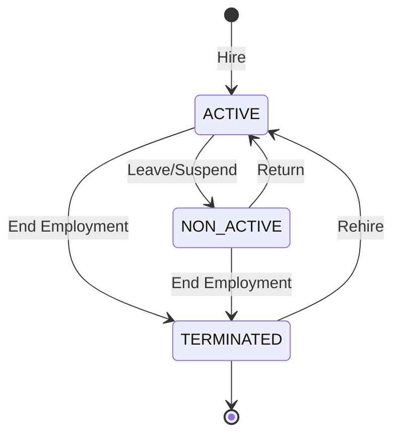
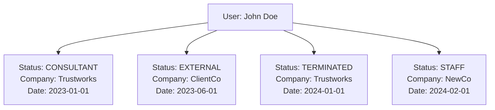

# User and UserStatus Temporal Design Documentation

## Overview

The Trustworks User system implements a temporal data model where user attributes change over time. The core `User` entity represents the immutable identity, while temporal aspects like status, salary, and company associations are tracked in separate time-series entities. This enables accurate historical reporting, retroactive corrections, and future-dated changes.

## Architectural Principles

### Temporal Design Pattern
- **Immutable Core**: User identity (uuid, username, email) remains constant
- **Temporal Attributes**: Status, salary, roles change over time with effective dates
- **Point-in-Time Queries**: Any historical state can be reconstructed for a given date
- **Event Sourcing**: Each change is a new record, preserving full history

### Key Concepts
- **Effective Dating**: All temporal records have a date when they become active
- **Latest-Valid Pattern**: Queries find the most recent record ≤ query date
- **No Deletion**: Historical records are never deleted, only superseded
- **Company Scoping**: Users can have different statuses per company

## Core Data Model

### User Entity (Immutable Core)

```java
@Entity
@Table(name = "user")
public class User {
    // Identity
    @Id String uuid;                    // Permanent identifier
    String username;                     // Unique username
    String email;                        // Contact email

    // Personal Information
    String firstname, lastname;          // Name
    LocalDate birthday;                  // Birth date
    String cpr;                         // Danish CPR number
    String gender;                      // Gender

    // Authentication
    String password;                     // BCrypt hashed
    String azureOid;                    // Azure AD Object ID
    String issuer;                      // OAuth issuer

    // Contact & Preferences
    String phone;                       // Phone number
    String slackusername;               // Slack handle
    boolean photoconsent;               // Photo usage consent

    // Skills
    PrimarySkillType primaryskilltype;   // Main skill category
    int primaryskilllevel;              // Skill level (1-5)

    // Benefits
    boolean pension;                    // Pension enrollment
    boolean healthcare;                 // Healthcare enrollment
    String pensiondetails;              // Pension specifics

    // Metadata
    LocalDate created;                  // Account creation date
    boolean active;                     // Account active flag

    // Transient Collections (loaded separately)
    @Transient List<UserStatus> statuses;
    @Transient List<Salary> salaries;
    @Transient List<TeamRole> teams;
    @Transient List<Role> roleList;
    @Transient List<UserBankInfo> userBankInfos;
}
```

### UserStatus Entity (Temporal Status)

```java
@Entity
@Table(name = "userstatus")
public class UserStatus {
    @Id String uuid;                    // Status record ID

    // Temporal Key
    String useruuid;                    // Link to User
    LocalDate statusdate;               // Effective date

    // Status Information
    ConsultantType type;                // CONSULTANT, STAFF, STUDENT, EXTERNAL
    StatusType status;                  // ACTIVE, NON_ACTIVE, TERMINATED
    int allocation;                     // Allocation percentage (0-100)

    // Company Association
    @ManyToOne Company company;         // Associated company

    // Benefits
    boolean isTwBonusEligible;         // Bonus eligibility flag
}
```

## Temporal Query Patterns

### Point-in-Time Status Query

```java
// Get user status at specific date
public UserStatus getUserStatus(LocalDate date) {
    return getStatuses().stream()
        .filter(s -> !s.getStatusdate().isAfter(date))
        .max(Comparator.comparing(UserStatus::getStatusdate))
        .orElse(defaultTerminatedStatus(date));
}
```

### Company-Specific Status

```java
// Get status for specific company at date
public UserStatus getCompanyStatus(String companyId, LocalDate date) {
    return getStatuses().stream()
        .filter(s -> s.getCompany().getUuid().equals(companyId))
        .filter(s -> !s.getStatusdate().isAfter(date))
        .max(Comparator.comparing(UserStatus::getStatusdate))
        .orElse(null);
}
```

### Hire Date Calculation

```java
// Find most recent ACTIVE status (handles rehires)
public LocalDate getHireDate() {
    LocalDate hireDate = null;
    boolean terminated = false;

    for (UserStatus status : statusesSortedByDate()) {
        if (status.getStatus() == ACTIVE && (hireDate == null || terminated)) {
            hireDate = status.getStatusdate();
            terminated = false;
        }
        if (status.getStatus() == TERMINATED) {
            terminated = true;
        }
    }

    return hireDate != null ? hireDate : LocalDate.now();
}
```

## Status Types and Transitions

### ConsultantType Enum
| Value | Description | Typical Use |
|-------|-------------|-------------|
| CONSULTANT | Billable consultant | Client work, projects |
| STAFF | Internal staff | Admin, HR, Finance |
| STUDENT | Student/Intern | Learning, assistance |
| EXTERNAL | External contractor | Temporary, project-based |

### StatusType Enum
| Value | Description | Impact |
|-------|-------------|--------|
| ACTIVE | Currently employed | Can log time, access systems |
| NON_ACTIVE | On leave/Inactive | Limited access, no billing |
| TERMINATED | Employment ended | No access, historical only |

### Valid Transitions



## Multi-Company Support

### Company Association Model

Users can have different statuses with different companies simultaneously:



### Company-Scoped Queries

```java
// Get all active consultants for a company on date
List<User> activeConsultants = User.findAll().stream()
    .filter(u -> {
        UserStatus status = u.getCompanyStatus(companyId, date);
        return status != null
            && status.getStatus() == ACTIVE
            && status.getType() == CONSULTANT;
    })
    .collect(Collectors.toList());
```

## Temporal Collections

### Salary History

```java
public Salary getSalary(LocalDate date) {
    return getSalaries().stream()
        .filter(s -> !s.getActivefrom().isAfter(date))
        .max(Comparator.comparing(Salary::getActivefrom))
        .orElse(defaultZeroSalary(date));
}
```

### Bank Information History

```java
public UserBankInfo getUserBankInfo(LocalDate date) {
    return getUserBankInfos().stream()
        .filter(b -> !b.getActiveDate().isAfter(date))
        .max(Comparator.comparing(UserBankInfo::getActiveDate))
        .orElse(new UserBankInfo());
}
```

## Business Logic Patterns

### Allocation Management

Allocation represents the percentage of time a user is allocated to work:

```java
// Full-time employee
UserStatus fullTime = new UserStatus(CONSULTANT, ACTIVE, date, 100, userId);

// Part-time (60%)
UserStatus partTime = new UserStatus(CONSULTANT, ACTIVE, date, 60, userId);

// On leave
UserStatus onLeave = new UserStatus(CONSULTANT, NON_ACTIVE, date, 0, userId);
```

### Bonus Eligibility

The `isTwBonusEligible` flag on UserStatus determines bonus eligibility:

```java
// Check if user is bonus eligible on invoice date
public boolean isBonusEligible(String userId, LocalDate invoiceDate) {
    UserStatus status = user.getUserStatus(invoiceDate);
    return status != null
        && status.getStatus() == ACTIVE
        && status.isTwBonusEligible();
}
```

## Database Schema

### user table
```sql
CREATE TABLE user (
    uuid VARCHAR(36) PRIMARY KEY,
    username VARCHAR(100) UNIQUE NOT NULL,
    email VARCHAR(255),
    firstname VARCHAR(100),
    lastname VARCHAR(100),
    password VARCHAR(255),
    azure_oid VARCHAR(36) UNIQUE,
    azure_issuer VARCHAR(150),
    birthday DATE,
    cpr VARCHAR(20),
    phone VARCHAR(50),
    slackusername VARCHAR(100),
    gender VARCHAR(10),
    type VARCHAR(50),
    active BOOLEAN DEFAULT true,
    created DATE,
    pension BOOLEAN DEFAULT false,
    healthcare BOOLEAN DEFAULT false,
    pensiondetails TEXT,
    defects TEXT,
    photoconsent BOOLEAN DEFAULT false,
    other TEXT,
    primaryskilltype VARCHAR(50),
    primary_skill_level INT,
    INDEX idx_username (username),
    INDEX idx_email (email),
    INDEX idx_azure_oid (azure_oid)
) ENGINE=InnoDB;
```

### userstatus table
```sql
CREATE TABLE userstatus (
    uuid VARCHAR(36) PRIMARY KEY,
    useruuid VARCHAR(36) NOT NULL,
    statusdate DATE NOT NULL,
    type VARCHAR(20) NOT NULL,
    status VARCHAR(20) NOT NULL,
    allocation INT DEFAULT 100,
    companyuuid VARCHAR(36),
    is_tw_bonus_eligible BOOLEAN DEFAULT false,
    INDEX idx_user_date (useruuid, statusdate DESC),
    INDEX idx_company_date (companyuuid, statusdate DESC),
    INDEX idx_status_type (status, type),
    FOREIGN KEY (useruuid) REFERENCES user(uuid),
    FOREIGN KEY (companyuuid) REFERENCES company(uuid)
) ENGINE=InnoDB;
```

## Query Optimization

### Efficient Temporal Queries

```sql
-- Get current status for all users
SELECT u.*, s.*
FROM user u
INNER JOIN (
    SELECT useruuid, MAX(statusdate) as max_date
    FROM userstatus
    WHERE statusdate <= CURDATE()
    GROUP BY useruuid
) latest ON u.uuid = latest.useruuid
INNER JOIN userstatus s ON s.useruuid = latest.useruuid
    AND s.statusdate = latest.max_date;

-- Get status history for user
SELECT *
FROM userstatus
WHERE useruuid = :userId
ORDER BY statusdate DESC;

-- Find status changes in date range
SELECT u.firstname, u.lastname, s.*
FROM userstatus s
JOIN user u ON s.useruuid = u.uuid
WHERE s.statusdate BETWEEN :startDate AND :endDate
ORDER BY s.statusdate, u.lastname;
```

### Index Strategy

1. **Primary Access Pattern**: `(useruuid, statusdate DESC)`
   - Supports point-in-time queries
   - Efficient latest status lookup

2. **Company Queries**: `(companyuuid, statusdate DESC)`
   - Company-wide status reports
   - Active employee counts

3. **Status Filtering**: `(status, type)`
   - Find all active consultants
   - Terminated employee reports

## Common Use Cases

### 1. Employee Onboarding

```java
// Create new user
User user = new User();
user.setFirstname("Jane");
user.setLastname("Doe");
user.setUsername("jane.doe");
user.setEmail("jane@trustworks.dk");
user.persist();

// Set initial status
UserStatus status = new UserStatus(
    ConsultantType.CONSULTANT,
    StatusType.ACTIVE,
    LocalDate.now(),
    100,  // Full allocation
    user.getUuid()
);
status.setCompany(defaultCompany);
status.setTwBonusEligible(true);
status.persist();
```

### 2. Status Change (Leave)

```java
// Employee going on parental leave
UserStatus leaveStatus = new UserStatus(
    existingUser.getUserStatus(today).getType(),
    StatusType.NON_ACTIVE,
    leaveStartDate,
    0,  // No allocation during leave
    existingUser.getUuid()
);
leaveStatus.setCompany(company);
leaveStatus.persist();

// Schedule return
UserStatus returnStatus = new UserStatus(
    ConsultantType.CONSULTANT,
    StatusType.ACTIVE,
    plannedReturnDate,
    100,
    existingUser.getUuid()
);
returnStatus.setCompany(company);
returnStatus.persist();
```

### 3. Termination

```java
// Terminate employment
UserStatus termination = new UserStatus(
    ConsultantType.CONSULTANT,
    StatusType.TERMINATED,
    lastWorkingDay.plusDays(1),
    0,
    user.getUuid()
);
termination.setCompany(company);
termination.persist();

// Deactivate user account
user.setActive(false);
user.persist();
```

### 4. Historical Reporting

```java
// Get all active consultants on specific date
public List<User> getActiveConsultantsOn(LocalDate date) {
    return User.findAll().stream()
        .filter(u -> {
            UserStatus status = u.getUserStatus(date);
            return status.getStatus() == StatusType.ACTIVE
                && status.getType() == ConsultantType.CONSULTANT;
        })
        .collect(Collectors.toList());
}

// Calculate average allocation for period
public double getAverageAllocation(String userId,
                                  LocalDate start,
                                  LocalDate end) {
    List<UserStatus> statuses = UserStatus
        .find("useruuid = ?1 and statusdate between ?2 and ?3",
              userId, start, end)
        .list();

    // Complex calculation considering status duration
    // Implementation depends on business rules
    return calculateWeightedAverage(statuses, start, end);
}
```

## Integration Points

### With Invoice Bonus System

```java
// Validate bonus eligibility using temporal status
public boolean canSelfAssignBonus(String userId, Invoice invoice) {
    UserStatus status = user.getUserStatus(invoice.getInvoicedate());

    return status != null
        && status.getStatus() == StatusType.ACTIVE
        && status.isTwBonusEligible()
        && bonusEligibilityService.hasEligibility(userId, invoice.getFinancialYear());
}
```

### With Time Tracking

```java
// Validate time entry based on status
public boolean canLogTime(String userId, LocalDate workDate) {
    UserStatus status = user.getUserStatus(workDate);

    return status != null
        && status.getStatus() == StatusType.ACTIVE
        && status.getAllocation() > 0;
}
```

### With Payroll

```java
// Get salary for payroll calculation
public PayrollData getPayrollData(String userId, YearMonth period) {
    LocalDate periodEnd = period.atEndOfMonth();

    UserStatus status = user.getUserStatus(periodEnd);
    Salary salary = user.getSalary(periodEnd);
    UserBankInfo bankInfo = user.getUserBankInfo(periodEnd);

    return new PayrollData(status, salary, bankInfo);
}
```

## Best Practices

### 1. Always Use Effective Dating
```java
// DON'T: Update existing status record
status.setType(ConsultantType.STAFF);
status.persist();

// DO: Create new status record with effective date
UserStatus newStatus = new UserStatus(
    ConsultantType.STAFF,
    status.getStatus(),
    effectiveDate,
    status.getAllocation(),
    status.getUseruuid()
);
newStatus.persist();
```

### 2. Validate Date Sequences
```java
// Ensure no gaps in status history
public void validateStatusHistory(List<UserStatus> statuses) {
    statuses.sort(Comparator.comparing(UserStatus::getStatusdate));

    for (int i = 1; i < statuses.size(); i++) {
        LocalDate prevDate = statuses.get(i-1).getStatusdate();
        LocalDate currDate = statuses.get(i).getStatusdate();

        if (currDate.isBefore(prevDate)) {
            throw new ValidationException("Overlapping status dates");
        }
    }
}
```

### 3. Handle Missing Data Gracefully
```java
public UserStatus getUserStatus(LocalDate date) {
    return getStatuses().stream()
        .filter(s -> !s.getStatusdate().isAfter(date))
        .max(Comparator.comparing(UserStatus::getStatusdate))
        .orElse(createDefaultStatus(date));  // Graceful fallback
}
```

## Troubleshooting

### Common Issues

1. **Missing Status for Date**
   - Check if user has any status records
   - Verify date is after user creation
   - Consider default/fallback status

2. **Incorrect Hire Date**
   - Review full status history
   - Check for gaps after termination
   - Verify rehire records exist

3. **Company Mismatch**
   - Ensure status has company association
   - Check company-specific queries
   - Validate company UUID

### Diagnostic Queries

```sql
-- Users without current status
SELECT u.*
FROM user u
LEFT JOIN userstatus s ON u.uuid = s.useruuid
WHERE s.uuid IS NULL;

-- Status gaps (no status for > 30 days)
SELECT s1.useruuid, s1.statusdate, s2.statusdate,
       DATEDIFF(s2.statusdate, s1.statusdate) as gap_days
FROM userstatus s1
JOIN userstatus s2 ON s1.useruuid = s2.useruuid
WHERE s2.statusdate = (
    SELECT MIN(statusdate)
    FROM userstatus s3
    WHERE s3.useruuid = s1.useruuid
      AND s3.statusdate > s1.statusdate
)
AND DATEDIFF(s2.statusdate, s1.statusdate) > 30;

-- Multiple active statuses per company
SELECT useruuid, companyuuid, COUNT(*) as count
FROM userstatus
WHERE status = 'ACTIVE'
  AND statusdate <= CURDATE()
GROUP BY useruuid, companyuuid
HAVING count > 1;
```

## Future Enhancements

### Planned Improvements

1. **Status Versioning**
   - Track who made status changes
   - Reason for status change
   - Approval workflow for changes

2. **Predictive Analytics**
   - Forecast future availability
   - Predict termination risk
   - Capacity planning

3. **Audit Trail**
   - Complete change history
   - Rollback capabilities
   - Compliance reporting

4. **Performance Optimization**
   - Materialized current status view
   - Status summary tables
   - Cached temporal queries