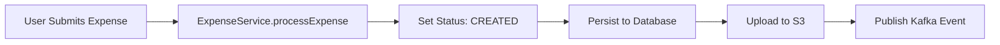
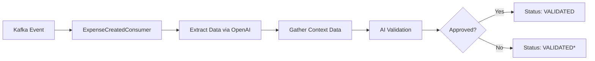
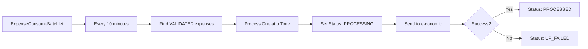
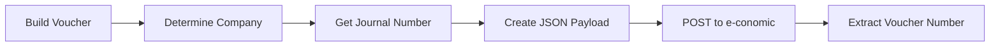
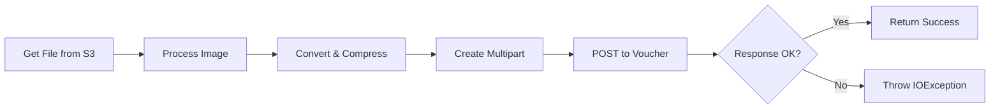
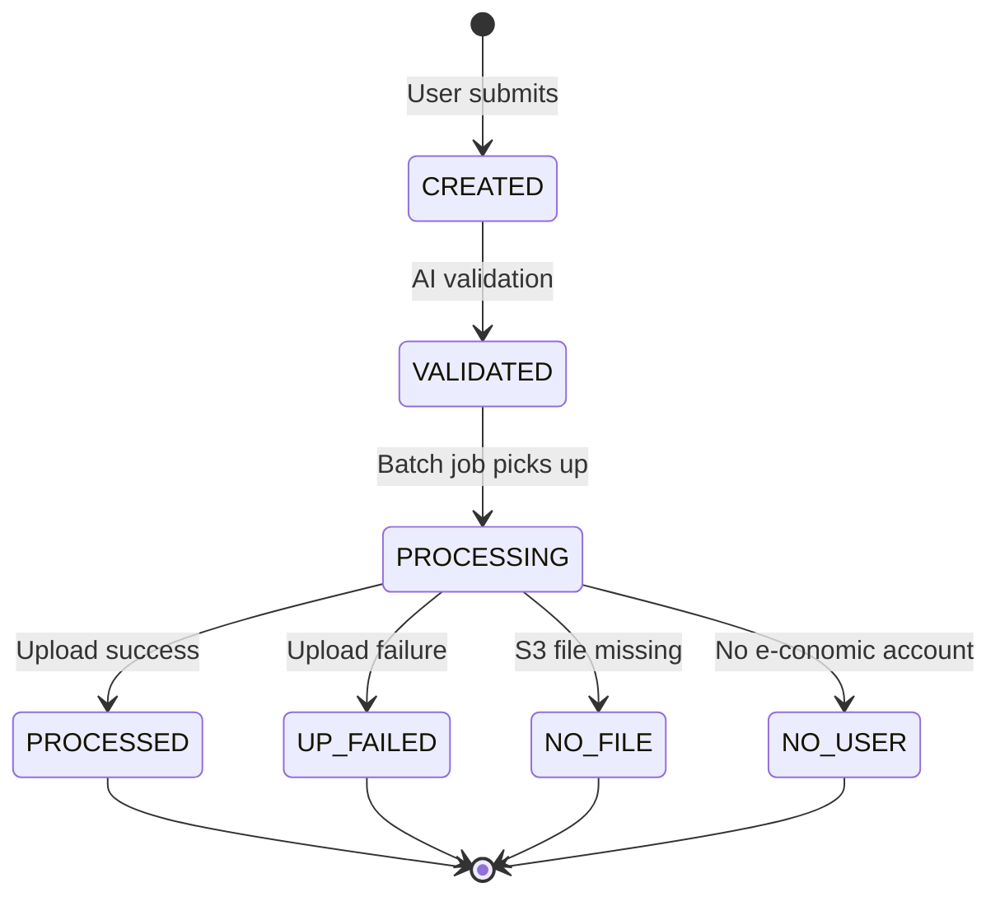

# Expense Processing and Upload Flow - Detailed Documentation

## Overview

The expense processing system handles employee expense submissions from initial receipt upload through AI validation to final posting in the e-conomic accounting system. The flow involves multiple services, asynchronous processing via Kafka, AI-powered validation, and integration with external systems.

## Architecture Components

### Core Services
- **ExpenseService** - Main orchestrator for expense processing
- **ExpenseFileService** - Manages file storage in AWS S3
- **EconomicsService** - Handles e-conomic API integration
- **ExpenseAIValidationService** - OpenAI-based validation
- **ExpenseCreatedProducer/Consumer** - Kafka event handling

### External Systems
- **AWS S3** - Receipt image storage
- **e-conomic API** - Accounting system
- **OpenAI** - Receipt data extraction and validation
- **Kafka** - Event streaming for async processing
- **Slack** - Notifications

## Complete Processing Flow

### Phase 1: Initial Receipt Submission

1. **User submits expense** with receipt image (Base64 encoded)
2. **ExpenseService.processExpense()** handles initial processing:
   - Sets status to `CREATED`
   - Persists expense record to database
   - Stores receipt file in AWS S3 via `ExpenseFileService`
   - Publishes Kafka event for async validation

### Phase 2: AI Validation (Asynchronous)

*Note: Currently both approved and rejected expenses get VALIDATED status (appears to be a bug)*

1. **ExpenseCreatedConsumer** receives Kafka event
2. **Data Extraction**:
   - Fetches receipt from S3
   - Uses OpenAI to extract date and amount from receipt
3. **Context Gathering**:
   - User information and contact details
   - BI data for the expense date
   - Budget aggregates for validation
4. **AI Validation**:
   - Sends all context to OpenAI for approval decision
   - Updates status to `VALIDATED`
   - Sends Slack notification if approved

### Phase 3: Batch Processing to e-conomic

1. **ExpenseConsumeBatchlet** runs every 10 minutes
2. **Selection Criteria**:
   - Status = `VALIDATED`
   - Amount > 0
   - Created > 2 days ago (cooling period)
   - Processes 1 expense per run
3. **Processing Steps**:
   - Set status to `PROCESSING`
   - Fetch file from S3
   - Verify user has e-conomic account
   - Send voucher to e-conomic
   - Upload receipt image to voucher

### Phase 4: e-conomic Integration

#### 4a: Voucher Creation

1. **Voucher Building** (`EconomicsService.buildJSONRequest`):
   - Determines target company and integration keys
   - Sets journal number based on company
   - Creates contra account from user's e-conomic ID
   - Sets expense account from expense data
   - Uses current fiscal year

2. **Voucher Posting**:
   - Posts JSON to e-conomic API
   - Uses idempotency key: `expense-{uuid}`
   - Extracts voucher number from response
   - Stores voucher number, year, and journal in expense record

#### 4b: File Upload

1. **Image Processing**:
   - Converts Base64 to byte array
   - Compresses image using `ImageProcessor`
   - Creates multipart form data

2. **Upload to e-conomic**:
   - Posts to: `/journals/{journal}/vouchers/{year}/{voucherNumber}/attachment`
   - Handles WebApplicationException for API errors
   - **Critical Issue**: Returns null on failure → causes "fileResponse is null" error

## Status Flow Diagram

## Error Handling

### Common Failure Points

1. **"Upload failed, fileResponse is null"**
   - Occurs in `EconomicsService.sendFile()` line 147
   - File upload to e-conomic returns null response
   - Causes: Network timeout, API error, auth failure

2. **NO_FILE Status**
   - S3 file missing or deleted
   - File reference corrupt
   - S3 permissions issue

3. **NO_USER Status**
   - User lacks e-conomic account
   - Multiple or zero UserAccount records

4. **UP_FAILED Status**
   - e-conomic API rejection
   - Network connectivity issues
   - Invalid voucher data

### Retry Mechanisms

1. **Fallback Job** (1-minute interval):
   - `ExpenseCreatedConsumer.expenseSyncJob()`
   - Retries all expenses with `CREATED` status
   - Ensures no expenses stuck if Kafka fails

2. **Manual Retry**:
   - Update status back to `VALIDATED` to retry
   - Or back to `CREATED` for full reprocessing

## Database Schema

### Expense Table
- `uuid` - Primary key
- `useruuid` - User reference
- `amount` - Expense amount
- `expensedate` - Date of expense
- `datecreated` - Submission date
- `status` - Processing status
- `vouchernumber` - e-conomic voucher number
- `journalnumber` - e-conomic journal
- `accountingyear` - Fiscal year
- `account` - Expense account code
- `accountname` - Account description
- `description` - Expense description
- `paidOut` - Payment date

### UserAccount Table
- `useruuid` - User reference
- `economics` - e-conomic account ID
- `username` - Display name

## Configuration & Environment

### Batch Job Schedule
- **expense-consume**: Every 10 minutes
- **expenseSyncJob**: Every 1 minute (fallback)

### Processing Rules
- 2-day cooling period before processing
- Only positive amounts processed
- Single expense per batch run

### Integration Points
- AWS S3 for file storage
- e-conomic API for accounting
- OpenAI for validation
- Kafka for event streaming
- Slack for notifications

## Monitoring & Debugging

### Key Log Points
1. Expense creation: "Processing new expense {uuid}"
2. AI validation: "Expense {uuid} validated by AI"
3. Batch processing: "Processing expense {uuid}"
4. e-conomic upload: "Sending voucher for expense {uuid}"
5. File upload: "Uploading file for expense {uuid}"

### Health Checks
- Check for stuck expenses in `PROCESSING` status
- Monitor `UP_FAILED` count for API issues
- Verify S3 connectivity for `NO_FILE` errors
- Check user accounts for `NO_USER` errors

## Known Issues

1. **Bug**: Both approved and rejected expenses get `VALIDATED` status (lines 97 & 101 in ExpenseCreatedConsumer)
2. **Issue**: Null response handling in file upload can crash batch job
3. **Risk**: No transaction rollback on partial failure (voucher created but file upload fails)
4. **Gap**: No automated cleanup for orphaned S3 files

## Recommendations

1. **Fix null response handling** in `EconomicsService.sendFile()`
2. **Implement proper status** for rejected expenses
3. **Add transaction management** for voucher + file upload
4. **Implement retry with exponential backoff**
5. **Add circuit breaker** for e-conomic API
6. **Create monitoring dashboard** for expense pipeline
7. **Add automated cleanup** for failed/orphaned expenses