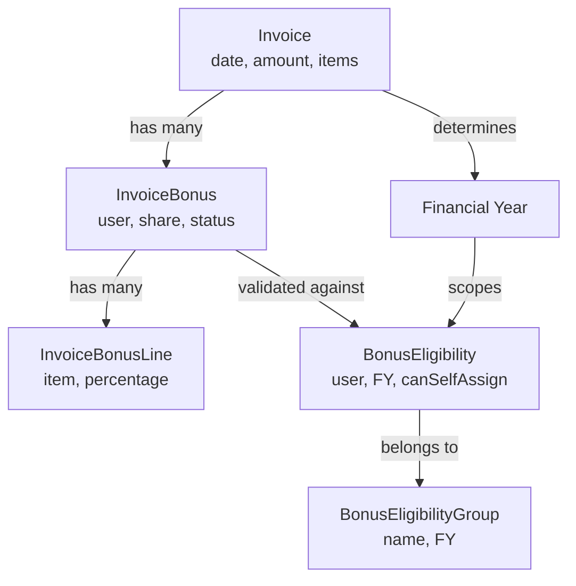
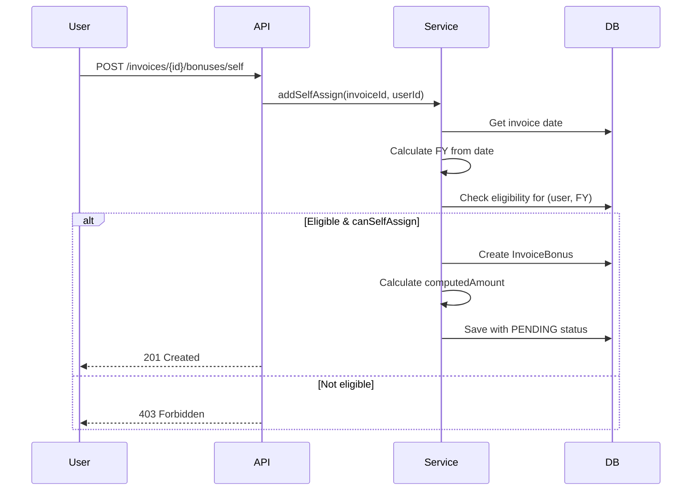
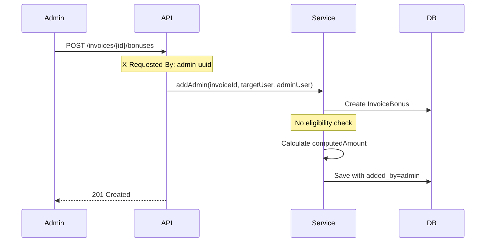
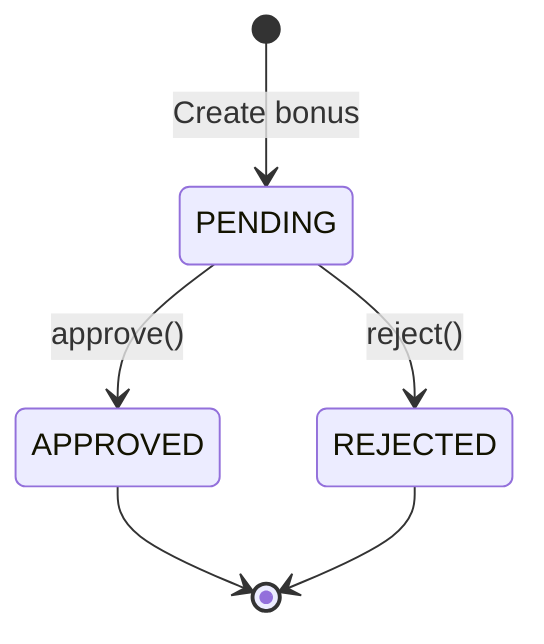

# Bonus Eligibility and Groups Architecture

## Executive Summary

The Bonus Eligibility system provides a structured approach to managing consultant bonus permissions on invoices. It uses a financial year-based model where consultants can be whitelisted for self-assignment of bonuses, while maintaining administrative override capabilities. The system links bonuses directly to invoices and invoice line items, enabling detailed tracking and approval workflows.

## Core Architecture Principles

### Financial Year Scoping
- All eligibility is scoped to financial years (July 1 - June 30)
- FY 2025 runs from July 1, 2025 to June 30, 2026
- Users can have different eligibility across multiple financial years
- Invoice date determines which FY eligibility to check

### Whitelist Model
- Eligibility is opt-in (whitelist) rather than opt-out
- Users must be explicitly added to eligibility for each FY
- Admin-added bonuses bypass eligibility requirements
- Self-assignment requires both eligibility and `canSelfAssign=true`

### Group-Based Management
- Eligibility entries are organized into groups per FY
- Groups provide aggregation and reporting capabilities
- Groups track total approved bonuses for their members

## Data Model Architecture

### Entity Hierarchy

```
BonusEligibilityGroup (FY-scoped container)
    └── BonusEligibility (User whitelist entries)
            └── Controls → InvoiceBonus (Self-assignment)
                    └── InvoiceBonusLine (Per-item allocation)
```

### Relationship Model



## Linking to Invoices and Invoice Lines

### Invoice Level Integration

#### Direct Links
- `InvoiceBonus.invoiceuuid` → `Invoice.uuid` (CASCADE DELETE)
- One bonus per user per invoice (unique constraint)
- Invoice date determines FY for eligibility validation

#### Computed Values
- `InvoiceBonus.computedAmount` calculated from invoice total
- Percentage bonuses: `invoiceTotal * (shareValue / 100)`
- Fixed bonuses: `shareValue` directly

#### Status Aggregation
```java
// Invoice-level bonus status
SalesApprovalStatus aggregated = service.aggregatedStatusForInvoice(invoiceId);
// Returns: PENDING if any pending, REJECTED if any rejected, else APPROVED

// Total bonus amount for invoice
double total = service.totalBonusAmountForInvoice(invoiceId);
```

### Invoice Line Item Integration

#### Line-Level Allocation
- `InvoiceBonusLine` links bonus to specific invoice items
- Enables partial bonus allocation across line items
- Percentage-based distribution (0-100% per line)

#### Structure
```sql
InvoiceBonusLine
├── bonusuuid       → InvoiceBonus.uuid
├── invoiceuuid     → Invoice.uuid (denormalized for queries)
├── invoiceitemuuid → InvoiceItem.uuid
└── percentage      → Allocation percentage for this line
```

#### Use Cases
1. **Selective Bonus**: Bonus only on specific deliverables
2. **Weighted Distribution**: Different percentages per line item
3. **Exclusions**: 0% on certain items (e.g., expenses)

## Eligibility Validation Flow

### Self-Assignment Process



### Admin Override Process



## Financial Year Calculation

### Invoice Date to FY Mapping

```java
public static int getFinancialYear(LocalDate invoiceDate) {
    if (invoiceDate.getMonthValue() >= 7) {
        // July-December: FY starts this year
        return invoiceDate.getYear();
    } else {
        // January-June: FY started last year
        return invoiceDate.getYear() - 1;
    }
}
```

### Examples
| Invoice Date | Financial Year | Period |
|--------------|---------------|---------|
| 2025-07-15 | FY 2025 | 2025-07-01 to 2026-06-30 |
| 2026-03-20 | FY 2025 | 2025-07-01 to 2026-06-30 |
| 2026-08-10 | FY 2026 | 2026-07-01 to 2027-06-30 |

## Eligibility Management

### Group Structure

```java
BonusEligibilityGroup {
    uuid: String              // Group identifier
    name: String              // "FY2025 Consultants"
    financialYear: int        // 2025

    // Computed properties
    getFinancialYearStart()   // 2025-07-01
    getFinancialYearEnd()     // 2026-06-30
}
```

### Eligibility Entry

```java
BonusEligibility {
    uuid: String              // Entry identifier
    group: BonusEligibilityGroup  // Parent group (same FY)
    useruuid: String          // Eligible user
    financialYear: int        // Must match group.financialYear
    canSelfAssign: boolean    // Self-assignment permission
}
```

### Constraints
- One eligibility per user per FY (`UNIQUE(useruuid, financialYear)`)
- `financialYear` must match parent group's FY
- Group deletion sets eligibility.group to NULL (preserves entries)

## Approval Workflow

### Status Transitions



### Approval Process

1. **Creation**: Status = PENDING, added_by = creator
2. **Review**: Admin/Finance reviews bonus request
3. **Decision**:
   - Approve: status = APPROVED, approved_by = approver, approved_at = now
   - Reject: status = REJECTED, approved_by = rejecter, note = reason

### Aggregated Invoice Status

```java
public SalesApprovalStatus aggregatedStatusForInvoice(String invoiceId) {
    List<InvoiceBonus> bonuses = findByInvoice(invoiceId);

    if (bonuses.any(b -> b.status == PENDING)) return PENDING;
    if (bonuses.any(b -> b.status == REJECTED)) return REJECTED;
    if (bonuses.any(b -> b.status == APPROVED)) return APPROVED;

    return PENDING; // Default if no bonuses
}
```

## Reporting and Analytics

### Group-Level Metrics

#### Approved Bonus Total
```sql
-- Sum of approved bonuses for group members in FY
SELECT SUM(b.computed_amount) as total
FROM invoice_bonuses b
JOIN invoices i ON b.invoiceuuid = i.uuid
WHERE b.status = 'APPROVED'
  AND b.useruuid IN (
    SELECT useruuid FROM invoice_bonus_eligibility
    WHERE group_uuid = :groupId
  )
  AND i.invoicedate BETWEEN :fyStart AND :fyEnd
```

### User-Level Metrics

```sql
-- User's bonus summary for FY
SELECT
    COUNT(*) as bonus_count,
    SUM(computed_amount) as total_amount,
    AVG(share_value) as avg_percentage
FROM invoice_bonuses b
JOIN invoices i ON b.invoiceuuid = i.uuid
WHERE b.useruuid = :userId
  AND CASE
    WHEN MONTH(i.invoicedate) >= 7 THEN YEAR(i.invoicedate)
    ELSE YEAR(i.invoicedate) - 1
  END = :financialYear
GROUP BY b.status
```

## Implementation Patterns

### Service Layer Pattern

```java
@ApplicationScoped
public class InvoiceBonusService {

    // Eligibility validation
    private void assertEligibleForInvoice(String invoiceId, String userId) {
        Invoice invoice = Invoice.findById(invoiceId);
        int fy = getFinancialYear(invoice.getInvoicedate());

        BonusEligibility eligibility = BonusEligibility
            .find("useruuid = ?1 and financialYear = ?2", userId, fy)
            .firstResult();

        if (eligibility == null || !eligibility.isCanSelfAssign()) {
            throw new ForbiddenException("Not eligible for self-assignment");
        }
    }

    // Bonus calculation
    private void recomputeComputedAmount(Invoice invoice, InvoiceBonus bonus) {
        double invoiceTotal = invoice.getSumWithTax();

        if (bonus.shareType == ShareType.PERCENT) {
            bonus.computedAmount = invoiceTotal * (bonus.shareValue / 100.0);
        } else {
            bonus.computedAmount = bonus.shareValue;
        }

        // Round to 2 decimals
        bonus.computedAmount = Math.round(bonus.computedAmount * 100.0) / 100.0;
    }
}
```

### REST Resource Pattern

```java
@Path("/invoices/{invoiceId}/bonuses")
public class InvoiceBonusResource {

    @POST
    @Path("/self")
    @RolesAllowed({"CONSULTANT", "SYSTEM"})
    public Response selfAssign(@PathParam("invoiceId") String invoiceId,
                              CreateBonusDTO dto) {
        // JWT determines user
        String userId = jwt.getClaim("uuid");

        InvoiceBonus bonus = service.addSelfAssign(
            invoiceId, userId, dto.shareType, dto.shareValue, dto.note
        );

        return Response.status(201).entity(bonus).build();
    }

    @POST
    @RolesAllowed({"ADMIN", "FINANCE", "SYSTEM"})
    public Response adminAdd(@PathParam("invoiceId") String invoiceId,
                           @HeaderParam("X-Requested-By") String adminUser,
                           CreateBonusDTO dto) {
        InvoiceBonus bonus = service.addAdmin(
            invoiceId, dto.useruuid, adminUser,
            dto.shareType, dto.shareValue, dto.note
        );

        return Response.status(201).entity(bonus).build();
    }
}
```

## Security Considerations

### Access Control
- Self-assignment requires eligibility whitelist
- Admin operations require elevated roles
- All operations require authenticated JWT
- Audit trail via added_by/approved_by fields

### Data Integrity
- Unique constraint prevents duplicate bonuses
- Cascade delete maintains referential integrity
- Percentage sum validation (≤100%)
- Financial year consistency enforced

## Migration and Evolution

### Historical Migrations

1. **V77**: Initial bonus tables
   - Created invoice_bonuses and invoice_bonus_eligibility
   - Basic self-assignment whitelist

2. **V78**: Line-level allocation
   - Added invoice_bonus_lines for per-item distribution

3. **V79**: Group-based organization
   - Introduced invoice_bonus_eligibility_group
   - Period-based groups initially

4. **V80**: Financial year model
   - Migrated from date ranges to FY-based periods
   - Simplified validation logic

5. **V81-82**: Per-FY eligibility
   - Removed date columns from eligibility
   - Enforced one eligibility per user per FY

### Future Considerations

1. **Multi-currency Support**
   - Store currency with bonus
   - Exchange rate handling for computedAmount

2. **Hierarchical Approval**
   - Multi-level approval workflows
   - Role-based approval limits

3. **Budget Integration**
   - Link groups to bonus budgets
   - Real-time budget tracking

4. **Advanced Allocations**
   - Formula-based calculations
   - Tiered percentage structures

## Performance Optimization

### Database Indexes
```sql
-- Existing indexes
KEY idx_invbon_invoiceuuid (invoiceuuid)
KEY idx_invbon_useruuid (useruuid)
UNIQUE KEY (invoiceuuid, useruuid)
UNIQUE KEY (useruuid, financial_year)

-- Recommended additions
KEY idx_invoice_date_status (invoicedate, status)  -- For FY reporting
KEY idx_bonus_status_fy (status, financial_year)   -- For approvals
```

### Query Optimization
- Use covering indexes for common queries
- Denormalize FY into bonus records if needed
- Consider materialized views for reporting

## Troubleshooting Guide

### Common Issues

1. **"Not eligible for self-assignment"**
   - Check user has eligibility for invoice's FY
   - Verify canSelfAssign = true
   - Confirm invoice date is correct

2. **"Sum of percent shares exceeds 100%"**
   - Review all PERCENT bonuses on invoice
   - Check for rounding errors
   - Consider using AMOUNT type instead

3. **"User already added for invoice bonus"**
   - Unique constraint violation
   - Check for existing bonus before creation
   - Use update instead of create

### Validation Queries

```sql
-- Find users without FY eligibility
SELECT DISTINCT b.useruuid
FROM invoice_bonuses b
LEFT JOIN invoice_bonus_eligibility e
  ON b.useruuid = e.useruuid
  AND e.financial_year = :fy
WHERE e.uuid IS NULL;

-- Check percentage sum per invoice
SELECT invoiceuuid, SUM(share_value) as total_pct
FROM invoice_bonuses
WHERE share_type = 'PERCENT'
GROUP BY invoiceuuid
HAVING total_pct > 100;
```