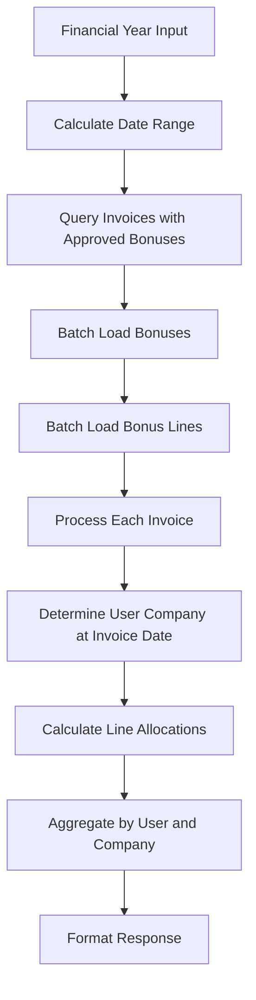

# Company Bonus Share API Documentation

## Overview

The Company Bonus Share API provides a comprehensive view of approved invoice bonuses distributed across companies based on user affiliations at the time of each invoice. This feature enables financial analysis and reporting of bonus distributions per company within a financial year.

## Endpoint

### Get Company Bonus Share by Financial Year

```http
GET /invoices/bonuses/company-share?financialYear={year}
```

#### Parameters

| Parameter | Type | Required | Description |
|-----------|------|----------|-------------|
| financialYear | Integer | Yes | The financial year (e.g., 2025 for FY July 1, 2025 - June 30, 2026) |

#### Response

```json
{
  "financialYear": 2025,
  "periodStart": "2025-07-01",
  "periodEnd": "2026-06-30",
  "totalAmount": 500000.00,
  "userShares": [
    {
      "userId": "11111111-1111-1111-1111-111111111111",
      "userName": "John Doe",
      "totalAmount": 150000.00,
      "companyAmounts": [
        {
          "companyId": "d8894494-2fb4-4f72-9e05-e6032e6dd691",
          "companyName": "Trustworks",
          "amount": 100000.00
        },
        {
          "companyId": "22222222-2222-2222-2222-222222222222",
          "companyName": "ClientCo",
          "amount": 50000.00
        }
      ]
    },
    {
      "userId": "33333333-3333-3333-3333-333333333333",
      "userName": "Jane Smith",
      "totalAmount": 120000.00,
      "companyAmounts": [
        {
          "companyId": "d8894494-2fb4-4f72-9e05-e6032e6dd691",
          "companyName": "Trustworks",
          "amount": 120000.00
        }
      ]
    }
  ]
}
```

#### Security

- Requires JWT authentication
- Roles required: `SYSTEM`, `FINANCE`, or `ADMIN`

## Business Logic

### Company Determination

The system determines a user's company affiliation using the temporal UserStatus model:

1. For each invoice with approved bonuses, the system retrieves the invoice date
2. The user's status at that specific date is queried from UserStatus history
3. The company associated with that status is used for allocation
4. If no company is found, amounts are allocated to "Unknown Company"

### Bonus Calculation

The calculation follows these rules:

1. **Only Approved Bonuses**: Only bonuses with status `APPROVED` are included
2. **Line-Level Allocation**: If InvoiceBonusLine entries exist:
   - Each line's percentage is applied to the total bonus amount
   - Line amounts are allocated to the user's company at invoice date
3. **Full Amount Allocation**: If no line allocations exist:
   - The entire computed bonus amount is allocated to the user's company

### Financial Year Definition

- Financial years run from July 1 to June 30
- FY 2025 = July 1, 2025 to June 30, 2026
- Invoices are included based on their invoice date falling within this period

## Implementation Details

### Performance Optimizations

The implementation includes several optimizations to handle large datasets efficiently:

1. **Batch Loading**: All data is loaded in batches to minimize database queries
2. **Query Optimization**: Uses EXISTS subqueries to filter only relevant invoices
3. **Caching**: User status lookups are cached within the request to avoid redundant queries
4. **Lazy Loading**: User statuses are loaded only when needed

### Query Strategy

```sql
-- Optimized query to get invoices with approved bonuses
SELECT DISTINCT i FROM Invoice i
WHERE i.invoicedate >= :startDate
AND i.invoicedate <= :endDate
AND EXISTS (
    SELECT 1 FROM InvoiceBonus b
    WHERE b.invoiceuuid = i.uuid
    AND b.status = 'APPROVED'
)
```

### Data Flow



## Use Cases

### Financial Reporting

Generate reports showing bonus distribution across different company entities for tax and accounting purposes.

### Performance Analysis

Analyze which companies generate the most bonus-eligible revenue and track trends over time.

### Audit Trail

Provide detailed breakdown of bonus allocations for compliance and audit requirements.

## Error Handling

| Status Code | Description |
|-------------|-------------|
| 200 | Success - Returns company bonus share data |
| 400 | Bad Request - Invalid financial year parameter |
| 401 | Unauthorized - Missing or invalid JWT |
| 403 | Forbidden - Insufficient permissions |

### Validation Rules

- Financial year must be between 2000 and 2999
- Financial year parameter is required
- User must have appropriate role (SYSTEM, FINANCE, or ADMIN)

## Related Endpoints

- `/invoices/eligibility-groups/{uuid}/approved-total` - Get total approved bonuses for an eligibility group
- `/invoices/{invoiceuuid}/bonuses` - List bonuses for a specific invoice
- `/invoices/eligibility` - Manage bonus eligibility

## Migration Notes

This feature integrates with:
- The temporal UserStatus model for company associations
- The InvoiceBonus approval workflow
- The InvoiceBonusLine allocation system
- The financial year-based eligibility model

## Example Usage

### cURL Request

```bash
curl -X GET "https://api.trustworks.dk/invoices/bonuses/company-share?financialYear=2025" \
  -H "Authorization: Bearer {JWT_TOKEN}" \
  -H "Accept: application/json"
```

### JavaScript Fetch

```javascript
const response = await fetch('/invoices/bonuses/company-share?financialYear=2025', {
  method: 'GET',
  headers: {
    'Authorization': `Bearer ${token}`,
    'Accept': 'application/json'
  }
});

const data = await response.json();

// Process company shares
data.userShares.forEach(userShare => {
  console.log(`${userShare.userName}: ${userShare.totalAmount}`);
  userShare.companyAmounts.forEach(company => {
    console.log(`  - ${company.companyName}: ${company.amount}`);
  });
});
```

## Notes

- Amounts are rounded to 2 decimal places
- Results are sorted by user total amount (descending)
- Company amounts within each user are sorted by amount (descending)
- The endpoint respects the temporal nature of user-company associations
- Historical data remains accurate even if users change companies