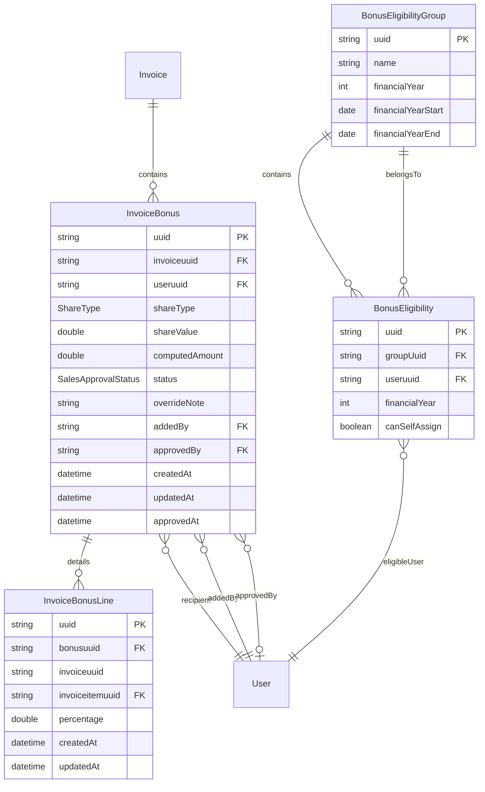

# Invoice Bonus REST API Documentation

## Overview

The Invoice Bonus system provides comprehensive bonus management for invoices, including eligibility whitelisting, self-assignment controls, and multi-level approval workflows. The system uses a financial year-based eligibility model (July 1 - June 30) and supports both percentage-based and fixed-amount bonuses.

## Core Concepts

### Financial Year (FY)
- Financial years run from July 1 to June 30
- FY 2025 = July 1, 2025 to June 30, 2026
- All eligibility and group memberships are scoped to specific financial years

### Bonus Types
- **PERCENT**: Percentage of invoice amount (0-100%)
- **AMOUNT**: Fixed amount in invoice currency

### Approval Status
- **PENDING**: Initial state, awaiting approval
- **APPROVED**: Approved by authorized user
- **REJECTED**: Rejected with optional note

## Data Model

### Entity Relationships



### Database Schema

#### invoice_bonuses
| Column | Type | Description |
|--------|------|-------------|
| uuid | VARCHAR(36) PK | Unique bonus identifier |
| invoiceuuid | VARCHAR(40) | Link to invoice (FK, CASCADE DELETE) |
| useruuid | VARCHAR(36) | Recipient user (FK, CASCADE DELETE) |
| share_type | VARCHAR(16) | 'PERCENT' or 'AMOUNT' |
| share_value | DOUBLE | Percentage (0-100) or fixed amount |
| computed_amount | DOUBLE | Server-calculated bonus amount |
| status | VARCHAR(16) | 'PENDING', 'APPROVED', 'REJECTED' |
| override_note | TEXT | Optional note/comment |
| added_by | VARCHAR(36) | User who created the bonus |
| approved_by | VARCHAR(36) | User who approved/rejected |
| created_at | DATETIME | Creation timestamp |
| updated_at | DATETIME | Last update timestamp |
| approved_at | DATETIME | Approval/rejection timestamp |

**Constraints:**
- UNIQUE(invoiceuuid, useruuid) - One bonus per user per invoice
- CHECK share_type IN ('PERCENT','AMOUNT')
- CHECK status IN ('PENDING','APPROVED','REJECTED')

#### invoice_bonus_lines
| Column | Type | Description |
|--------|------|-------------|
| uuid | VARCHAR(36) PK | Line identifier |
| bonusuuid | VARCHAR(36) | Parent bonus (FK, CASCADE DELETE) |
| invoiceuuid | VARCHAR(40) | Invoice reference |
| invoiceitemuuid | VARCHAR(36) | Invoice line item |
| percentage | DOUBLE | Percentage allocation (0-100) |
| created_at | DATETIME | Creation timestamp |
| updated_at | DATETIME | Last update timestamp |

**Constraints:**
- UNIQUE(bonusuuid, invoiceitemuuid) - One allocation per item per bonus

#### invoice_bonus_eligibility_group
| Column | Type | Description |
|--------|------|-------------|
| uuid | VARCHAR(36) PK | Group identifier |
| name | VARCHAR(255) | Group name (e.g., "FY2025") |
| financial_year | INT | Financial year start (e.g., 2025) |

#### invoice_bonus_eligibility
| Column | Type | Description |
|--------|------|-------------|
| uuid | VARCHAR(36) PK | Eligibility identifier |
| group_uuid | VARCHAR(36) | Parent group (FK, SET NULL on delete) |
| useruuid | VARCHAR(36) | Eligible user |
| financial_year | INT | Financial year |
| can_self_assign | TINYINT(1) | Self-assignment permission |

**Constraints:**
- UNIQUE(useruuid, financial_year) - One eligibility per user per FY

## REST Endpoints

### Bonus Management

#### List Invoice Bonuses
```http
GET /invoices/{invoiceuuid}/bonuses
```
**Response:** Array of InvoiceBonus objects
**Access:** SYSTEM role required

#### Self-Assign Bonus
```http
POST /invoices/{invoiceuuid}/bonuses/self
```
**Body:**
```json
{
  "useruuid": "11111111-1111-1111-1111-111111111111",
  "shareType": "PERCENT",
  "shareValue": 10.0,
  "note": "Lead on case"
}
```
**Validation:**
- User must be in eligibility whitelist for invoice's financial year
- canSelfAssign must be true
- Invoice date determines financial year validation
- One bonus per user per invoice

**Response:** 201 Created with InvoiceBonus object
**Errors:**
- 403: User not eligible for self-assignment
- 409: Bonus already exists for user/invoice

#### Admin Add Bonus
```http
POST /invoices/{invoiceuuid}/bonuses
```
**Headers:**
- `X-Requested-By: {admin-user-uuid}` (required)

**Body:**
```json
{
  "useruuid": "11111111-1111-1111-1111-111111111111",
  "shareType": "AMOUNT",
  "shareValue": 2500.0,
  "note": "Fixed bonus per agreement"
}
```
**Validation:**
- Sum of PERCENT shares cannot exceed 100%
- No eligibility requirements for admin-added bonuses

**Response:** 201 Created with InvoiceBonus object

#### Update Bonus
```http
PUT /invoices/{invoiceuuid}/bonuses/{bonusuuid}
```
**Body:**
```json
{
  "shareType": "PERCENT",
  "shareValue": 12.5,
  "note": "Adjusted after final invoice sum"
}
```
**Response:** 204 No Content

#### Delete Bonus
```http
DELETE /invoices/{invoiceuuid}/bonuses/{bonusuuid}
```
**Response:** 204 No Content

#### Approve Bonus
```http
POST /invoices/{invoiceuuid}/bonuses/{bonusuuid}/approve
```
**Headers:**
- `X-Requested-By: {approver-uuid}` (optional, falls back to JWT)

**Response:** BonusAggregateResponse with aggregated status and total

#### Reject Bonus
```http
POST /invoices/{invoiceuuid}/bonuses/{bonusuuid}/reject
```
**Headers:**
- `X-Requested-By: {approver-uuid}` (optional, falls back to JWT)

**Body:** Optional rejection note (string)

**Response:** BonusAggregateResponse with aggregated status and total

### Bonus Lines (Per-Item Allocation)

#### Get Bonus Lines
```http
GET /invoices/{invoiceuuid}/bonuses/{bonusuuid}/lines
```
**Response:** Array of InvoiceBonusLine objects

#### Update Bonus Lines
```http
PUT /invoices/{invoiceuuid}/bonuses/{bonusuuid}/lines
```
**Body:**
```json
[
  {
    "invoiceitemuuid": "item-uuid-1",
    "percentage": 60.0
  },
  {
    "invoiceitemuuid": "item-uuid-2",
    "percentage": 40.0
  }
]
```
**Response:** BonusAggregateResponse

### Eligibility Management

#### List Eligibility
```http
GET /invoices/eligibility
```
**Query Parameters:**
- `useruuid`: Filter by user (optional)
- `financialYear`: Filter by FY (optional)

**Response:** Array of BonusEligibility objects with embedded groups

#### Upsert Eligibility
```http
POST /invoices/eligibility
```
**Body:**
```json
{
  "useruuid": "11111111-1111-1111-1111-111111111111",
  "canSelfAssign": true,
  "groupuuid": "44444444-4444-4444-4444-444444444444"
}
```
**Behavior:**
- Creates or updates eligibility for user in group's financial year
- One eligibility per user per FY enforced
- Group's financialYear determines the eligibility's FY

**Response:** 201 Created with BonusEligibility object

#### Delete Eligibility
```http
DELETE /invoices/eligibility/{useruuid}
```
**Response:** 204 No Content
**Note:** Deletes ALL eligibility entries for user across all financial years

### Eligibility Groups

#### List Groups
```http
GET /invoices/eligibility-groups
```
**Response:** Array of BonusEligibilityGroup objects

#### Get Group
```http
GET /invoices/eligibility-groups/{uuid}
```
**Response:** BonusEligibilityGroup object

#### Create Group
```http
POST /invoices/eligibility-groups
```
**Body:**
```json
{
  "name": "FY2025",
  "financialYear": 2025
}
```
**Response:** 201 Created with BonusEligibilityGroup object

#### Update Group
```http
PUT /invoices/eligibility-groups/{uuid}
```
**Body:**
```json
{
  "name": "FY2025 - Updated",
  "financialYear": 2025
}
```
**Response:** BonusEligibilityGroup object

#### Delete Group
```http
DELETE /invoices/eligibility-groups/{uuid}
```
**Response:** 204 No Content
**Note:** Sets group_uuid to NULL in related eligibility entries (ON DELETE SET NULL)

#### Get Group Approved Total
```http
GET /invoices/eligibility-groups/{uuid}/approved-total
```
**Query Parameters:**
- `financialYear`: Optional, defaults to group's FY

**Response:**
```json
{
  "groupuuid": "44444444-4444-4444-4444-444444444444",
  "from": "2025-07-01",
  "to": "2026-06-30",
  "approvedTotal": 125000.00
}
```
**Description:** Returns sum of approved bonuses for all group members within the specified financial year

## Business Logic

### Bonus Calculation

#### Percentage-Based
```
computedAmount = invoiceTotal * (shareValue / 100)
```

#### Fixed Amount
```
computedAmount = shareValue
```

### Financial Year Determination
For an invoice dated `invoiceDate`:
```java
int financialYear = (invoiceDate.getMonthValue() >= 7)
    ? invoiceDate.getYear()
    : invoiceDate.getYear() - 1;
```

### Eligibility Validation (Self-Assignment)
1. Extract financial year from invoice date
2. Check if user has eligibility for that FY
3. Verify `canSelfAssign = true`
4. Check no existing bonus for user/invoice combination

### Aggregated Status Logic
For an invoice with multiple bonuses:
- If ANY bonus is PENDING → Aggregated: PENDING
- Else if ANY bonus is REJECTED → Aggregated: REJECTED
- Else if ANY bonus is APPROVED → Aggregated: APPROVED
- Else → PENDING (default)

### Total Bonus Calculation
```java
double total = InvoiceBonus.stream()
    .filter(b -> b.invoiceuuid.equals(invoiceId))
    .mapToDouble(InvoiceBonus::getComputedAmount)
    .sum();
```

## Service Layer

### InvoiceBonusService Methods

| Method | Description |
|--------|-------------|
| `findByInvoice(String invoiceuuid)` | List all bonuses for invoice |
| `aggregatedStatusForInvoice(String invoiceuuid)` | Calculate overall bonus status |
| `totalBonusAmountForInvoice(String invoiceuuid)` | Sum all bonus amounts |
| `sumApproved(String invoiceuuid)` | Sum only approved bonuses |
| `addSelfAssign(...)` | Add self-assigned bonus with eligibility check |
| `addAdmin(...)` | Add admin-assigned bonus (no eligibility check) |
| `updateShare(...)` | Update bonus type/value/note |
| `approve(String bonusuuid, String approver)` | Approve bonus |
| `reject(String bonusuuid, String approver, String note)` | Reject bonus |
| `delete(String bonusuuid)` | Remove bonus |
| `listLines(String bonusuuid)` | Get per-item allocations |
| `putLines(...)` | Update per-item allocations |
| `listEligibility(String useruuid, Integer financialYear)` | Query eligibility |
| `upsertEligibility(...)` | Create/update eligibility |
| `deleteEligibilityByUseruuid(String useruuid)` | Remove all user eligibility |

## Security & Access Control

### Role Requirements
- All endpoints require `SYSTEM` role minimum
- Self-assignment may also allow `CONSULTANT` role
- JWT authentication required (`@SecurityRequirement(name = "jwt")`)

### Audit Trail
All bonus records maintain:
- `added_by`: User who created the bonus
- `approved_by`: User who approved/rejected
- `created_at`, `updated_at`, `approved_at`: Timestamps

## Error Handling

### Common Error Responses

| Status | Scenario |
|--------|----------|
| 400 | Invalid input, validation failure |
| 401 | Unauthorized (missing/invalid JWT) |
| 403 | Forbidden (insufficient permissions, eligibility failure) |
| 404 | Resource not found |
| 409 | Conflict (duplicate bonus, sum exceeds 100%) |

### Error Response Format
```json
{
  "error": "User already added for invoice bonus"
}
```

## Usage Examples

### Complete Bonus Workflow

1. **Setup Group for FY2025**
```http
POST /invoices/eligibility-groups
{
  "name": "FY2025 Consultants",
  "financialYear": 2025
}
```

2. **Add User to Eligibility**
```http
POST /invoices/eligibility
{
  "useruuid": "consultant-123",
  "canSelfAssign": true,
  "groupuuid": "group-456"
}
```

3. **Consultant Self-Assigns Bonus**
```http
POST /invoices/invoice-789/bonuses/self
{
  "useruuid": "consultant-123",
  "shareType": "PERCENT",
  "shareValue": 10.0,
  "note": "Project lead"
}
```

4. **Manager Approves Bonus**
```http
POST /invoices/invoice-789/bonuses/bonus-abc/approve
X-Requested-By: manager-999
```

5. **Query Total Approved for Group**
```http
GET /invoices/eligibility-groups/group-456/approved-total?financialYear=2025
```

## Performance Considerations

- Unique constraints on (invoiceuuid, useruuid) prevent duplicates
- Cascade deletes maintain referential integrity
- Indexes on foreign keys optimize joins
- Financial year partitioning possible for large datasets

## Migration History

1. V77: Initial bonus tables creation
2. V78: Added bonus lines for per-item allocation
3. V79: Introduced eligibility groups
4. V80: Migrated to financial year model
5. V81: Removed date-based eligibility
6. V82: Enforced per-FY eligibility uniqueness