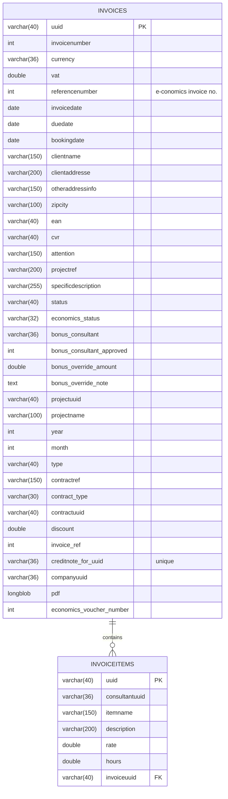
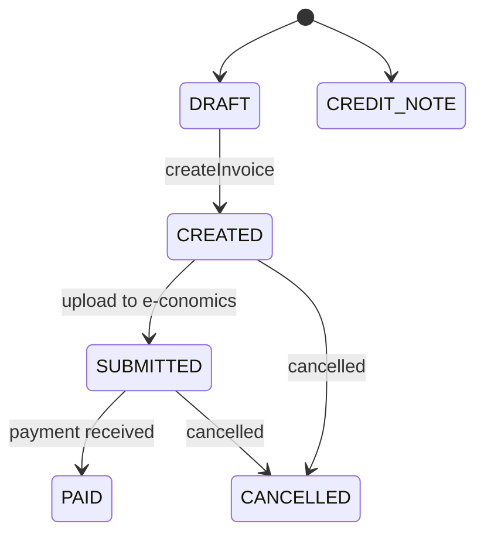
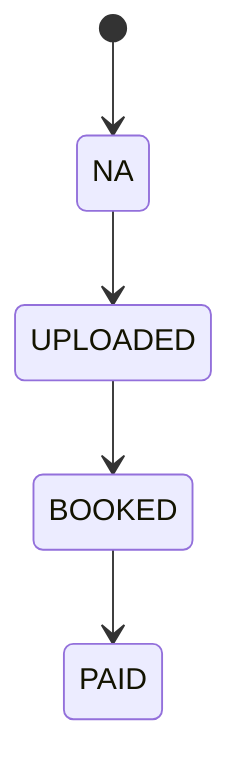

# Trustworks Intranet — Invoice Database & Process Documentation

> **Audience:** Backend & frontend developers, ops/DBAs  
> **Scope:** How the `invoices` and `invoiceitems` tables are structured and used by the application flows (drafting, editing, finalizing, credit notes, internal/phantom invoices), the REST endpoints involved, and how to query or extend the model safely.

---

## Table of Contents

1. [System Context](#system-context)
2. [High-Level Invoice Process](#high-level-invoice-process)
3. [Data Model](#data-model)
   - [Entity Relationship](#entity-relationship)
   - [Table: invoices](#table-invoices)
   - [Table: invoiceitems](#table-invoiceitems)
   - [Indexes & Constraints](#indexes--constraints)
   - [Enumerations & Conventions](#enumerations--conventions)
4. [Lifecycle & Field Mapping](#lifecycle--field-mapping)
5. [REST API Endpoints](#rest-api-endpoints)
6. [Calculations: Sums, VAT & Discounts](#calculations-sums-vat--discounts)
7. [Pagination in the Invoice Grid](#pagination-in-the-invoice-grid)
8. [Notes & Bonus Handling](#notes--bonus-handling)
9. [Operational Guidance & Common Queries](#operational-guidance--common-queries)
10. [Data Integrity & Gotchas](#data-integrity--gotchas)
11. [Extensibility Recommendations](#extensibility-recommendations)
12. [Appendix: Full SQL Schema](#appendix-full-sql-schema)

---

## System Context

- **Actors**
  - **Account Manager / Sales:** Reviews monthly client/project work, creates & edits *draft* invoices, submits final invoices, may create *credit notes* or *phantom/internal* invoices.
  - **Finance / Accounting:** Books invoices in **e‑conomics**; statuses are reflected back via `economics_status`.
- **Prerequisites**
  - Clients, Contracts, and Projects configured.
  - Work entries logged for the period.
- **Core Data Sources**
  - **WorkService**: Registered hours per consultant/project.
  - **ProjectService** / **ContractService**: Billable rules, discounts (e.g., `SKI0217_2021`).
  - **CompanyRestService**: Issuer selection & address details (used for internal invoices).
  - **InvoiceRestService**: All persistence & server‑side workflows.

---

## High-Level Invoice Process

> This section mirrors the current implementation.

1) **Select month & load candidates**  
   - `InvoiceView` asks `InvoiceService`/`InvoiceRestService` for candidate projects & existing invoices for the month (`loadProjectSummaryByYearAndMonth`, `getInvoicesForSingleMonth`).  
   - UI groups by **Client** → **Project**, showing *Registered vs Invoiced* amounts and highlighting users with not‑yet‑invoiced hours.

2) **Create a draft invoice**  
   - From a candidate: `InvoiceService.createInvoiceFromProject` → `InvoiceRestService.createDraftFromProject`.  
   - Special flows:
     - **Internal invoice drafts**: `createInternalInvoiceDraft(from company)`
     - **Internal service invoice drafts**: `createInternalServiceInvoiceDraft(from→to company, month)`
     - **Phantom invoices**: `createPhantomInvoice` (pro forma/placeholder)

3) **Edit draft invoice**  
   - Opens in **InvoiceDesign** with address/contact fields, dates, currency, VAT, discount, notes.  
   - Line items use `invoiceitems` rows. Users can add/edit/remove items (description, hours, rate, consultant), apply % discount, adjust VAT, and enter *invoice notes* (per contract+project+month, persisted as `InvoiceNote`).  
   - Sums update live (client-side) and are persisted via `InvoiceService.update` (REST: `updateDraftInvoice`).

4) **Create final invoice & related actions**  
   - **Create invoice**: `InvoiceService.createInvoice` transitions **DRAFT → CREATED** and triggers **server-side PDF** generation.  
   - **Credit note**: `InvoiceService.createCreditNote` creates a `CREDIT_NOTE` referencing the original invoice (`creditnote_for_uuid`).  
   - **Delete draft**: `InvoiceService.delete` removes a **DRAFT** (cascades to `invoiceitems`).  
   - **Regenerate PDF**: `InvoiceService.regeneratePdf` builds a fresh PDF for an invoice.

5) **Reference & bonus handling**  
   - Update references: `InvoiceService.updateInvoiceReference`.  
   - Sales/bonus approval: `InvoiceService.updateInvoiceBonusStatus` affects `bonus_consultant(_approved)`, `bonus_override_*`, and `SalesApprovalStatus` (UI).

6) **Economics & payment lifecycle**  
   - `economics_status`: `NA → UPLOADED → BOOKED → PAID`.  
   - Application-level `status`: `DRAFT → CREATED → SUBMITTED → (PAID | CANCELLED)`, with `CREDIT_NOTE` for credit notes.

---

## Data Model

### Entity Relationship



> **Cardinality:** One invoice has zero or more invoice items. Items are **deleted automatically** when a draft invoice is deleted (FK `ON DELETE CASCADE`).

---

### Table: `invoices`

**Storage:** `ENGINE=InnoDB`, `CHARSET=latin1`, `COLLATE=latin1_swedish_ci`  
**Primary key:** `uuid` (application-assigned)  
**Purpose:** Header-level invoice document, status fields, customer/contract metadata, and attached PDF.

| Column | Type / Default | Notes |
|---|---|---|
| `uuid` | `varchar(40)` PK | Application-generated ID. |
| `invoicenumber` | `int(11)` | Invoice number from Trustworks (optional until finalized). |
| `currency` | `varchar(36)` default `DKK` | ISO 4217 recommended values; enforced at app layer. |
| `vat` | `double` default `25` | VAT percentage (0–100). |
| `referencenumber` | `int(11)` default `0` | “Economics invoice number – fx from eworks.” |
| `invoicedate` | `date` | Issue date. |
| `duedate` | `date` | Due date. |
| `bookingdate` | `date` default `1900-01-01` | Booking date in e‑conomics. |
| `clientname` | `varchar(150)` | Invoice recipient name. |
| `clientaddresse` | `varchar(200)` | **Spelling note:** likely *clientaddress(e)*. |
| `otheraddressinfo` | `varchar(150)` | Additional address line. |
| `zipcity` | `varchar(100)` | Postal code & city. |
| `ean` | `varchar(40)` | EAN/GLN (for public sector). |
| `cvr` | `varchar(40)` | Company registration (DK CVR). |
| `attention` | `varchar(150)` | Attn: person or dept. |
| `projectref` | `varchar(200)` | Free-form project reference. |
| `specificdescription` | `varchar(255)` | Free-form header description. |
| `status` | `varchar(40)` | App lifecycle: `DRAFT`, `CREATED`, `SUBMITTED`, `PAID`, `CANCELLED`, or `CREDIT_NOTE`. |
| `economics_status` | `varchar(32)` default `NA` | `NA`, `UPLOADED`, `BOOKED`, `PAID`. |
| `bonus_consultant` | `varchar(36)` | Consultant receiving bonus. |
| `bonus_consultant_approved` | `int(11)` default `0` | 0/1 flag (approver). |
| `bonus_override_amount` | `double` default `0` | Absolute override. |
| `bonus_override_note` | `text` | Reasoning / audit note. |
| `projectuuid` | `varchar(40)` | Link to Project (app domain). |
| `projectname` | `varchar(100)` | Denormalized for reporting. |
| `year`, `month` | `int(11)` | Accounting period for candidate grouping. |
| `type` | `varchar(40)` | `INVOICE`, `CREDIT_NOTE`, `PHANTOM`, `INTERNAL`, `INTERNAL_SERVICE`. |
| `contractref` | `varchar(150)` default `'NULL'` | External contract reference (**string literal 'NULL'**). |
| `contract_type` | `varchar(30)` default `PERIOD` | Contract billing type (e.g., `PERIOD`). |
| `contractuuid` | `varchar(40)` | Link to Contract (app domain). |
| `discount` | `double` default `0` | Percentage discount (0–100). |
| `invoice_ref` | `int(11)` default `0` | Optional cross-ref id. |
| `creditnote_for_uuid` | `varchar(36)` unique | Points to the original invoice when type=`CREDIT_NOTE`. |
| `companyuuid` | `varchar(36)` default `'d8894494-2fb4-4f72-9e05-e6032e6dd691'` | Issuing company. |
| `pdf` | `longblob` | Generated PDF content. |
| `economics_voucher_number` | `int(11)` default `0` | Voucher booking ref from e‑conomics. |

---

### Table: `invoiceitems`

**Purpose:** Line-level details for an invoice: consultant, hours, rate, label/description.

| Column | Type / Default | Notes |
|---|---|---|
| `uuid` | `varchar(40)` PK | Application-generated ID. |
| `consultantuuid` | `varchar(36)` | Consultant performing the work. |
| `itemname` | `varchar(150)` | Short label (e.g., “Consulting”). |
| `description` | `varchar(200)` | Longer line description. |
| `rate` | `double` | Monetary rate (per hour/unit). |
| `hours` | `double` | Hours/quantity. |
| `invoiceuuid` | `varchar(40)` FK → `invoices.uuid` | **ON DELETE CASCADE**. |

**Important:** Money is stored as `double`. Consider moving to `DECIMAL(12,2)` (see [Gotchas](#data-integrity--gotchas)).

---

### Indexes & Constraints

**Primary & unique**
- `invoices.uuid` (PK), unique.
- `invoiceitems.uuid` (PK), unique.
- `invoices.creditnote_for_uuid` unique → at most one credit note per original invoice.

**Foreign keys**
- `invoiceitems.invoiceuuid` → `invoices.uuid` **ON DELETE CASCADE**.

**Secondary indexes (usage)**
- `invoices(year, month, projectuuid)` → monthly candidate queries and per‑project lookups.
- `invoices(projectuuid)` → quick project aggregations.
- `invoices(economics_status)` → finance dashboards.
- `invoices(economics_voucher_number)` → voucher reconciliation.

**Suggested additions (optional but recommended)**
- Unique key on `(companyuuid, invoicenumber)` when `invoicenumber` is set.
- Index on `(status, invoicedate)` for operational boards.
- Index on `(type)` if querying by invoice type is frequent.

---

### Enumerations & Conventions

- **Invoice Status (`invoices.status`)**: `DRAFT`, `CREATED`, `SUBMITTED`, `PAID`, `CANCELLED`, `CREDIT_NOTE`.
- **Economics Status (`invoices.economics_status`)**: `NA`, `UPLOADED`, `BOOKED`, `PAID`.
- **Invoice Type (`invoices.type`)**: `INVOICE`, `CREDIT_NOTE`, `PHANTOM`, `INTERNAL`, `INTERNAL_SERVICE`.
- **Contract Type (`invoices.contract_type`)**: `PERIOD` (others may exist at app layer).

State diagrams:





---

## Lifecycle & Field Mapping

This section ties user actions to DB mutations and REST calls.

| Step | REST / Service | DB Effects (high level) |
|---|---|---|
| Load candidates | `loadProjectSummaryByYearAndMonth`, `getInvoicesForSingleMonth` | Reads `invoices` by `(year, month)`; aggregates `invoiceitems` (if existing invoices). |
| Create draft (project) | `createDraftFromProject` → `POST /invoices/drafts` | Insert `invoices` row with `status=DRAFT`, `type=INVOICE` (unless internal/phantom flows). Set `year`,`month`,`projectuuid`, etc. |
| Create internal draft | `createInternalInvoiceDraft` / `createInternalServiceInvoiceDraft` | Insert `invoices` with `type=INTERNAL` or `INTERNAL_SERVICE`. |
| Create phantom draft | `createPhantomInvoice` | Insert `invoices` with `type=PHANTOM`. |
| Edit draft | `updateDraftInvoice` | Update mutable header fields; maintain related `invoiceitems`. |
| Add/Remove item | Part of draft update | Insert/Update/Delete `invoiceitems` where `invoiceuuid` = draft’s `uuid`. |
| Finalize invoice | `createInvoice` | Transition `status: DRAFT→CREATED`; generate & store `pdf`; optionally assign `invoicenumber`. |
| Submit/upload | Integration layer | `status: CREATED→SUBMITTED`; `economics_status: NA→UPLOADED/BOOKED`; set `referencenumber`, `economics_voucher_number`, `bookingdate`. |
| Payment posted | Import job / manual | `status: SUBMITTED→PAID`; `economics_status: BOOKED→PAID`. |
| Credit note | `createCreditNote` | New `invoices` row with `type=CREDIT_NOTE`, `status=CREATED`, and `creditnote_for_uuid` referencing the original. |
| Regenerate PDF | `regeneratePdf` | Rebuilds and overwrites `pdf`. |
| Delete draft | `delete` | Delete from `invoices` (and cascade `invoiceitems`). |

---

## REST API Endpoints

### Draft Invoice Creation Flow

Draft invoices are created by **POST** `/invoices/drafts` with mandatory query params:

- `contractuuid`
- `projectuuid`
- `month` — formatted `YYYY-MM-01`
- `type` — `CONTRACT` or `RECEIPT`

The REST client validates params and logs each request (URL + status). Non‑2xx responses include a short text body; `InvoiceRestService` logs and rethrows so the UI can surface the message.

**Example**

```
POST /invoices/drafts?contractuuid=<uuid>&projectuuid=<uuid>&month=2025-05-01&type=CONTRACT
```

### Other Notable Endpoints / Operations

- `GET /invoices?page=X&size=Y` — Paged list for the grid.  
- `GET /invoices/count` — Total count for grid pagination.  
- `PUT /invoices/{uuid}` — Update draft header & items (via `updateDraftInvoice`).  
- `POST /invoices/{uuid}/finalize` — Transition to `CREATED` and build PDF (via `createInvoice`).  
- `POST /invoices/{uuid}/credit-note` — Create `CREDIT_NOTE` for original.  
- `DELETE /invoices/{uuid}` — Delete **DRAFT** invoice (cascades items).  
- `POST /invoices/{uuid}/pdf:regenerate` — Rebuild attached PDF.  
- `PUT /invoices/{uuid}/reference` — Update reference numbers.  
- `PUT /invoices/{uuid}/bonus` — Update bonus fields & approval status.  

> **Logging:** All operations are logged via `JBossLog`, including draft creation URLs and error codes/messages.

---

## Calculations: Sums, VAT & Discounts

UI shows live totals based on the `invoiceitems` and header fields (`vat`, `discount`). On the server, sums are computed using logic equivalent to `Invoice.getSumNoTax` plus VAT/discount application.

**Definitions**

- **Line subtotal (no VAT):** `SUM(items.rate * items.hours)`
- **Discount (header-level):** percentage `invoices.discount` (0–100)
- **Net (no VAT):** `subtotal_no_tax * (1 - discount/100)`
- **VAT amount:** `net_no_tax * (vat/100)`
- **Gross total:** `net_no_tax + vat_amount`

**Example SQL (reporting-only; avoid for hot paths)**

```sql
SELECT
  i.uuid,
  COALESCE(SUM(it.rate * it.hours), 0)                    AS subtotal_no_vat,
  i.discount,
  i.vat,
  ROUND(COALESCE(SUM(it.rate * it.hours), 0) * (1 - i.discount/100), 2) AS net_no_vat,
  ROUND(COALESCE(SUM(it.rate * it.hours), 0) * (1 - i.discount/100) * (i.vat/100), 2) AS vat_amount,
  ROUND(COALESCE(SUM(it.rate * it.hours), 0) * (1 - i.discount/100) * (1 + i.vat/100), 2) AS total_gross
FROM invoices i
LEFT JOIN invoiceitems it ON it.invoiceuuid = i.uuid
WHERE i.uuid = :invoice_uuid
GROUP BY i.uuid;
```

> **Rounding:** The example uses `ROUND(..., 2)`. The application’s final rounding rules (banker’s rounding vs. half‑up) should be applied consistently in both PDF and any export.

---

## Pagination in the Invoice Grid

The invoice list uses a backend `DataProvider` which requests pages from:

- `GET /invoices?page=X&size=Y`
- `GET /invoices/count`

This allows lazy loading of larger datasets while still enabling `setAllRowsVisible(true)` for a full view.

---

## Notes & Bonus Handling

- **Notes lifecycle:** One `InvoiceNote` per **contract+project+month**. Edited via `InvoiceService.getInvoiceNote` / `updateInvoiceNote` from the UI. (Note: `InvoiceNote` is stored outside this schema.)
- **Bonus handling:**  
  - `bonus_consultant`: recipient of sales/bonus.  
  - `bonus_consultant_approved`: 0/1 approval switch.  
  - `bonus_override_amount`, `bonus_override_note`: absolute override and rationale.  
  - Updated via `InvoiceService.updateInvoiceBonusStatus`.

---

## Operational Guidance & Common Queries

### 1) Find invoices for a given month (by project)

```sql
SELECT *
FROM invoices
WHERE year = :y AND month = :m
ORDER BY clientname, projectname, invoicedate DESC;
```

### 2) Load draft for editing + its items

```sql
SELECT i.*, it.*
FROM invoices i
LEFT JOIN invoiceitems it ON it.invoiceuuid = i.uuid
WHERE i.uuid = :invoice_uuid;
```

### 3) Detect invoices uploaded/booked in e‑conomics but not yet paid

```sql
SELECT i.uuid, i.invoicenumber, i.referencenumber, i.economics_status
FROM invoices i
WHERE i.economics_status IN ('UPLOADED','BOOKED') AND i.status = 'SUBMITTED';
```

### 4) Credit notes and their originals

```sql
SELECT cn.uuid AS credit_uuid, cn.invoicenumber AS credit_no,
       orig.uuid AS original_uuid, orig.invoicenumber AS original_no
FROM invoices cn
JOIN invoices orig ON orig.uuid = cn.creditnote_for_uuid
WHERE cn.type = 'CREDIT_NOTE';
```

### 5) Items value audit (by consultant, month)

```sql
SELECT i.year, i.month, it.consultantuuid,
       ROUND(SUM(it.rate * it.hours), 2) AS value_no_vat
FROM invoices i
JOIN invoiceitems it ON it.invoiceuuid = i.uuid
GROUP BY i.year, i.month, it.consultantuuid
ORDER BY i.year DESC, i.month DESC;
```

### 6) Due in next 7 days (operational follow-up)

```sql
SELECT uuid, invoicenumber, clientname, duedate, status
FROM invoices
WHERE duedate BETWEEN CURRENT_DATE() AND DATE_ADD(CURRENT_DATE(), INTERVAL 7 DAY)
  AND status IN ('CREATED','SUBMITTED');
```

---

## Data Integrity & Gotchas

- **Money in `double`:** Floating-point may cause rounding drift. Prefer `DECIMAL(12,2)` for `rate`, `discount` as `DECIMAL(5,2)`, and `vat` as `DECIMAL(5,2)` (or keep VAT as integer percent). If changing, migrate with care and update calculations.
- **Encoding:** Schema uses `latin1_swedish_ci`. If your app is UTF‑8, consider migrating to `utf8mb4` to avoid mojibake in names/addresses.
- **Spelling:** `clientaddresse`—keep as-is for backward compatibility, but document clearly and consider adding a *view* with normalized alias.
- **`contractref` default `'NULL'`:** This is the literal string `"NULL"`, not SQL `NULL`. Queries should treat `'NULL'` as *unset* and consider normalizing in the application layer or via migration.
- **`invoicenumber` uniqueness:** Not unique by default. Ensure the application does not reuse numbers; consider a unique key `(companyuuid, invoicenumber)` once all historical data is clean.
- **PDF in-row (`longblob`):** Rows can become large; if DB backups grow or performance suffers, consider moving PDFs to object storage with a pointer in DB.
- **One credit note per original:** Enforced by `ux_invoices_creditnote_for_uuid`. If partial credit notes are needed, model them explicitly (e.g., link table).

---

## Extensibility Recommendations

1. **Add computed totals** *(optional)*: store `total_no_vat`, `vat_amount`, `total_gross` on `invoices` for faster reporting; maintain via app or triggers.
2. **Constraints via CHECK** *(MySQL 8+)*: emulate enums for `status`, `economics_status`, `type` to catch invalid values early.
3. **Reference data**: if `currency`, `vat` relate to companies/countries, centralize in reference tables.
4. **Auditing**: add `created_at`, `created_by`, `updated_at`, `updated_by` to both tables; log `status` transitions.
5. **Mermaid ERD & State Diagrams**: this doc includes Mermaid blocks; most markdown renderers can display them for team reviews.
6. **Performance**: confirm plans on `year,month,projectuuid` for candidate loading; ensure covering indexes if needed.
7. **API shape**: consider returning server-calculated totals alongside invoice DTOs to keep UI logic thin & consistent.

---

## Appendix: Full SQL Schema

> Exact DDL from the current database.

```sql
CREATE TABLE `invoices` (
  `uuid` varchar(40) NOT NULL,
  `invoicenumber` int(11) DEFAULT NULL,
  `currency` varchar(36) DEFAULT 'DKK',
  `vat` double DEFAULT 25,
  `referencenumber` int(11) DEFAULT 0 COMMENT 'Economics invoice number - fx from eworks',
  `invoicedate` date DEFAULT NULL,
  `duedate` date DEFAULT NULL,
  `bookingdate` date DEFAULT '1900-01-01',
  `clientname` varchar(150) DEFAULT NULL,
  `clientaddresse` varchar(200) DEFAULT NULL,
  `otheraddressinfo` varchar(150) DEFAULT NULL,
  `zipcity` varchar(100) DEFAULT NULL,
  `ean` varchar(40) DEFAULT NULL,
  `cvr` varchar(40) DEFAULT NULL,
  `attention` varchar(150) DEFAULT NULL,
  `projectref` varchar(200) DEFAULT NULL,
  `specificdescription` varchar(255) DEFAULT NULL,
  `status` varchar(40) DEFAULT NULL,
  `economics_status` varchar(32) NOT NULL DEFAULT 'NA',
  `bonus_consultant` varchar(36) DEFAULT NULL,
  `bonus_consultant_approved` int(11) DEFAULT 0,
  `bonus_override_amount` double DEFAULT 0,
  `bonus_override_note` text DEFAULT NULL,
  `projectuuid` varchar(40) DEFAULT NULL,
  `projectname` varchar(100) DEFAULT NULL,
  `year` int(11) DEFAULT NULL,
  `month` int(11) DEFAULT NULL,
  `type` varchar(40) DEFAULT NULL,
  `contractref` varchar(150) DEFAULT 'NULL',
  `contract_type` varchar(30) NOT NULL DEFAULT 'PERIOD',
  `contractuuid` varchar(40) DEFAULT NULL,
  `discount` double DEFAULT 0,
  `invoice_ref` int(11) DEFAULT 0,
  `creditnote_for_uuid` varchar(36) DEFAULT NULL,
  `companyuuid` varchar(36) NOT NULL DEFAULT 'd8894494-2fb4-4f72-9e05-e6032e6dd691',
  `pdf` longblob DEFAULT NULL,
  `economics_voucher_number` int(11) NOT NULL DEFAULT 0,
  PRIMARY KEY (`uuid`),
  UNIQUE KEY `invoices_uuid_uindex` (`uuid`),
  UNIQUE KEY `ux_invoices_creditnote_for_uuid` (`creditnote_for_uuid`),
  KEY `invoices_year_month_projectuuid_index` (`year`,`month`,`projectuuid`),
  KEY `invoices_projectuuid_index` (`projectuuid`),
  KEY `idx_invoices_economics_status` (`economics_status`),
  KEY `idx_invoices_economics_voucher_number` (`economics_voucher_number`)
) ENGINE=InnoDB DEFAULT CHARSET=latin1 COLLATE=latin1_swedish_ci;
```

```sql
CREATE TABLE `invoiceitems` (
  `uuid` varchar(40) NOT NULL,
  `consultantuuid` varchar(36) DEFAULT NULL,
  `itemname` varchar(150) DEFAULT NULL,
  `description` varchar(200) DEFAULT NULL,
  `rate` double DEFAULT NULL,
  `hours` double DEFAULT NULL,
  `invoiceuuid` varchar(40) DEFAULT NULL,
  PRIMARY KEY (`uuid`),
  KEY `invoiceitems_invoices_uuid_fk` (`invoiceuuid`),
  CONSTRAINT `invoiceitems_invoices_uuid_fk` FOREIGN KEY (`invoiceuuid`) REFERENCES `invoices` (`uuid`) ON DELETE CASCADE
) ENGINE=InnoDB DEFAULT CHARSET=latin1 COLLATE=latin1_swedish_ci;
```
