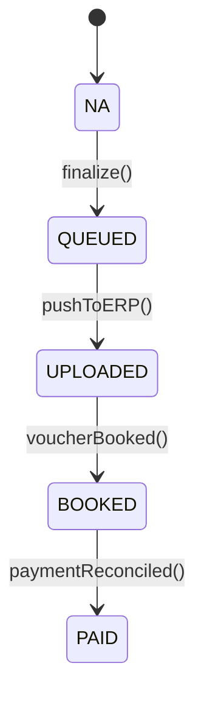

# Trustworks Intranet — Invoice Flow, Process & Data‑Model Optimization

### Architecture proposal + phased rollout plan (with detailed accept/exit criteria)

**Audience:** Engineering (backend, frontend, data), Product, Finance/Operations  
**Scope:** Improvements to user flow, service/process orchestration, data model & APIs for invoices, including credit/internal/phantom flows and the e‑conomics integration.  
**Principles:** Single source of truth, explicit state machines, idempotency, traceability, correctness of money, performance, operability, and backwards compatibility during migration.

⸻

## 1) Recommended Design Changes (flow, process, data model)

### A. Flow & UX Improvements
#### 1. Single‑source totals (server‑authoritative)
• **Problem:** Totals are computed both in UI and backend (duplication + drift risk, e.g., SKI rules).  
• **Change:** Move all monetary calculations (discounts, VAT, SKI0217_2021 adjustments, fees) to the backend. The UI renders server‑computed amounts only and shows explicit derived lines (e.g., SKI key discount, admin fee) so totals are explainable.  
• **API:** Every invoice payload includes totals (subtotal, discounts, vat_amount, grand_total) and any system‑generated “derived” lines (read‑only flags).

#### 2. Guard‑rails before “Create draft” & “Finalize”
• **Pre‑Draft checks:** contract address present, currency/VAT policy resolved, project linkage valid, required reference fields for public sector (EAN), and any contract rule (e.g., SKI).  
• **Pre‑Finalize checks:** zero missing addresses, due date logic, bonus approval (if mandatory), internal consistency (no negative quantities unless line type is “discount/credit”).  
• **UX:** Show a short “Readiness” checklist (all green before enabling the primary action).

#### 3. Partial invoicing and traceability
• **Change:** Link line items to underlying work entries (many‑to‑many) so the system can:  
• Mark only the invoiced subset of work as paid out.  
• Prevent double invoicing of the same work.  
• Explain “what makes up this line?” in the UI.

#### 4. Side‑by‑side compare & relation cues (credit/original)
• Keep your current relation banner and side‑by‑side compare, but extend:  
• Show delta between the credit and original per line (when linked).  
• Badge tabs by relation group with deterministic color (your current approach is good—keep it).

#### 5. Robust reorder of line items
• **Problem:** Reordering deletes/reinserts items; IDs change.  
• **Change:** Add position to items and update positions on reorder. Preserve stable item UUIDs to support audit/links to work entries.

#### 6. Operational dashboard
• Add a small Finance/Operations dashboard: “Queued to e‑conomics”, “Uploaded, awaiting booking”, “Booked, awaiting payment”, “Failed pushes (retrying)”, etc.

⸻

### B. Process & Service Orchestration
#### 1. Explicit status machines
• **Application status (app_status):** DRAFT → CREATED → SUBMITTED → (PAID | CANCELLED) with CREDIT_NOTE as a separate type (not a final status).  
• **ERP sync status (erp_status):** NA → QUEUED → UPLOADED → BOOKED → PAID.  
• **Rules:**  
• finalize moves DRAFT → CREATED and enqueues to ERP (erp_status=QUEUED).  
• A background worker pushes to e‑conomics; on success, erp_status=UPLOADED; on voucher booking, BOOKED; on settlement, PAID.  
• No direct UI thread → ERP calls. UI fire‑and‑forgets; progress is visible via status fields.

#### 2. Outbox + Idempotency on ERP integration
• **Implement the Transactional Outbox pattern:**  
• invoice_outbox(id, invoice_uuid, attempt_count, next_attempt_at, idempotency_key, last_error, status).  
• Worker reads outbox in FIFO, retries with backoff, and sets erp_status.  
• Include idempotency key per invoice when calling e‑conomics to prevent duplicates.

#### 3. Invoice numbering as a safe sequence
• **Replace “max(invoicenumber)+1” with a per‑company sequence table:**  
• invoice_number_seq(companyuuid PK, next_number).  
• SELECT … FOR UPDATE in a single transaction to allocate a number atomically.  
• Unique constraint (companyuuid, invoicenumber) enforced when invoicenumber > 0 (see DDL approach below).

#### 4. Credit notes (generalize for partial credits)
• Allow partial credits by linking credit lines to original line UUIDs.  
• Keep the one credit note per invoice uniqueness if that’s a business rule; if not, change to “many credit notes allowed, total credited ≤ original.”

#### 5. Internal & intercompany
• For INTERNAL and INTERNAL_SERVICE, persist a cross‑link:  
• intercompany_link(outgoing_invoice_uuid, incoming_invoice_uuid, relation_type)  
• Enables reconciliation and eliminates ad‑hoc matching by invoice_ref.

⸻

### C. Data Model / Storage

**Goals:** Correct money types, UTF‑8, normalized addresses, predictable ordering, auditability, traceability to work, multi‑currency snapshotting, lighter DB by moving PDFs to object storage.

	1.	Money & quantities  
	• Replace double with:  
	• DECIMAL(12,2) for amounts/rates  
	• DECIMAL(9,3) for hours/quantities  
	• DECIMAL(5,2) for VAT %, discount %  
	• Add rounding policy (half‑up) and make it uniform across API, PDF, and reports.  
	2.	UTF‑8 everywhere  
	• Migrate schema to utf8mb4 to avoid mojibake in addresses/names.  
	• Keep a compatibility view if consumers expect old collations.  
	3.	Normalize address & rename typo  
	• Keep legacy clientaddresse for backward compatibility, introduce:  
	• bill_to_name, bill_to_line1, bill_to_line2, bill_to_postcode, bill_to_city, bill_to_country  
	• Add a generated column or a view to emulate clientaddresse.  
	4.	Line items  
	• Add: position INT, line_type ENUM('STANDARD','DISCOUNT','FEE','TAX_EXEMPT','CREDIT'), tax_rate DECIMAL(5,2), source_type, source_id (work linkage).  
	• Preserve consultantuuid, but model many‑to‑many via invoice_item_sources(invoice_item_uuid, work_entry_id, amount_allocated) to support partial invoicing.  
	5.	Totals snapshot & currency  
	• Add to invoices: exchange_rate DECIMAL(12,6), subtotal DECIMAL(12,2), discount_total, vat_total, grand_total.  
	• All are snapshotted at finalize; later re‑computations never alter the historical document.  
	6.	Files to object storage  
	• Move pdf LONG BLOB to object storage:  
	• Add pdf_object_key VARCHAR(255), pdf_sha256 CHAR(64).  
	• Keep DB lean and backups fast.  
	7.	Audit & versioning  
	• Add created_at, created_by, updated_at, updated_by, version (optimistic locking) on invoices and invoiceitems.  
	8.	Constraints & indexes (MySQL 8+)  
	• CHECKs (or enforce in app if unavailable):  
	• vat between 0 and 100, discount between 0 and 100  
	• Indexes:  
	• (year, month, projectuuid, status)  
	• (companyuuid, invoicenumber) unique, but only when invoicenumber>0  
MySQL workaround: unique index (companyuuid, invoicenumber, is_real) where is_real is a generated column invoicenumber>0.  
9.	Notes  
• Continue supporting “sticky notes” by (contract, project, month), but also allow invoice‑scoped notes (invoice_uuid) for final documents.

⸻

### D. API shape (summary)
• GET `/invoices/{id}` → returns:  
• header, items (with position, line_type, tax_rate, sources), totals, statuses, links (credit/original), documents (pdf key/hash), audit, version.  
• POST `/invoices/drafts` (validate prerequisites; return draft with server-calculated default lines).  
• PUT `/invoices/{id}` (optimistic lock with `If-Match: <version>`).  
PATCH `/invoices/{id}/items/order` (positions only).  
PATCH `/invoices/{id}/items/{itemId}` (partial edit; preserves item UUID).  
• POST `/invoices/{id}:finalize` → assigns sequence number, computes snapshots, enqueues outbox.  
• POST `/invoices/{id}:credit` (partial/full; takes line refs or amounts).  
• GET `/invoices/status` for operations dashboard (queue depth, last errors, etc.).

⸻

## 2) Phased Delivery Plan

Each phase is small, independently shippable, and contains detailed acceptance criteria.  
Target order reduces risk: foundations (money types & totals) → states/outbox → UX & traceability → storage & ops hardening.

⸻

### Phase 1 — Monetary correctness & single source of truth

**Design**  
• Introduce server‑authoritative totals:  
• Add totals object to API; UI stops doing monetary math except local formatting.  
• Introduce derived lines (read‑only) for SKI0217_2021 discounts and the fixed fee.  
• Add position on invoiceitems; reorder updates only position.  
• Start storing exchange_rate at finalize (no changes to UI yet).  
• Keep existing columns; do not change types in this phase to minimize risk.

**DB DDL (additive only)**
```sql
ALTER TABLE invoiceitems ADD COLUMN position INT NOT NULL DEFAULT 1000 AFTER hours;
ALTER TABLE invoices ADD COLUMN exchange_rate DECIMAL(12,6) NULL AFTER currency;
-- Optional: precompute snapshot totals (fill in next phase)
ALTER TABLE invoices
ADD COLUMN subtotal DECIMAL(12,2) NULL,
ADD COLUMN discount_total DECIMAL(12,2) NULL,
ADD COLUMN vat_total DECIMAL(12,2) NULL,
ADD COLUMN grand_total DECIMAL(12,2) NULL;
```

**API**  
• GET `/invoices/{id}` returns totals + derivedLines.  
• PATCH `/invoices/{id}/items/order` accepts `[{itemUuid, position}]`.

**UI**  
• Replace all client‑side totals with API values; render derived lines with lock icon.  
• Reorder uses new endpoint, not delete/reinsert.

**Accept Criteria**  
• Totals (subtotal, vat, grand) match PDF exactly for 100% of sampled invoices (≥ 50 mixed types).  
• Reorder does not change item UUIDs.  
• SKI contracts show 3 lines (key % discount, 2% admin, fixed fee) as read‑only derived lines; removing them is not allowed.  
• No regressions in “Create Draft”, “Finalize”, “Credit Note”, “Internal”.

⸻

### Phase 2 — Status machines & ERP outbox

**Design**  
• Introduce erp_status (NA, QUEUED, UPLOADED, BOOKED, PAID) and background worker.  
• finalize enqueues an outbox row; worker pushes to e‑conomics with idempotency; retries with backoff.  
• Gate transitions (REST layer enforces legal transitions).

**DB DDL**
```sql
CREATE TABLE invoice_outbox (
id BIGINT PRIMARY KEY AUTO_INCREMENT,
invoice_uuid VARCHAR(40) NOT NULL,
idempotency_key VARCHAR(64) NOT NULL,
attempt_count INT NOT NULL DEFAULT 0,
next_attempt_at DATETIME NOT NULL,
status ENUM('QUEUED','DELIVERING','FAILED','DELIVERED') NOT NULL DEFAULT 'QUEUED',
last_error TEXT NULL,
created_at DATETIME NOT NULL DEFAULT CURRENT_TIMESTAMP,
UNIQUE KEY uk_outbox_idem (idempotency_key)
);

ALTER TABLE invoices
ADD COLUMN erp_status ENUM('NA','QUEUED','UPLOADED','BOOKED','PAID') NOT NULL DEFAULT 'NA' AFTER status;
```

**API**  
• POST `/invoices/{id}:finalize` → sets app_status=CREATED, erp_status=QUEUED, creates outbox row.

**Worker**  
• Cron/queue runner with exponential backoff; marks erp_status based on results.  
• Do not block UI on ERP availability.

**Accept Criteria**  
• Finalize returns in < 500 ms (no synchronous ERP call).  
• If ERP is down, invoice remains erp_status=QUEUED and is retried until UPLOADED.  
• Duplicate finalize calls produce one ERP document only (idempotency).  
• Transitions: illegal transitions return 409 with machine-readable error.

⸻

### Phase 3 — Optimistic locking, audit & versioned updates

**Design**  
• Add version (rowversion) fields; enforce with If‑Match/ETag on PUT/PATCH.  
• Add created_at/by, updated_at/by on invoices/items.  
• Persist audit trail of sensitive fields (status, totals, number).

**DB DDL**
```sql
ALTER TABLE invoices
ADD COLUMN version INT NOT NULL DEFAULT 0,
ADD COLUMN created_at DATETIME NOT NULL DEFAULT CURRENT_TIMESTAMP,
ADD COLUMN created_by VARCHAR(36) NULL,
ADD COLUMN updated_at DATETIME NOT NULL DEFAULT CURRENT_TIMESTAMP ON UPDATE CURRENT_TIMESTAMP,
ADD COLUMN updated_by VARCHAR(36) NULL;

ALTER TABLE invoiceitems
ADD COLUMN version INT NOT NULL DEFAULT 0,
ADD COLUMN created_at DATETIME NOT NULL DEFAULT CURRENT_TIMESTAMP,
ADD COLUMN created_by VARCHAR(36) NULL,
ADD COLUMN updated_at DATETIME NOT NULL DEFAULT CURRENT_TIMESTAMP ON UPDATE CURRENT_TIMESTAMP,
ADD COLUMN updated_by VARCHAR(36) NULL;
```

**API**  
• GET `/invoices/{id}` returns ETag (from version).  
• PUT/PATCH require If‑Match; stale updates return 409.

**Accept Criteria**  
• Two simultaneous edits to the same draft cause one to be rejected with 409.  
• Audit shows who changed what & when for status and monetary fields.

⸻

### Phase 4 — Correct money types & UTF‑8 migration

**Design**  
• Convert money/hours from DOUBLE to DECIMAL; migrate collation to utf8mb4.

**DB DDL (online migration pattern)**  
1. Add shadow columns (*_dec) and backfill from existing data.  
2. Flip reads to use shadow columns in code.  
3. Backfill verification (100% rows).  
4. Swap names (or keep originals as generated columns).  
5. Collation switch.

**Illustrative snippet (per column; do per table in maintenance window):**
```sql
ALTER TABLE invoiceitems ADD COLUMN rate_dec DECIMAL(12,2) NULL, ADD COLUMN hours_dec DECIMAL(9,3) NULL, ALGORITHM=INPLACE, LOCK=NONE;
UPDATE invoiceitems SET rate_dec = rate, hours_dec = hours WHERE rate_dec IS NULL OR hours_dec IS NULL;
-- Code switch to read rate_dec/hours_dec
ALTER TABLE invoiceitems DROP COLUMN rate, DROP COLUMN hours,
CHANGE COLUMN rate_dec rate DECIMAL(12,2) NOT NULL,
CHANGE COLUMN hours_dec hours DECIMAL(9,3) NOT NULL;

-- Collation
ALTER TABLE invoices CONVERT TO CHARACTER SET utf8mb4 COLLATE utf8mb4_0900_ai_ci;
ALTER TABLE invoiceitems CONVERT TO CHARACTER SET utf8mb4 COLLATE utf8mb4_0900_ai_ci;
```

**Accept Criteria**  
• Recompute totals for a sample of historical invoices (≥ 200) — no drift > DKK 0.01 compared to PDFs.  
• All UI strings render correctly (names with emojis/accents etc.).

⸻

### Phase 5 — Work traceability & partial invoicing

**Design**  
• Introduce invoice_item_sources (link item ↔ work entries, optional amount split).  
• Update “finalize” to mark linked work as paid out, not whole project‑month.

**DB DDL**
```sql
CREATE TABLE invoice_item_sources (
invoice_item_uuid VARCHAR(40) NOT NULL,
work_entry_id     VARCHAR(40) NOT NULL,
amount_allocated  DECIMAL(12,2) NOT NULL,
PRIMARY KEY (invoice_item_uuid, work_entry_id),
KEY idx_work (work_entry_id),
CONSTRAINT fk_iis_item FOREIGN KEY (invoice_item_uuid) REFERENCES invoiceitems(uuid) ON DELETE CASCADE
);
```

**API/UI**  
• “Add from work” picker in draft: select entries & split amounts/hours into a line.  
• “Show provenance” on a line lists linked work items.  
• “Not yet invoiced” indicator derives from unlinked work entries.

**Accept Criteria**  
• Marking paid‑out is only applied to linked work entries at finalize.  
• Same entry cannot be linked twice to different invoices (enforced by Work service or via a unique constraint there).

⸻

### Phase 6 — Credit notes (partial credits) & intercompany links

**Design**  
• Credit API accepts: (a) full credit, (b) partial with per‑line refs/amounts.  
• Introduce credit_for_item_uuid NULL on invoiceitems of credit notes.  
• Add intercompany_link table to pair internal service “sender/receiver”.

**DB DDL**
```sql
ALTER TABLE invoiceitems ADD COLUMN credit_for_item_uuid VARCHAR(40) NULL;
CREATE TABLE intercompany_link (
outgoing_invoice_uuid VARCHAR(40) NOT NULL,
incoming_invoice_uuid VARCHAR(40) NOT NULL,
relation_type ENUM('INTERNAL','INTERNAL_SERVICE') NOT NULL,
PRIMARY KEY (outgoing_invoice_uuid, incoming_invoice_uuid)
);
```

**UI**  
• Credit creation wizard: pick lines & amounts; show running total.

**Accept Criteria**  
• Create partial credit that matches selected lines; totals must equal sum of credited amounts (with VAT rules).  
• Intercompany dashboard shows matched pairs; no orphaned internals.

⸻

### Phase 7 — File storage off DB (object storage)

**Design**  
• Generate PDFs to object storage (S3/Azure Blob/GCS); store pdf_object_key, pdf_sha256.  
• Provide signed URLs or a proxy download endpoint.

**DB DDL**
```sql
ALTER TABLE invoices
ADD COLUMN pdf_object_key VARCHAR(255) NULL,
ADD COLUMN pdf_sha256 CHAR(64) NULL;

-- Optional: keep pdf BLOB during transition; later set to NULL to slim DB.
```

**Accept Criteria**  
• Download always succeeds through new path; PDFs checksum‑verified.  
• DB backup size reduces materially; restore time improves.

⸻

### Phase 8 — Address normalization & typo remediation

**Design**  
• Add normalized billing address fields.  
• Create a view invoices_v that exposes legacy names (e.g., clientaddresse) mapped from normalized fields so existing reports don’t break.

**DB DDL**
```sql
ALTER TABLE invoices
ADD COLUMN bill_to_name      VARCHAR(150) NULL,
ADD COLUMN bill_to_line1     VARCHAR(200) NULL,
ADD COLUMN bill_to_line2     VARCHAR(200) NULL,
ADD COLUMN bill_to_postcode  VARCHAR(20)  NULL,
ADD COLUMN bill_to_city      VARCHAR(100) NULL,
ADD COLUMN bill_to_country   VARCHAR(2)   NULL;

-- Optional legacy view (example)
-- CREATE VIEW invoices_legacy AS SELECT ..., CONCAT_WS(' ', bill_to_line1, bill_to_line2) AS clientaddresse, ... FROM invoices;
```

**Accept Criteria**  
• New drafts use normalized fields; legacy export/queries keep working.  
• Public‑sector invoices validate EAN presence (when bill_to_country='DK' and customer flagged as public).

⸻

### Phase 9 — Performance & operational hardening

**Design**  
• Add covering indexes for hot queries; review EXPLAIN plans.  
• Introduce materialized monthly aggregates (or cached views) for dashboards.  
• Build Operations screen for ERP queue, last errors, retry counts.

**Accept Criteria**  
• “Load candidates for month” completes p95 < 800 ms for N≈10k work entries.  
• ERP queue shows live metrics; failed deliveries are retried automatically; manual “Retry now” action works.

⸻

### Phase 10 — Security & roles

**Design**  
• Replace @RolesAllowed("SYSTEM") on invoice resource with fine‑grained roles (SALES, FINANCE, ADMIN), aligning UI and service.  
• Add scope‑based API tokens for machine‑to‑machine (ERP worker).

**Accept Criteria**  
• Unauthorized calls return 403 with consistent problem+json body.  
• Pen tests confirm least‑privilege posture.

⸻

## Reference Details (Design Blueprints)

### 1) State Machines



**Invariants**  
• invoicenumber > 0 iff type != PHANTOM and app_status >= CREATED.  
• erp_status != NA only after finalize.  
• One credit note per invoice if business rule stands; otherwise enforce SUM(credits) ≤ original.

⸻

### 2) Example Payload (server‑authoritative totals & derived lines)

```json
{
"uuid": "…",
"type": "INVOICE",
"app_status": "CREATED",
"erp_status": "QUEUED",
"companyuuid": "…",
"invoicenumber": 12345,
"currency": "DKK",
"exchange_rate": 1.000000,
"header": {
"bill_to_name": "Acme A/S",
"bill_to_line1": "Main St 1",
"bill_to_postcode": "2100",
"bill_to_city": "København",
"ean": "5790001330552",
"cvr": "12345678"
},
"items": [
{ "uuid": "…", "position": 100, "line_type": "STANDARD", "itemname": "Consulting", "hours": 12.50, "rate": 1200.00, "tax_rate": 25.00, "sources": [{"work_entry_id":"w1","amount_allocated":15000.00}] },
{ "uuid": "…", "position": 900, "line_type": "DISCOUNT", "itemname": "SKI key discount 4%", "hours": 1, "rate": -600.00, "tax_rate": 25.00, "readOnly": true }
],
"totals": {
"subtotal": 15000.00,
"discount_total": 600.00,
"vat_total": 3600.00,
"grand_total": 18000.00
},
"documents": [{"kind":"pdf","objectKey":"invoices/2025/05/…pdf","sha256":"…"}],
"version": 7
}
```

⸻

### 3) Unique‑when‑real invoice number (MySQL trick)

```sql
ALTER TABLE invoices
ADD COLUMN is_real TINYINT(1) AS (invoicenumber > 0) PERSISTENT,
ADD UNIQUE KEY uk_company_real_number (companyuuid, invoicenumber, is_real);
```

⸻

### 4) Error model (consistent responses)
   • 400 — Validation failed (pre‑draft/finalize checklist).  
   • 409 — Illegal status transition / optimistic lock failure.  
   • 422 — Monetary mismatch (internal invariant; should not happen if API is used correctly).

All errors return a small JSON:
```json
{ "error": "ILLEGAL_TRANSITION", "message": "Cannot finalize a non-draft invoice.", "details": { "from":"CREATED", "to":"CREATED" } }
```

⸻

## Risks & Mitigations
• Schema migrations (money types): Use additive shadow columns then swap to avoid downtime. Verify with sampled PDFs.  
• ERP coupling: The outbox pattern isolates availability issues and adds idempotency.  
• Behavior change on SKI rules: Making lines explicit improves explainability and auditing; keep the exact math unchanged.  
• Sequence race conditions: Solved by table‑backed, transactional sequences.

⸻

## Rollback Strategy
• Each phase is feature‑flagged.  
• Keep legacy codepaths for one release cycle; feature flag off → revert to previous behavior without DB drops.  
• Backups taken before DDL; DDL is forward‑only (drops happen only after a stabilization period).

⸻

## Summary of Benefits
• Correctness: DECIMAL money + single calculation source eliminates rounding drift.  
• Reliability: Outbox + idempotency decouples UI from ERP and stops duplicates.  
• Traceability: Line↔work links explain every kroner and prevent double invoicing.  
• Scalability: Object storage for PDFs and proper indexes keep DB lean and fast.  
• Operability: Clear states, retries, and dashboards make incidents diagnosable.  
• UX: Guard‑rails and explicit derived lines reduce errors and support review/approvals.

⸻

## Appendix — Quick Checklist for Implementation
• Add position, totals, exchange_rate fields; serve totals via API.  
• Introduce erp_status, invoice_outbox, background worker & retries.  
• Switch reorder to position updates; keep UUIDs stable.  
• Add optimistic locking (version) and audit fields.  
• Migrate money → DECIMAL and schema → utf8mb4.  
• Implement work traceability (invoice_item_sources).  
• Support partial credits and intercompany links.  
• Move PDFs to object storage, provide download endpoint.  
• Normalize addresses, keep legacy view/compat.  
• Add ops dashboard + metrics, adjust roles & scopes.

⸻
