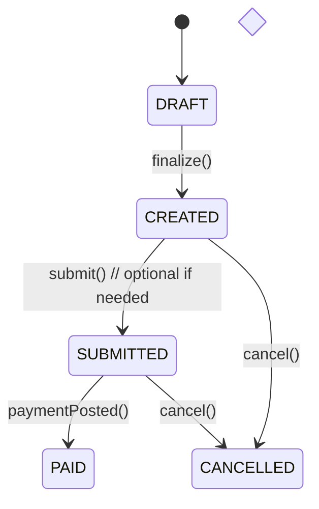
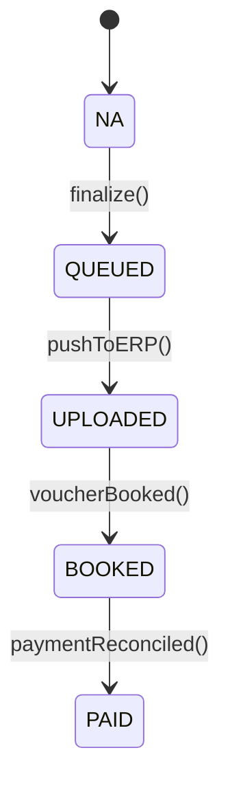
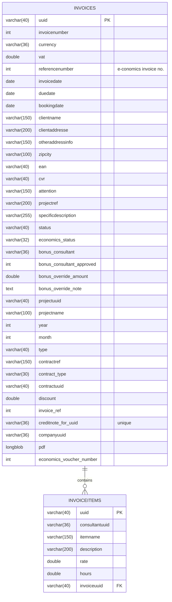
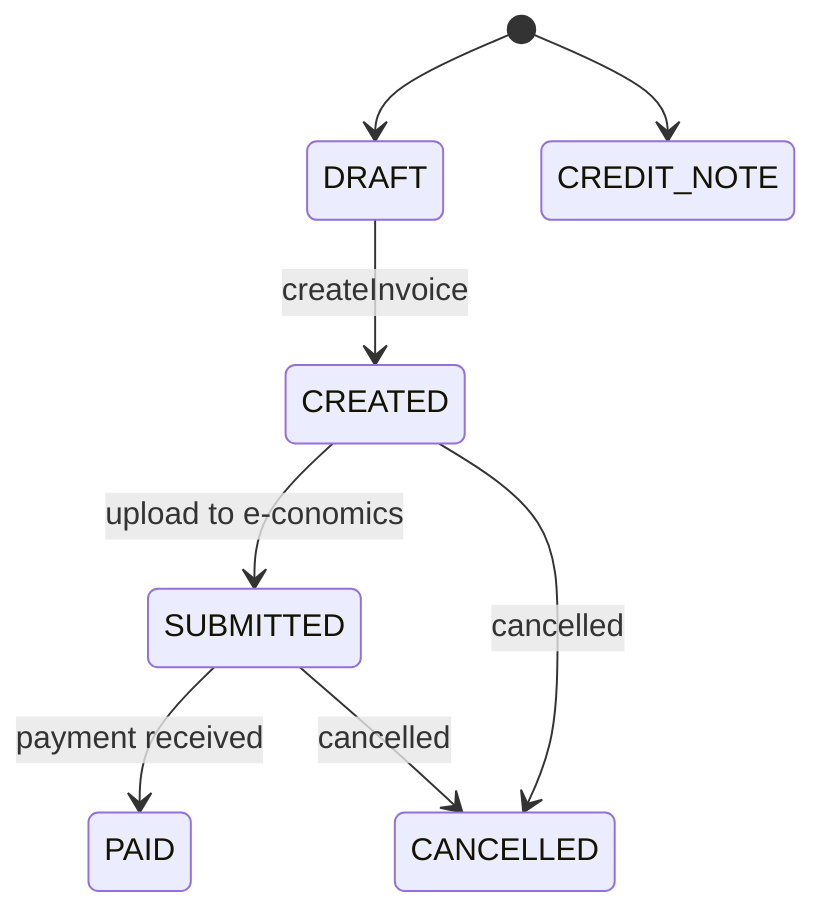
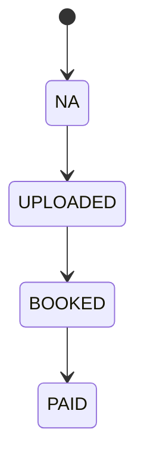

# Trustworks Intranet — Invoice Flow, Process & Data‑Model Optimization

### Architecture proposal + phased rollout plan (with detailed accept/exit criteria)

**Audience:** Engineering (backend, frontend, data), Product, Finance/Operations  
**Scope:** Improvements to user flow, service/process orchestration, data model & APIs for invoices, including credit/internal/phantom flows and the e‑conomics integration.  
**Principles:** Single source of truth, explicit state machines, idempotency, traceability, correctness of money, performance, operability, and backwards compatibility during migration.

⸻

## 1) Recommended Design Changes (flow, process, data model)

### A. Flow & UX Improvements
#### 1. Single‑source totals (server‑authoritative)
• **Problem:** Totals are computed both in UI and backend (duplication + drift risk, e.g., SKI rules).  
• **Change:** Move all monetary calculations (discounts, VAT, SKI0217_2021 adjustments, fees) to the backend. The UI renders server‑computed amounts only and shows explicit derived lines (e.g., SKI key discount, admin fee) so totals are explainable.  
• **API:** Every invoice payload includes totals (subtotal, discounts, vat_amount, grand_total) and any system‑generated “derived” lines (read‑only flags).

#### 2. Guard‑rails before “Create draft” & “Finalize”
• **Pre‑Draft checks:** contract address present, currency/VAT policy resolved, project linkage valid, required reference fields for public sector (EAN), and any contract rule (e.g., SKI).  
• **Pre‑Finalize checks:** zero missing addresses, due date logic, bonus approval (if mandatory), internal consistency (no negative quantities unless line type is “discount/credit”).  
• **UX:** Show a short “Readiness” checklist (all green before enabling the primary action).

#### 3. Partial invoicing and traceability
• **Change:** Link line items to underlying work entries (many‑to‑many) so the system can:  
• Mark only the invoiced subset of work as paid out.  
• Prevent double invoicing of the same work.  
• Explain “what makes up this line?” in the UI.

#### 4. Side‑by‑side compare & relation cues (credit/original)
• Keep your current relation banner and side‑by‑side compare, but extend:  
• Show delta between the credit and original per line (when linked).  
• Badge tabs by relation group with deterministic color (your current approach is good—keep it).

#### 5. Robust reorder of line items
• **Problem:** Reordering deletes/reinserts items; IDs change.  
• **Change:** Add position to items and update positions on reorder. Preserve stable item UUIDs to support audit/links to work entries.

#### 6. Operational dashboard
• Add a small Finance/Operations dashboard: “Queued to e‑conomics”, “Uploaded, awaiting booking”, “Booked, awaiting payment”, “Failed pushes (retrying)”, etc.

⸻

### B. Process & Service Orchestration
#### 1. Explicit status machines
• **Application status (app_status):** DRAFT → CREATED → SUBMITTED → (PAID | CANCELLED) with CREDIT_NOTE as a separate type (not a final status).  
• **ERP sync status (erp_status):** NA → QUEUED → UPLOADED → BOOKED → PAID.  
• **Rules:**  
• finalize moves DRAFT → CREATED and enqueues to ERP (erp_status=QUEUED).  
• A background worker pushes to e‑conomics; on success, erp_status=UPLOADED; on voucher booking, BOOKED; on settlement, PAID.  
• No direct UI thread → ERP calls. UI fire‑and‑forgets; progress is visible via status fields.

#### 2. Outbox + Idempotency on ERP integration
• **Implement the Transactional Outbox pattern:**  
• invoice_outbox(id, invoice_uuid, attempt_count, next_attempt_at, idempotency_key, last_error, status).  
• Worker reads outbox in FIFO, retries with backoff, and sets erp_status.  
• Include idempotency key per invoice when calling e‑conomics to prevent duplicates.

#### 3. Invoice numbering as a safe sequence
• **Replace “max(invoicenumber)+1” with a per‑company sequence table:**  
• invoice_number_seq(companyuuid PK, next_number).  
• SELECT … FOR UPDATE in a single transaction to allocate a number atomically.  
• Unique constraint (companyuuid, invoicenumber) enforced when invoicenumber > 0 (see DDL approach below).

#### 4. Credit notes (generalize for partial credits)
• Allow partial credits by linking credit lines to original line UUIDs.  
• Keep the one credit note per invoice uniqueness if that’s a business rule; if not, change to “many credit notes allowed, total credited ≤ original.”

#### 5. Internal & intercompany
• For INTERNAL and INTERNAL_SERVICE, persist a cross‑link:  
• intercompany_link(outgoing_invoice_uuid, incoming_invoice_uuid, relation_type)  
• Enables reconciliation and eliminates ad‑hoc matching by invoice_ref.

⸻

### C. Data Model / Storage

**Goals:** Correct money types, UTF‑8, normalized addresses, predictable ordering, auditability, traceability to work, multi‑currency snapshotting, lighter DB by moving PDFs to object storage.

	1.	Money & quantities  
	• Replace double with:  
	• DECIMAL(12,2) for amounts/rates  
	• DECIMAL(9,3) for hours/quantities  
	• DECIMAL(5,2) for VAT %, discount %  
	• Add rounding policy (half‑up) and make it uniform across API, PDF, and reports.  
	2.	UTF‑8 everywhere  
	• Migrate schema to utf8mb4 to avoid mojibake in addresses/names.  
	• Keep a compatibility view if consumers expect old collations.  
	3.	Normalize address & rename typo  
	• Keep legacy clientaddresse for backward compatibility, introduce:  
	• bill_to_name, bill_to_line1, bill_to_line2, bill_to_postcode, bill_to_city, bill_to_country  
	• Add a generated column or a view to emulate clientaddresse.  
	4.	Line items  
	• Add: position INT, line_type ENUM('STANDARD','DISCOUNT','FEE','TAX_EXEMPT','CREDIT'), tax_rate DECIMAL(5,2), source_type, source_id (work linkage).  
	• Preserve consultantuuid, but model many‑to‑many via invoice_item_sources(invoice_item_uuid, work_entry_id, amount_allocated) to support partial invoicing.  
	5.	Totals snapshot & currency  
	• Add to invoices: exchange_rate DECIMAL(12,6), subtotal DECIMAL(12,2), discount_total, vat_total, grand_total.  
	• All are snapshotted at finalize; later re‑computations never alter the historical document.  
	6.	Files to object storage  
	• Move pdf LONG BLOB to object storage:  
	• Add pdf_object_key VARCHAR(255), pdf_sha256 CHAR(64).  
	• Keep DB lean and backups fast.  
	7.	Audit & versioning  
	• Add created_at, created_by, updated_at, updated_by, version (optimistic locking) on invoices and invoiceitems.  
	8.	Constraints & indexes (MySQL 8+)  
	• CHECKs (or enforce in app if unavailable):  
	• vat between 0 and 100, discount between 0 and 100  
	• Indexes:  
	• (year, month, projectuuid, status)  
	• (companyuuid, invoicenumber) unique, but only when invoicenumber>0  
MySQL workaround: unique index (companyuuid, invoicenumber, is_real) where is_real is a generated column invoicenumber>0.  
9.	Notes  
• Continue supporting “sticky notes” by (contract, project, month), but also allow invoice‑scoped notes (invoice_uuid) for final documents.

⸻

### D. API shape (summary)
• GET `/invoices/{id}` → returns:  
• header, items (with position, line_type, tax_rate, sources), totals, statuses, links (credit/original), documents (pdf key/hash), audit, version.  
• POST `/invoices/drafts` (validate prerequisites; return draft with server-calculated default lines).  
• PUT `/invoices/{id}` (optimistic lock with `If-Match: <version>`).  
PATCH `/invoices/{id}/items/order` (positions only).  
PATCH `/invoices/{id}/items/{itemId}` (partial edit; preserves item UUID).  
• POST `/invoices/{id}:finalize` → assigns sequence number, computes snapshots, enqueues outbox.  
• POST `/invoices/{id}:credit` (partial/full; takes line refs or amounts).  
• GET `/invoices/status` for operations dashboard (queue depth, last errors, etc.).

⸻

## 2) Phased Delivery Plan

Each phase is small, independently shippable, and contains detailed acceptance criteria.  
Target order reduces risk: foundations (money types & totals) → states/outbox → UX & traceability → storage & ops hardening.

⸻

### Phase 1 — Monetary correctness & single source of truth

**Design**  
• Introduce server‑authoritative totals:  
• Add totals object to API; UI stops doing monetary math except local formatting.  
• Introduce derived lines (read‑only) for SKI0217_2021 discounts and the fixed fee.  
• Add position on invoiceitems; reorder updates only position.  
• Start storing exchange_rate at finalize (no changes to UI yet).  
• Keep existing columns; do not change types in this phase to minimize risk.

**DB DDL (additive only)**
```sql
ALTER TABLE invoiceitems ADD COLUMN position INT NOT NULL DEFAULT 1000 AFTER hours;
ALTER TABLE invoices ADD COLUMN exchange_rate DECIMAL(12,6) NULL AFTER currency;
-- Optional: precompute snapshot totals (fill in next phase)
ALTER TABLE invoices
ADD COLUMN subtotal DECIMAL(12,2) NULL,
ADD COLUMN discount_total DECIMAL(12,2) NULL,
ADD COLUMN vat_total DECIMAL(12,2) NULL,
ADD COLUMN grand_total DECIMAL(12,2) NULL;
```

**API**  
• GET `/invoices/{id}` returns totals + derivedLines.  
• PATCH `/invoices/{id}/items/order` accepts `[{itemUuid, position}]`.

**UI**  
• Replace all client‑side totals with API values; render derived lines with lock icon.  
• Reorder uses new endpoint, not delete/reinsert.

**Accept Criteria**  
• Totals (subtotal, vat, grand) match PDF exactly for 100% of sampled invoices (≥ 50 mixed types).  
• Reorder does not change item UUIDs.  
• SKI contracts show 3 lines (key % discount, 2% admin, fixed fee) as read‑only derived lines; removing them is not allowed.  
• No regressions in “Create Draft”, “Finalize”, “Credit Note”, “Internal”.

⸻

### Phase 2 — Status machines & ERP outbox

**Design**  
• Introduce erp_status (NA, QUEUED, UPLOADED, BOOKED, PAID) and background worker.  
• finalize enqueues an outbox row; worker pushes to e‑conomics with idempotency; retries with backoff.  
• Gate transitions (REST layer enforces legal transitions).

**DB DDL**
```sql
CREATE TABLE invoice_outbox (
id BIGINT PRIMARY KEY AUTO_INCREMENT,
invoice_uuid VARCHAR(40) NOT NULL,
idempotency_key VARCHAR(64) NOT NULL,
attempt_count INT NOT NULL DEFAULT 0,
next_attempt_at DATETIME NOT NULL,
status ENUM('QUEUED','DELIVERING','FAILED','DELIVERED') NOT NULL DEFAULT 'QUEUED',
last_error TEXT NULL,
created_at DATETIME NOT NULL DEFAULT CURRENT_TIMESTAMP,
UNIQUE KEY uk_outbox_idem (idempotency_key)
);

ALTER TABLE invoices
ADD COLUMN erp_status ENUM('NA','QUEUED','UPLOADED','BOOKED','PAID') NOT NULL DEFAULT 'NA' AFTER status;
```

**API**  
• POST `/invoices/{id}:finalize` → sets app_status=CREATED, erp_status=QUEUED, creates outbox row.

**Worker**  
• Cron/queue runner with exponential backoff; marks erp_status based on results.  
• Do not block UI on ERP availability.

**Accept Criteria**  
• Finalize returns in < 500 ms (no synchronous ERP call).  
• If ERP is down, invoice remains erp_status=QUEUED and is retried until UPLOADED.  
• Duplicate finalize calls produce one ERP document only (idempotency).  
• Transitions: illegal transitions return 409 with machine-readable error.

⸻

### Phase 3 — Optimistic locking, audit & versioned updates

**Design**  
• Add version (rowversion) fields; enforce with If‑Match/ETag on PUT/PATCH.  
• Add created_at/by, updated_at/by on invoices/items.  
• Persist audit trail of sensitive fields (status, totals, number).

**DB DDL**
```sql
ALTER TABLE invoices
ADD COLUMN version INT NOT NULL DEFAULT 0,
ADD COLUMN created_at DATETIME NOT NULL DEFAULT CURRENT_TIMESTAMP,
ADD COLUMN created_by VARCHAR(36) NULL,
ADD COLUMN updated_at DATETIME NOT NULL DEFAULT CURRENT_TIMESTAMP ON UPDATE CURRENT_TIMESTAMP,
ADD COLUMN updated_by VARCHAR(36) NULL;

ALTER TABLE invoiceitems
ADD COLUMN version INT NOT NULL DEFAULT 0,
ADD COLUMN created_at DATETIME NOT NULL DEFAULT CURRENT_TIMESTAMP,
ADD COLUMN created_by VARCHAR(36) NULL,
ADD COLUMN updated_at DATETIME NOT NULL DEFAULT CURRENT_TIMESTAMP ON UPDATE CURRENT_TIMESTAMP,
ADD COLUMN updated_by VARCHAR(36) NULL;
```

**API**  
• GET `/invoices/{id}` returns ETag (from version).  
• PUT/PATCH require If‑Match; stale updates return 409.

**Accept Criteria**  
• Two simultaneous edits to the same draft cause one to be rejected with 409.  
• Audit shows who changed what & when for status and monetary fields.

⸻

### Phase 4 — Correct money types & UTF‑8 migration

**Design**  
• Convert money/hours from DOUBLE to DECIMAL; migrate collation to utf8mb4.

**DB DDL (online migration pattern)**  
1. Add shadow columns (*_dec) and backfill from existing data.  
2. Flip reads to use shadow columns in code.  
3. Backfill verification (100% rows).  
4. Swap names (or keep originals as generated columns).  
5. Collation switch.

**Illustrative snippet (per column; do per table in maintenance window):**
```sql
ALTER TABLE invoiceitems ADD COLUMN rate_dec DECIMAL(12,2) NULL, ADD COLUMN hours_dec DECIMAL(9,3) NULL, ALGORITHM=INPLACE, LOCK=NONE;
UPDATE invoiceitems SET rate_dec = rate, hours_dec = hours WHERE rate_dec IS NULL OR hours_dec IS NULL;
-- Code switch to read rate_dec/hours_dec
ALTER TABLE invoiceitems DROP COLUMN rate, DROP COLUMN hours,
CHANGE COLUMN rate_dec rate DECIMAL(12,2) NOT NULL,
CHANGE COLUMN hours_dec hours DECIMAL(9,3) NOT NULL;

-- Collation
ALTER TABLE invoices CONVERT TO CHARACTER SET utf8mb4 COLLATE utf8mb4_0900_ai_ci;
ALTER TABLE invoiceitems CONVERT TO CHARACTER SET utf8mb4 COLLATE utf8mb4_0900_ai_ci;
```

**Accept Criteria**  
• Recompute totals for a sample of historical invoices (≥ 200) — no drift > DKK 0.01 compared to PDFs.  
• All UI strings render correctly (names with emojis/accents etc.).

⸻

### Phase 5 — Work traceability & partial invoicing

**Design**  
• Introduce invoice_item_sources (link item ↔ work entries, optional amount split).  
• Update “finalize” to mark linked work as paid out, not whole project‑month.

**DB DDL**
```sql
CREATE TABLE invoice_item_sources (
invoice_item_uuid VARCHAR(40) NOT NULL,
work_entry_id     VARCHAR(40) NOT NULL,
amount_allocated  DECIMAL(12,2) NOT NULL,
PRIMARY KEY (invoice_item_uuid, work_entry_id),
KEY idx_work (work_entry_id),
CONSTRAINT fk_iis_item FOREIGN KEY (invoice_item_uuid) REFERENCES invoiceitems(uuid) ON DELETE CASCADE
);
```

**API/UI**  
• “Add from work” picker in draft: select entries & split amounts/hours into a line.  
• “Show provenance” on a line lists linked work items.  
• “Not yet invoiced” indicator derives from unlinked work entries.

**Accept Criteria**  
• Marking paid‑out is only applied to linked work entries at finalize.  
• Same entry cannot be linked twice to different invoices (enforced by Work service or via a unique constraint there).

⸻

### Phase 6 — Credit notes (partial credits) & intercompany links

**Design**  
• Credit API accepts: (a) full credit, (b) partial with per‑line refs/amounts.  
• Introduce credit_for_item_uuid NULL on invoiceitems of credit notes.  
• Add intercompany_link table to pair internal service “sender/receiver”.

**DB DDL**
```sql
ALTER TABLE invoiceitems ADD COLUMN credit_for_item_uuid VARCHAR(40) NULL;
CREATE TABLE intercompany_link (
outgoing_invoice_uuid VARCHAR(40) NOT NULL,
incoming_invoice_uuid VARCHAR(40) NOT NULL,
relation_type ENUM('INTERNAL','INTERNAL_SERVICE') NOT NULL,
PRIMARY KEY (outgoing_invoice_uuid, incoming_invoice_uuid)
);
```

**UI**  
• Credit creation wizard: pick lines & amounts; show running total.

**Accept Criteria**  
• Create partial credit that matches selected lines; totals must equal sum of credited amounts (with VAT rules).  
• Intercompany dashboard shows matched pairs; no orphaned internals.

⸻

### Phase 7 — File storage off DB (object storage)

**Design**  
• Generate PDFs to object storage (S3/Azure Blob/GCS); store pdf_object_key, pdf_sha256.  
• Provide signed URLs or a proxy download endpoint.

**DB DDL**
```sql
ALTER TABLE invoices
ADD COLUMN pdf_object_key VARCHAR(255) NULL,
ADD COLUMN pdf_sha256 CHAR(64) NULL;

-- Optional: keep pdf BLOB during transition; later set to NULL to slim DB.
```

**Accept Criteria**  
• Download always succeeds through new path; PDFs checksum‑verified.  
• DB backup size reduces materially; restore time improves.

⸻

### Phase 8 — Address normalization & typo remediation

**Design**  
• Add normalized billing address fields.  
• Create a view invoices_v that exposes legacy names (e.g., clientaddresse) mapped from normalized fields so existing reports don’t break.

**DB DDL**
```sql
ALTER TABLE invoices
ADD COLUMN bill_to_name      VARCHAR(150) NULL,
ADD COLUMN bill_to_line1     VARCHAR(200) NULL,
ADD COLUMN bill_to_line2     VARCHAR(200) NULL,
ADD COLUMN bill_to_postcode  VARCHAR(20)  NULL,
ADD COLUMN bill_to_city      VARCHAR(100) NULL,
ADD COLUMN bill_to_country   VARCHAR(2)   NULL;

-- Optional legacy view (example)
-- CREATE VIEW invoices_legacy AS SELECT ..., CONCAT_WS(' ', bill_to_line1, bill_to_line2) AS clientaddresse, ... FROM invoices;
```

**Accept Criteria**  
• New drafts use normalized fields; legacy export/queries keep working.  
• Public‑sector invoices validate EAN presence (when bill_to_country='DK' and customer flagged as public).

⸻

### Phase 9 — Performance & operational hardening

**Design**  
• Add covering indexes for hot queries; review EXPLAIN plans.  
• Introduce materialized monthly aggregates (or cached views) for dashboards.  
• Build Operations screen for ERP queue, last errors, retry counts.

**Accept Criteria**  
• “Load candidates for month” completes p95 < 800 ms for N≈10k work entries.  
• ERP queue shows live metrics; failed deliveries are retried automatically; manual “Retry now” action works.

⸻

### Phase 10 — Security & roles

**Design**  
• Replace @RolesAllowed("SYSTEM") on invoice resource with fine‑grained roles (SALES, FINANCE, ADMIN), aligning UI and service.  
• Add scope‑based API tokens for machine‑to‑machine (ERP worker).

**Accept Criteria**  
• Unauthorized calls return 403 with consistent problem+json body.  
• Pen tests confirm least‑privilege posture.

⸻

## Reference Details (Design Blueprints)

### 1) State Machines




**Invariants**  
• invoicenumber > 0 iff type != PHANTOM and app_status >= CREATED.  
• erp_status != NA only after finalize.  
• One credit note per invoice if business rule stands; otherwise enforce SUM(credits) ≤ original.

⸻

### 2) Example Payload (server‑authoritative totals & derived lines)

```json
{
"uuid": "…",
"type": "INVOICE",
"app_status": "CREATED",
"erp_status": "QUEUED",
"companyuuid": "…",
"invoicenumber": 12345,
"currency": "DKK",
"exchange_rate": 1.000000,
"header": {
"bill_to_name": "Acme A/S",
"bill_to_line1": "Main St 1",
"bill_to_postcode": "2100",
"bill_to_city": "København",
"ean": "5790001330552",
"cvr": "12345678"
},
"items": [
{ "uuid": "…", "position": 100, "line_type": "STANDARD", "itemname": "Consulting", "hours": 12.50, "rate": 1200.00, "tax_rate": 25.00, "sources": [{"work_entry_id":"w1","amount_allocated":15000.00}] },
{ "uuid": "…", "position": 900, "line_type": "DISCOUNT", "itemname": "SKI key discount 4%", "hours": 1, "rate": -600.00, "tax_rate": 25.00, "readOnly": true }
],
"totals": {
"subtotal": 15000.00,
"discount_total": 600.00,
"vat_total": 3600.00,
"grand_total": 18000.00
},
"documents": [{"kind":"pdf","objectKey":"invoices/2025/05/…pdf","sha256":"…"}],
"version": 7
}
```

⸻

### 3) Unique‑when‑real invoice number (MySQL trick)

```sql
ALTER TABLE invoices
ADD COLUMN is_real TINYINT(1) AS (invoicenumber > 0) PERSISTENT,
ADD UNIQUE KEY uk_company_real_number (companyuuid, invoicenumber, is_real);
```

⸻

### 4) Error model (consistent responses)
   • 400 — Validation failed (pre‑draft/finalize checklist).  
   • 409 — Illegal status transition / optimistic lock failure.  
   • 422 — Monetary mismatch (internal invariant; should not happen if API is used correctly).

All errors return a small JSON:
```json
{ "error": "ILLEGAL_TRANSITION", "message": "Cannot finalize a non-draft invoice.", "details": { "from":"CREATED", "to":"CREATED" } }
```

⸻

## Risks & Mitigations
• Schema migrations (money types): Use additive shadow columns then swap to avoid downtime. Verify with sampled PDFs.  
• ERP coupling: The outbox pattern isolates availability issues and adds idempotency.  
• Behavior change on SKI rules: Making lines explicit improves explainability and auditing; keep the exact math unchanged.  
• Sequence race conditions: Solved by table‑backed, transactional sequences.

⸻

## Rollback Strategy
• Each phase is feature‑flagged.  
• Keep legacy codepaths for one release cycle; feature flag off → revert to previous behavior without DB drops.  
• Backups taken before DDL; DDL is forward‑only (drops happen only after a stabilization period).

⸻

## Summary of Benefits
• Correctness: DECIMAL money + single calculation source eliminates rounding drift.  
• Reliability: Outbox + idempotency decouples UI from ERP and stops duplicates.  
• Traceability: Line↔work links explain every kroner and prevent double invoicing.  
• Scalability: Object storage for PDFs and proper indexes keep DB lean and fast.  
• Operability: Clear states, retries, and dashboards make incidents diagnosable.  
• UX: Guard‑rails and explicit derived lines reduce errors and support review/approvals.

⸻

## Appendix — Quick Checklist for Implementation
• Add position, totals, exchange_rate fields; serve totals via API.  
• Introduce erp_status, invoice_outbox, background worker & retries.  
• Switch reorder to position updates; keep UUIDs stable.  
• Add optimistic locking (version) and audit fields.  
• Migrate money → DECIMAL and schema → utf8mb4.  
• Implement work traceability (invoice_item_sources).  
• Support partial credits and intercompany links.  
• Move PDFs to object storage, provide download endpoint.  
• Normalize addresses, keep legacy view/compat.  
• Add ops dashboard + metrics, adjust roles & scopes.

⸻

# Invoice Process Overview

This document describes the end-to-end invoice process as implemented in the Trustworks Intranet application, based on the current source code. It focuses on user flows, data lifecycles, and system interactions without altering code.

Actors
- Account Manager / Sales: Reviews monthly client/project work, creates and edits draft invoices, submits final invoices, may create credit notes or phantom/internal invoices.
- Finance / Accounting: Books invoices in e-conomics; statuses reflected back via EconomicsInvoiceStatus.

Prerequisites
- Clients, Contracts, and Projects are configured.
- Work entries have been logged for the period.

High-level Flow
1) Select month and load invoice candidates
    - InvoiceView queries InvoiceService/InvoiceRestService for candidate projects and existing invoices for a selected month (loadProjectSummaryByYearAndMonth, getInvoicesForSingleMonth).
    - The UI groups data per Client and Project, showing Registered vs Invoiced amounts and highlighting users with not yet invoiced hours.

2) Create a draft invoice
    - From a candidate, the user creates a draft invoice via InvoiceService.createInvoiceFromProject (delegates to InvoiceRestService.createDraftFromProject).
    - Special flows:
        - Internal invoice drafts: createInternalInvoiceDraft(from company selection)
        - Internal service invoice drafts: createInternalServiceInvoiceDraft(from->to company, month)
        - Phantom invoices: createPhantomInvoice (used for proforma/placeholder purposes)

3) Edit draft invoice
    - The draft opens in a detail pane using the InvoiceDesign component with fields for addresses, attention, EAN, CVR, due/issue dates, currency, VAT, discount, and notes.
    - Line items are shown using InvoiceLineItem entries. Users can:
        - Add/edit/remove line items (description, hours, rate, consultant)
        - Apply discounts (percentage) and adjust VAT
        - Enter contract/project notes (persisted as InvoiceNote per contract+project+month)
    - Sums are updated live in the UI and computed using Invoice.getSumNoTax plus VAT and discount logic.
    - Changes to a draft are persisted via InvoiceService.update (REST: updateDraftInvoice).

4) Create final invoice / other actions
    - Create invoice: InvoiceService.createInvoice transitions a DRAFT to a CREATED invoice and triggers PDF generation server-side.
    - Credit note: InvoiceService.createCreditNote creates a CREDIT_NOTE invoice for a given original invoice.
    - Delete draft: InvoiceService.delete removes a DRAFT.
    - Regenerate PDF: InvoiceService.regeneratePdf requests a new PDF build for a given invoice.

5) Reference and bonus handling
    - Reference numbers and invoice references can be updated via InvoiceService.updateInvoiceReference.
    - **Legacy bonus fields**: Invoice.bonusConsultant, bonus amounts/override handled via InvoiceService.updateInvoiceBonusStatus.
    - **New bonus system**: Comprehensive bonus management via InvoiceBonusService with eligibility validation, self-assignment, and approval workflows.
    - **Financial year-based eligibility**: BonusEligibility entries control self-assignment per FY (July 1 - June 30).
    - **Bonus types**: PERCENT (0-100% of invoice) or AMOUNT (fixed value in invoice currency).
    - **Per-line allocation**: InvoiceBonusLine enables distribution across specific invoice items.

6) Economics and payment lifecycle
    - EconomicsInvoiceStatus reflects integration status with e-conomics:
        - NA -> UPLOADED -> BOOKED -> PAID
    - Application-level InvoiceStatus tracks invoice lifecycle:
        - DRAFT -> CREATED -> SUBMITTED -> PAID or CANCELLED
        - CREDIT_NOTE indicates credit note invoices.

Data Sources and Key Interactions
- Work data (WorkService) provides registered hours used to compute candidate sums per project/consultant and to populate line items/rates.
- Project and Contract data (ProjectService, ContractService) define billable context and contract-related rules/discounts (e.g., SKI0217_2021 logic).
- Company data (CompanyRestService) provides issuer selection for internal invoices and address details on the invoice.
- REST API (InvoiceRestService) implements all persistence and server-side workflows for drafts, creation, deletion, notes, references, and PDF generation.

Notes Lifecycle
- Each contract+project+month can store an InvoiceNote; UI offers a dialog to edit and persist notes via InvoiceService.getInvoiceNote / updateInvoiceNote.

Invoice Types
- InvoiceType: INVOICE, CREDIT_NOTE, PHANTOM, INTERNAL, INTERNAL_SERVICE
- Drafts can be transitioned to different types through the flows above.

Error Handling
- InvoiceRestService gracefully logs and bubbles REST errors (e.g., draft creation failures) and may show UI notifications.

Related UI Components
- InvoiceView: Main controller/view orchestrating all actions.
- InvoiceDesign: Form section with fields and buttons for invoice operations.
- InvoiceLineItem: UI row for editing a line item.
- InvoiceClientItem / InvoiceClientDetailItem: Client/project grouping and detail selection.

See also
- data-model.md for field-level details
- services.md for available application services
- api.md for REST endpoints
- ../invoice_pagination.md for paging behaviour


# Invoice Sorting API

The `/invoices` endpoint supports optional `sort` parameters to order the returned invoices server-side.

`sort` values use the format `field,dir` where `dir` is `asc` or `desc`. The parameter may be repeated to specify secondary fields. When omitted the result defaults to `invoicedate,desc`.

## Supported fields

- `invoicenumber`
- `uuid`
- `clientname`
- `projectname`
- `sumnotax`
- `type`
- `invoicedate`
- `bookingdate`

Unknown fields result in `400 Bad Request` with a body like `{"error":"Unsupported sort field: field"}`.

### Examples

Single sort

```http
GET /invoices?page=0&size=50&sort=invoicedate,desc
```

Composite sort

```http
GET /invoices?page=2&size=25&sort=clientname,asc&sort=projectname,asc&sort=invoicedate,desc
```

Only sorting

```http
GET /invoices?sort=sumnotax,desc
```


# Invoice Pagination API

The `/invoices` endpoint now supports optional paging parameters to limit the number of invoices returned.

`GET /invoices?page=X&size=Y` returns page `X` with `Y` invoices per page. If `page` and `size` are omitted the endpoint behaves as before.

To get the total number of invoices without loading them use:

`GET /invoices/count`

Both endpoints log debug messages indicating requested page information and counts.


# Trustworks Intranet — Invoice Database & Process Documentation

> **Audience:** Backend & frontend developers, ops/DBAs  
> **Scope:** How the `invoices` and `invoiceitems` tables are structured and used by the application flows (drafting, editing, finalizing, credit notes, internal/phantom invoices), the REST endpoints involved, and how to query or extend the model safely.

---

## Table of Contents

1. [System Context](#system-context)
2. [High-Level Invoice Process](#high-level-invoice-process)
3. [Data Model](#data-model)
    - [Entity Relationship](#entity-relationship)
    - [Table: invoices](#table-invoices)
    - [Table: invoiceitems](#table-invoiceitems)
    - [Indexes & Constraints](#indexes--constraints)
    - [Enumerations & Conventions](#enumerations--conventions)
4. [Lifecycle & Field Mapping](#lifecycle--field-mapping)
5. [REST API Endpoints](#rest-api-endpoints)
6. [Calculations: Sums, VAT & Discounts](#calculations-sums-vat--discounts)
7. [Pagination in the Invoice Grid](#pagination-in-the-invoice-grid)
8. [Notes & Bonus Handling](#notes--bonus-handling)
9. [Operational Guidance & Common Queries](#operational-guidance--common-queries)
10. [Data Integrity & Gotchas](#data-integrity--gotchas)
11. [Extensibility Recommendations](#extensibility-recommendations)
12. [Appendix: Full SQL Schema](#appendix-full-sql-schema)

---

## System Context

- **Actors**
    - **Account Manager / Sales:** Reviews monthly client/project work, creates & edits *draft* invoices, submits final invoices, may create *credit notes* or *phantom/internal* invoices.
    - **Finance / Accounting:** Books invoices in **e‑conomics**; statuses are reflected back via `economics_status`.
- **Prerequisites**
    - Clients, Contracts, and Projects configured.
    - Work entries logged for the period.
- **Core Data Sources**
    - **WorkService**: Registered hours per consultant/project.
    - **ProjectService** / **ContractService**: Billable rules, discounts (e.g., `SKI0217_2021`).
    - **CompanyRestService**: Issuer selection & address details (used for internal invoices).
    - **InvoiceRestService**: All persistence & server‑side workflows.

---

## High-Level Invoice Process

> This section mirrors the current implementation.

1) **Select month & load candidates**
    - `InvoiceView` asks `InvoiceService`/`InvoiceRestService` for candidate projects & existing invoices for the month (`loadProjectSummaryByYearAndMonth`, `getInvoicesForSingleMonth`).
    - UI groups by **Client** → **Project**, showing *Registered vs Invoiced* amounts and highlighting users with not‑yet‑invoiced hours.

2) **Create a draft invoice**
    - From a candidate: `InvoiceService.createInvoiceFromProject` → `InvoiceRestService.createDraftFromProject`.
    - Special flows:
        - **Internal invoice drafts**: `createInternalInvoiceDraft(from company)`
        - **Internal service invoice drafts**: `createInternalServiceInvoiceDraft(from→to company, month)`
        - **Phantom invoices**: `createPhantomInvoice` (pro forma/placeholder)

3) **Edit draft invoice**
    - Opens in **InvoiceDesign** with address/contact fields, dates, currency, VAT, discount, notes.
    - Line items use `invoiceitems` rows. Users can add/edit/remove items (description, hours, rate, consultant), apply % discount, adjust VAT, and enter *invoice notes* (per contract+project+month, persisted as `InvoiceNote`).
    - Sums update live (client-side) and are persisted via `InvoiceService.update` (REST: `updateDraftInvoice`).

4) **Create final invoice & related actions**
    - **Create invoice**: `InvoiceService.createInvoice` transitions **DRAFT → CREATED** and triggers **server-side PDF** generation.
    - **Credit note**: `InvoiceService.createCreditNote` creates a `CREDIT_NOTE` referencing the original invoice (`creditnote_for_uuid`).
    - **Delete draft**: `InvoiceService.delete` removes a **DRAFT** (cascades to `invoiceitems`).
    - **Regenerate PDF**: `InvoiceService.regeneratePdf` builds a fresh PDF for an invoice.

5) **Reference & bonus handling**
    - Update references: `InvoiceService.updateInvoiceReference`.
    - Sales/bonus approval: `InvoiceService.updateInvoiceBonusStatus` affects `bonus_consultant(_approved)`, `bonus_override_*`, and `SalesApprovalStatus` (UI).

6) **Economics & payment lifecycle**
    - `economics_status`: `NA → UPLOADED → BOOKED → PAID`.
    - Application-level `status`: `DRAFT → CREATED → SUBMITTED → (PAID | CANCELLED)`, with `CREDIT_NOTE` for credit notes.

---

## Data Model

### Entity Relationship



> **Cardinality:** One invoice has zero or more invoice items. Items are **deleted automatically** when a draft invoice is deleted (FK `ON DELETE CASCADE`).

---

### Table: `invoices`

**Storage:** `ENGINE=InnoDB`, `CHARSET=latin1`, `COLLATE=latin1_swedish_ci`  
**Primary key:** `uuid` (application-assigned)  
**Purpose:** Header-level invoice document, status fields, customer/contract metadata, and attached PDF.

| Column | Type / Default | Notes |
|---|---|---|
| `uuid` | `varchar(40)` PK | Application-generated ID. |
| `invoicenumber` | `int(11)` | Invoice number from Trustworks (optional until finalized). |
| `currency` | `varchar(36)` default `DKK` | ISO 4217 recommended values; enforced at app layer. |
| `vat` | `double` default `25` | VAT percentage (0–100). |
| `referencenumber` | `int(11)` default `0` | “Economics invoice number – fx from eworks.” |
| `invoicedate` | `date` | Issue date. |
| `duedate` | `date` | Due date. |
| `bookingdate` | `date` default `1900-01-01` | Booking date in e‑conomics. |
| `clientname` | `varchar(150)` | Invoice recipient name. |
| `clientaddresse` | `varchar(200)` | **Spelling note:** likely *clientaddress(e)*. |
| `otheraddressinfo` | `varchar(150)` | Additional address line. |
| `zipcity` | `varchar(100)` | Postal code & city. |
| `ean` | `varchar(40)` | EAN/GLN (for public sector). |
| `cvr` | `varchar(40)` | Company registration (DK CVR). |
| `attention` | `varchar(150)` | Attn: person or dept. |
| `projectref` | `varchar(200)` | Free-form project reference. |
| `specificdescription` | `varchar(255)` | Free-form header description. |
| `status` | `varchar(40)` | App lifecycle: `DRAFT`, `CREATED`, `SUBMITTED`, `PAID`, `CANCELLED`, or `CREDIT_NOTE`. |
| `economics_status` | `varchar(32)` default `NA` | `NA`, `UPLOADED`, `BOOKED`, `PAID`. |
| `bonus_consultant` | `varchar(36)` | Consultant receiving bonus. |
| `bonus_consultant_approved` | `int(11)` default `0` | 0/1 flag (approver). |
| `bonus_override_amount` | `double` default `0` | Absolute override. |
| `bonus_override_note` | `text` | Reasoning / audit note. |
| `projectuuid` | `varchar(40)` | Link to Project (app domain). |
| `projectname` | `varchar(100)` | Denormalized for reporting. |
| `year`, `month` | `int(11)` | Accounting period for candidate grouping. |
| `type` | `varchar(40)` | `INVOICE`, `CREDIT_NOTE`, `PHANTOM`, `INTERNAL`, `INTERNAL_SERVICE`. |
| `contractref` | `varchar(150)` default `'NULL'` | External contract reference (**string literal 'NULL'**). |
| `contract_type` | `varchar(30)` default `PERIOD` | Contract billing type (e.g., `PERIOD`). |
| `contractuuid` | `varchar(40)` | Link to Contract (app domain). |
| `discount` | `double` default `0` | Percentage discount (0–100). |
| `invoice_ref` | `int(11)` default `0` | Optional cross-ref id. |
| `creditnote_for_uuid` | `varchar(36)` unique | Points to the original invoice when type=`CREDIT_NOTE`. |
| `companyuuid` | `varchar(36)` default `'d8894494-2fb4-4f72-9e05-e6032e6dd691'` | Issuing company. |
| `pdf` | `longblob` | Generated PDF content. |
| `economics_voucher_number` | `int(11)` default `0` | Voucher booking ref from e‑conomics. |

---

### Table: `invoiceitems`

**Purpose:** Line-level details for an invoice: consultant, hours, rate, label/description.

| Column | Type / Default | Notes |
|---|---|---|
| `uuid` | `varchar(40)` PK | Application-generated ID. |
| `consultantuuid` | `varchar(36)` | Consultant performing the work. |
| `itemname` | `varchar(150)` | Short label (e.g., “Consulting”). |
| `description` | `varchar(200)` | Longer line description. |
| `rate` | `double` | Monetary rate (per hour/unit). |
| `hours` | `double` | Hours/quantity. |
| `invoiceuuid` | `varchar(40)` FK → `invoices.uuid` | **ON DELETE CASCADE**. |

**Important:** Money is stored as `double`. Consider moving to `DECIMAL(12,2)` (see [Gotchas](#data-integrity--gotchas)).

---

### Indexes & Constraints

**Primary & unique**
- `invoices.uuid` (PK), unique.
- `invoiceitems.uuid` (PK), unique.
- `invoices.creditnote_for_uuid` unique → at most one credit note per original invoice.

**Foreign keys**
- `invoiceitems.invoiceuuid` → `invoices.uuid` **ON DELETE CASCADE**.

**Secondary indexes (usage)**
- `invoices(year, month, projectuuid)` → monthly candidate queries and per‑project lookups.
- `invoices(projectuuid)` → quick project aggregations.
- `invoices(economics_status)` → finance dashboards.
- `invoices(economics_voucher_number)` → voucher reconciliation.

**Suggested additions (optional but recommended)**
- Unique key on `(companyuuid, invoicenumber)` when `invoicenumber` is set.
- Index on `(status, invoicedate)` for operational boards.
- Index on `(type)` if querying by invoice type is frequent.

---

### Enumerations & Conventions

- **Invoice Status (`invoices.status`)**: `DRAFT`, `CREATED`, `SUBMITTED`, `PAID`, `CANCELLED`, `CREDIT_NOTE`.
- **Economics Status (`invoices.economics_status`)**: `NA`, `UPLOADED`, `BOOKED`, `PAID`.
- **Invoice Type (`invoices.type`)**: `INVOICE`, `CREDIT_NOTE`, `PHANTOM`, `INTERNAL`, `INTERNAL_SERVICE`.
- **Contract Type (`invoices.contract_type`)**: `PERIOD` (others may exist at app layer).

State diagrams:





---

## Lifecycle & Field Mapping

This section ties user actions to DB mutations and REST calls.

| Step | REST / Service | DB Effects (high level) |
|---|---|---|
| Load candidates | `loadProjectSummaryByYearAndMonth`, `getInvoicesForSingleMonth` | Reads `invoices` by `(year, month)`; aggregates `invoiceitems` (if existing invoices). |
| Create draft (project) | `createDraftFromProject` → `POST /invoices/drafts` | Insert `invoices` row with `status=DRAFT`, `type=INVOICE` (unless internal/phantom flows). Set `year`,`month`,`projectuuid`, etc. |
| Create internal draft | `createInternalInvoiceDraft` / `createInternalServiceInvoiceDraft` | Insert `invoices` with `type=INTERNAL` or `INTERNAL_SERVICE`. |
| Create phantom draft | `createPhantomInvoice` | Insert `invoices` with `type=PHANTOM`. |
| Edit draft | `updateDraftInvoice` | Update mutable header fields; maintain related `invoiceitems`. |
| Add/Remove item | Part of draft update | Insert/Update/Delete `invoiceitems` where `invoiceuuid` = draft’s `uuid`. |
| Finalize invoice | `createInvoice` | Transition `status: DRAFT→CREATED`; generate & store `pdf`; optionally assign `invoicenumber`. |
| Submit/upload | Integration layer | `status: CREATED→SUBMITTED`; `economics_status: NA→UPLOADED/BOOKED`; set `referencenumber`, `economics_voucher_number`, `bookingdate`. |
| Payment posted | Import job / manual | `status: SUBMITTED→PAID`; `economics_status: BOOKED→PAID`. |
| Credit note | `createCreditNote` | New `invoices` row with `type=CREDIT_NOTE`, `status=CREATED`, and `creditnote_for_uuid` referencing the original. |
| Regenerate PDF | `regeneratePdf` | Rebuilds and overwrites `pdf`. |
| Delete draft | `delete` | Delete from `invoices` (and cascade `invoiceitems`). |

---

## REST API Endpoints

### Draft Invoice Creation Flow

Draft invoices are created by **POST** `/invoices/drafts` with mandatory query params:

- `contractuuid`
- `projectuuid`
- `month` — formatted `YYYY-MM-01`
- `type` — `CONTRACT` or `RECEIPT`

The REST client validates params and logs each request (URL + status). Non‑2xx responses include a short text body; `InvoiceRestService` logs and rethrows so the UI can surface the message.

**Example**

```
POST /invoices/drafts?contractuuid=<uuid>&projectuuid=<uuid>&month=2025-05-01&type=CONTRACT
```

### Other Notable Endpoints / Operations

- `GET /invoices?page=X&size=Y` — Paged list for the grid.
- `GET /invoices/count` — Total count for grid pagination.
- `PUT /invoices/{uuid}` — Update draft header & items (via `updateDraftInvoice`).
- `POST /invoices/{uuid}/finalize` — Transition to `CREATED` and build PDF (via `createInvoice`).
- `POST /invoices/{uuid}/credit-note` — Create `CREDIT_NOTE` for original.
- `DELETE /invoices/{uuid}` — Delete **DRAFT** invoice (cascades items).
- `POST /invoices/{uuid}/pdf:regenerate` — Rebuild attached PDF.
- `PUT /invoices/{uuid}/reference` — Update reference numbers.
- `PUT /invoices/{uuid}/bonus` — Update bonus fields & approval status.

> **Logging:** All operations are logged via `JBossLog`, including draft creation URLs and error codes/messages.

---

## Calculations: Sums, VAT & Discounts

UI shows live totals based on the `invoiceitems` and header fields (`vat`, `discount`). On the server, sums are computed using logic equivalent to `Invoice.getSumNoTax` plus VAT/discount application.

**Definitions**

- **Line subtotal (no VAT):** `SUM(items.rate * items.hours)`
- **Discount (header-level):** percentage `invoices.discount` (0–100)
- **Net (no VAT):** `subtotal_no_tax * (1 - discount/100)`
- **VAT amount:** `net_no_tax * (vat/100)`
- **Gross total:** `net_no_tax + vat_amount`

**Example SQL (reporting-only; avoid for hot paths)**

```sql
SELECT
  i.uuid,
  COALESCE(SUM(it.rate * it.hours), 0)                    AS subtotal_no_vat,
  i.discount,
  i.vat,
  ROUND(COALESCE(SUM(it.rate * it.hours), 0) * (1 - i.discount/100), 2) AS net_no_vat,
  ROUND(COALESCE(SUM(it.rate * it.hours), 0) * (1 - i.discount/100) * (i.vat/100), 2) AS vat_amount,
  ROUND(COALESCE(SUM(it.rate * it.hours), 0) * (1 - i.discount/100) * (1 + i.vat/100), 2) AS total_gross
FROM invoices i
LEFT JOIN invoiceitems it ON it.invoiceuuid = i.uuid
WHERE i.uuid = :invoice_uuid
GROUP BY i.uuid;
```

> **Rounding:** The example uses `ROUND(..., 2)`. The application’s final rounding rules (banker’s rounding vs. half‑up) should be applied consistently in both PDF and any export.

---

## Pagination in the Invoice Grid

The invoice list uses a backend `DataProvider` which requests pages from:

- `GET /invoices?page=X&size=Y`
- `GET /invoices/count`

This allows lazy loading of larger datasets while still enabling `setAllRowsVisible(true)` for a full view.

---

## Notes & Bonus Handling

### Invoice Notes
- **Notes lifecycle:** One `InvoiceNote` per **contract+project+month**. Edited via `InvoiceService.getInvoiceNote` / `updateInvoiceNote` from the UI. (Note: `InvoiceNote` is stored outside this schema.)

### Legacy Bonus System (invoice table columns)
- **Bonus handling:**
    - `bonus_consultant`: recipient of sales/bonus.
    - `bonus_consultant_approved`: 0/1 approval switch.
    - `bonus_override_amount`, `bonus_override_note`: absolute override and rationale.
    - Updated via `InvoiceService.updateInvoiceBonusStatus`.

### New Bonus System (separate tables)
- **invoice_bonuses**: One bonus per user per invoice with share type/value, computed amount, and approval status
- **invoice_bonus_lines**: Per-item allocation of bonuses across invoice line items
- **invoice_bonus_eligibility**: Whitelist controlling self-assignment permissions per financial year
- **invoice_bonus_eligibility_group**: Groups organizing eligibility entries by financial year

#### Bonus Workflow
1. **Eligibility Setup**: Admin creates BonusEligibilityGroup for FY and adds users with canSelfAssign flag
2. **Self-Assignment**: Eligible consultants add bonuses via `/invoices/{id}/bonuses/self`
3. **Admin Override**: Admins can add bonuses for any user via `/invoices/{id}/bonuses`
4. **Approval**: Finance/Admin approves or rejects bonuses, updating status
5. **Aggregation**: Invoice shows aggregated bonus status (PENDING if any pending, REJECTED if any rejected, else APPROVED)

---

## Operational Guidance & Common Queries

### 1) Find invoices for a given month (by project)

```sql
SELECT *
FROM invoices
WHERE year = :y AND month = :m
ORDER BY clientname, projectname, invoicedate DESC;
```

### 2) Load draft for editing + its items

```sql
SELECT i.*, it.*
FROM invoices i
LEFT JOIN invoiceitems it ON it.invoiceuuid = i.uuid
WHERE i.uuid = :invoice_uuid;
```

### 3) Detect invoices uploaded/booked in e‑conomics but not yet paid

```sql
SELECT i.uuid, i.invoicenumber, i.referencenumber, i.economics_status
FROM invoices i
WHERE i.economics_status IN ('UPLOADED','BOOKED') AND i.status = 'SUBMITTED';
```

### 4) Credit notes and their originals

```sql
SELECT cn.uuid AS credit_uuid, cn.invoicenumber AS credit_no,
       orig.uuid AS original_uuid, orig.invoicenumber AS original_no
FROM invoices cn
JOIN invoices orig ON orig.uuid = cn.creditnote_for_uuid
WHERE cn.type = 'CREDIT_NOTE';
```

### 5) Items value audit (by consultant, month)

```sql
SELECT i.year, i.month, it.consultantuuid,
       ROUND(SUM(it.rate * it.hours), 2) AS value_no_vat
FROM invoices i
JOIN invoiceitems it ON it.invoiceuuid = i.uuid
GROUP BY i.year, i.month, it.consultantuuid
ORDER BY i.year DESC, i.month DESC;
```

### 6) Due in next 7 days (operational follow-up)

```sql
SELECT uuid, invoicenumber, clientname, duedate, status
FROM invoices
WHERE duedate BETWEEN CURRENT_DATE() AND DATE_ADD(CURRENT_DATE(), INTERVAL 7 DAY)
  AND status IN ('CREATED','SUBMITTED');
```

---

## Data Integrity & Gotchas

- **Money in `double`:** Floating-point may cause rounding drift. Prefer `DECIMAL(12,2)` for `rate`, `discount` as `DECIMAL(5,2)`, and `vat` as `DECIMAL(5,2)` (or keep VAT as integer percent). If changing, migrate with care and update calculations.
- **Encoding:** Schema uses `latin1_swedish_ci`. If your app is UTF‑8, consider migrating to `utf8mb4` to avoid mojibake in names/addresses.
- **Spelling:** `clientaddresse`—keep as-is for backward compatibility, but document clearly and consider adding a *view* with normalized alias.
- **`contractref` default `'NULL'`:** This is the literal string `"NULL"`, not SQL `NULL`. Queries should treat `'NULL'` as *unset* and consider normalizing in the application layer or via migration.
- **`invoicenumber` uniqueness:** Not unique by default. Ensure the application does not reuse numbers; consider a unique key `(companyuuid, invoicenumber)` once all historical data is clean.
- **PDF in-row (`longblob`):** Rows can become large; if DB backups grow or performance suffers, consider moving PDFs to object storage with a pointer in DB.
- **One credit note per original:** Enforced by `ux_invoices_creditnote_for_uuid`. If partial credit notes are needed, model them explicitly (e.g., link table).

---

## Extensibility Recommendations

1. **Add computed totals** *(optional)*: store `total_no_vat`, `vat_amount`, `total_gross` on `invoices` for faster reporting; maintain via app or triggers.
2. **Constraints via CHECK** *(MySQL 8+)*: emulate enums for `status`, `economics_status`, `type` to catch invalid values early.
3. **Reference data**: if `currency`, `vat` relate to companies/countries, centralize in reference tables.
4. **Auditing**: add `created_at`, `created_by`, `updated_at`, `updated_by` to both tables; log `status` transitions.
5. **Mermaid ERD & State Diagrams**: this doc includes Mermaid blocks; most markdown renderers can display them for team reviews.
6. **Performance**: confirm plans on `year,month,projectuuid` for candidate loading; ensure covering indexes if needed.
7. **API shape**: consider returning server-calculated totals alongside invoice DTOs to keep UI logic thin & consistent.

---

## Appendix: Full SQL Schema

> Exact DDL from the current database.

### Core Invoice Tables

```sql
CREATE TABLE `invoices` (
  `uuid` varchar(40) NOT NULL,
  `invoicenumber` int(11) DEFAULT NULL,
  `currency` varchar(36) DEFAULT 'DKK',
  `vat` double DEFAULT 25,
  `referencenumber` int(11) DEFAULT 0 COMMENT 'Economics invoice number - fx from eworks',
  `invoicedate` date DEFAULT NULL,
  `duedate` date DEFAULT NULL,
  `bookingdate` date DEFAULT '1900-01-01',
  `clientname` varchar(150) DEFAULT NULL,
  `clientaddresse` varchar(200) DEFAULT NULL,
  `otheraddressinfo` varchar(150) DEFAULT NULL,
  `zipcity` varchar(100) DEFAULT NULL,
  `ean` varchar(40) DEFAULT NULL,
  `cvr` varchar(40) DEFAULT NULL,
  `attention` varchar(150) DEFAULT NULL,
  `projectref` varchar(200) DEFAULT NULL,
  `specificdescription` varchar(255) DEFAULT NULL,
  `status` varchar(40) DEFAULT NULL,
  `economics_status` varchar(32) NOT NULL DEFAULT 'NA',
  `bonus_consultant` varchar(36) DEFAULT NULL,
  `bonus_consultant_approved` int(11) DEFAULT 0,
  `bonus_override_amount` double DEFAULT 0,
  `bonus_override_note` text DEFAULT NULL,
  `projectuuid` varchar(40) DEFAULT NULL,
  `projectname` varchar(100) DEFAULT NULL,
  `year` int(11) DEFAULT NULL,
  `month` int(11) DEFAULT NULL,
  `type` varchar(40) DEFAULT NULL,
  `contractref` varchar(150) DEFAULT 'NULL',
  `contract_type` varchar(30) NOT NULL DEFAULT 'PERIOD',
  `contractuuid` varchar(40) DEFAULT NULL,
  `discount` double DEFAULT 0,
  `invoice_ref` int(11) DEFAULT 0,
  `creditnote_for_uuid` varchar(36) DEFAULT NULL,
  `companyuuid` varchar(36) NOT NULL DEFAULT 'd8894494-2fb4-4f72-9e05-e6032e6dd691',
  `pdf` longblob DEFAULT NULL,
  `economics_voucher_number` int(11) NOT NULL DEFAULT 0,
  PRIMARY KEY (`uuid`),
  UNIQUE KEY `invoices_uuid_uindex` (`uuid`),
  UNIQUE KEY `ux_invoices_creditnote_for_uuid` (`creditnote_for_uuid`),
  KEY `invoices_year_month_projectuuid_index` (`year`,`month`,`projectuuid`),
  KEY `invoices_projectuuid_index` (`projectuuid`),
  KEY `idx_invoices_economics_status` (`economics_status`),
  KEY `idx_invoices_economics_voucher_number` (`economics_voucher_number`)
) ENGINE=InnoDB DEFAULT CHARSET=latin1 COLLATE=latin1_swedish_ci;
```

```sql
CREATE TABLE `invoiceitems` (
  `uuid` varchar(40) NOT NULL,
  `consultantuuid` varchar(36) DEFAULT NULL,
  `itemname` varchar(150) DEFAULT NULL,
  `description` varchar(200) DEFAULT NULL,
  `rate` double DEFAULT NULL,
  `hours` double DEFAULT NULL,
  `invoiceuuid` varchar(40) DEFAULT NULL,
  PRIMARY KEY (`uuid`),
  KEY `invoiceitems_invoices_uuid_fk` (`invoiceuuid`),
  CONSTRAINT `invoiceitems_invoices_uuid_fk` FOREIGN KEY (`invoiceuuid`) REFERENCES `invoices` (`uuid`) ON DELETE CASCADE
) ENGINE=InnoDB DEFAULT CHARSET=latin1 COLLATE=latin1_swedish_ci;
```

### Invoice Bonus Tables

```sql
CREATE TABLE invoice_bonuses (
    uuid VARCHAR(36) NOT NULL PRIMARY KEY,
    invoiceuuid VARCHAR(40) NOT NULL,
    useruuid VARCHAR(36) NOT NULL,
    share_type VARCHAR(16) NOT NULL,
    share_value DOUBLE NOT NULL,
    computed_amount DOUBLE NOT NULL DEFAULT 0,
    status VARCHAR(16) NOT NULL DEFAULT 'PENDING',
    override_note TEXT NULL,
    added_by VARCHAR(36) NOT NULL,
    approved_by VARCHAR(36) NULL,
    created_at DATETIME NOT NULL DEFAULT CURRENT_TIMESTAMP,
    updated_at DATETIME NOT NULL DEFAULT CURRENT_TIMESTAMP ON UPDATE CURRENT_TIMESTAMP,
    approved_at DATETIME NULL,
    UNIQUE KEY ux_invoice_bonuses_invoice_user (invoiceuuid, useruuid),
    KEY idx_invbon_invoiceuuid (invoiceuuid),
    KEY idx_invbon_useruuid (useruuid),
    CONSTRAINT fk_invbonus_invoice FOREIGN KEY (invoiceuuid) REFERENCES invoices(uuid) ON DELETE CASCADE,
    CONSTRAINT fk_invbonus_user FOREIGN KEY (useruuid) REFERENCES user(uuid) ON DELETE CASCADE,
    CONSTRAINT chk_share_type CHECK (share_type IN ('PERCENT','AMOUNT')),
    CONSTRAINT chk_status CHECK (status IN ('PENDING','APPROVED','REJECTED'))
) ENGINE=InnoDB DEFAULT CHARSET=utf8mb4 COLLATE=utf8mb4_general_ci;

CREATE TABLE invoice_bonus_lines (
    uuid VARCHAR(36) NOT NULL PRIMARY KEY,
    bonusuuid VARCHAR(36) NOT NULL,
    invoiceuuid VARCHAR(40) NOT NULL,
    invoiceitemuuid VARCHAR(36) NOT NULL,
    percentage DOUBLE NOT NULL,
    created_at DATETIME NOT NULL DEFAULT CURRENT_TIMESTAMP,
    updated_at DATETIME NOT NULL DEFAULT CURRENT_TIMESTAMP ON UPDATE CURRENT_TIMESTAMP,
    UNIQUE KEY ux_invbonusline_bonus_item (bonusuuid, invoiceitemuuid),
    KEY idx_invbonus_lines_bonus (bonusuuid),
    CONSTRAINT fk_invbonus_lines_bonus FOREIGN KEY (bonusuuid) REFERENCES invoice_bonuses(uuid) ON DELETE CASCADE
) ENGINE=InnoDB DEFAULT CHARSET=utf8mb4 COLLATE=utf8mb4_general_ci;

CREATE TABLE invoice_bonus_eligibility_group (
    uuid VARCHAR(36) NOT NULL PRIMARY KEY,
    name VARCHAR(255) NOT NULL,
    financial_year INT NOT NULL
) ENGINE=InnoDB DEFAULT CHARSET=utf8mb4 COLLATE=utf8mb4_general_ci;

CREATE TABLE invoice_bonus_eligibility (
    uuid VARCHAR(36) NOT NULL PRIMARY KEY,
    group_uuid VARCHAR(36) NULL,
    useruuid VARCHAR(36) NOT NULL,
    financial_year INT NOT NULL,
    can_self_assign TINYINT(1) NOT NULL DEFAULT 0,
    UNIQUE KEY uq_eligibility_user_fy (useruuid, financial_year),
    KEY idx_invoice_bonus_eligibility_group_uuid (group_uuid),
    CONSTRAINT fk_inv_bonus_elig_user FOREIGN KEY (useruuid) REFERENCES user(uuid) ON DELETE CASCADE
) ENGINE=InnoDB DEFAULT CHARSET=utf8mb4 COLLATE=utf8mb4_general_ci;
```

# Manual Invoice Ledger Entry

`ManualCustomerInvoice` no longer contains a `customer` object. Each entry is posted using only the `contraAccount` specified in the integration settings.

`EconomicsInvoiceService.buildJSONRequest` logs the created invoice entry and relies on the configured contra account to satisfy the e‑conomics requirement that either `customer` or `contraAccount` is present.

The `Journal` DTO still serializes the property as `journalNumber`.
