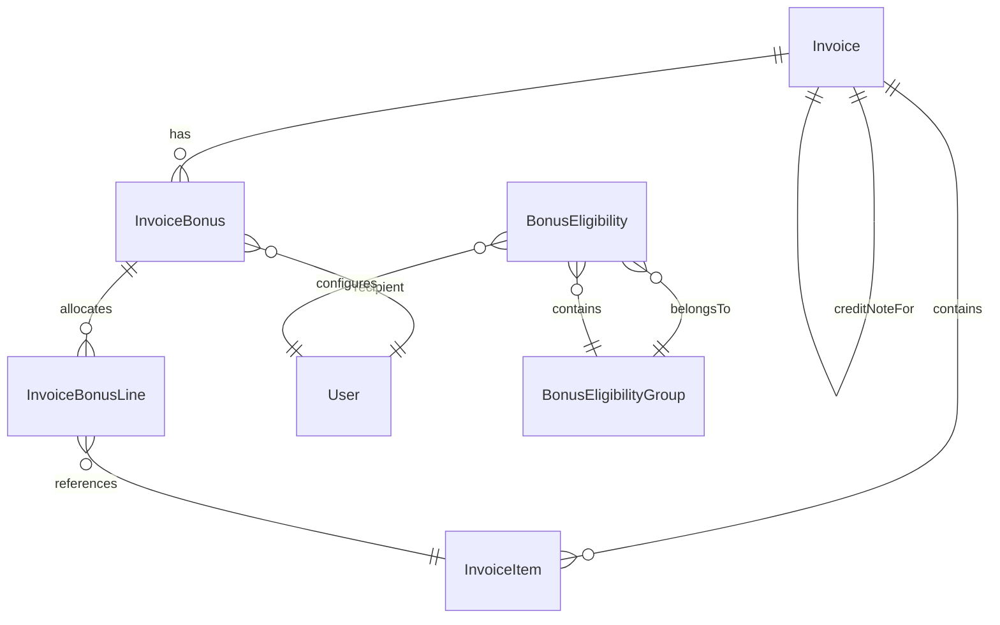

# Invoice System - Data Model

## Core Entities

### Invoice
Primary invoice entity containing header information.

```java
@Entity
@Table(name = "invoices")
public class Invoice {
    // Identifiers
    @Id
    private String uuid;
    private String contractuuid;
    private String projectuuid;
    private int invoicenumber;          // Sequential invoice number
    private int referencenumber;        // E-conomics reference
    
    // Dates
    private LocalDate invoicedate;
    private LocalDate duedate;
    private int year;
    private int month;
    
    // Client Information
    private String clientname;
    private String clientaddress;
    private String attention;
    private String cvr;                 // Company registration number
    private String ean;                 // Electronic invoicing ID
    
    // Financial
    private double discount;            // Header-level discount (0-100)
    private double vat;                // VAT percentage (0 or 25)
    private String currency;           // DKK, EUR, SEK, USD, GBP
    
    // Status
    @Enumerated(EnumType.STRING)
    private InvoiceStatus status;       // DRAFT, CREATED, SUBMITTED, PAID, etc.
    
    @Enumerated(EnumType.STRING)
    private InvoiceType type;           // INVOICE, CREDIT_NOTE, PHANTOM, INTERNAL
    
    @Enumerated(EnumType.STRING)
    private EconomicsInvoiceStatus economicsStatus;  // Sync status
    
    // Relationships
    @OneToMany(cascade = CascadeType.ALL, orphanRemoval = true)
    @JoinColumn(name = "invoiceuuid")
    private List<InvoiceItem> invoiceitems;
    
    // Credit Note
    private String creditnoteForUuid;   // Reference to original invoice
    
    // Bonus (Legacy)
    private String bonusConsultant;
    @Enumerated(EnumType.STRING)
    private SalesApprovalStatus bonusConsultantApprovedStatus;
    
    // Computed Fields (Transient)
    @Transient
    private Double sumBeforeDiscounts;
    @Transient
    private Double sumAfterDiscounts;
    @Transient
    private Double vatAmount;
    @Transient
    private Double grandTotal;
}
```

### InvoiceItem
Line items within an invoice.

```java
@Entity
@Table(name = "invoice_items")
public class InvoiceItem {
    @Id
    @GeneratedValue(generator = "uuid")
    private String uuid;
    
    private String invoiceuuid;         // Parent invoice
    private String consultantuuid;      // Consultant who did the work
    private String itemname;            // Line item description
    private String description;         // Detailed description
    private double rate;                // Hourly rate or unit price
    private double hours;               // Hours or quantity
    private int position;               // Display order (for sorting)
    
    @Enumerated(EnumType.STRING)
    private InvoiceItemOrigin origin;  // BASE or CALCULATED
    
    // For pricing engine
    private String calculationRef;      // Reference to calculation rule
    private String ruleId;             // Pricing rule identifier
}
```

### InvoiceBonus
Modern bonus allocation per invoice.

```java
@Entity
@Table(name = "invoice_bonuses")
public class InvoiceBonus {
    @Id
    @GeneratedValue(generator = "uuid")
    private String uuid;
    
    private String invoiceuuid;
    private String useruuid;            // Bonus recipient
    
    @Enumerated(EnumType.STRING)
    private ShareType shareType;        // PERCENT or AMOUNT
    
    private double shareValue;          // Percentage (0-100) or fixed amount
    private double computedAmount;      // Calculated bonus amount
    
    @Enumerated(EnumType.STRING)
    private SalesApprovalStatus status; // PENDING, APPROVED, REJECTED
    
    private String addedBy;
    private String approvedBy;
    private String rejectedBy;
    private String rejectionReason;
    private String overrideNote;
    
    private LocalDateTime createdAt;
    private LocalDateTime updatedAt;
    private LocalDateTime approvedAt;
    private LocalDateTime rejectedAt;
}
```

### InvoiceBonusLine
Line-level bonus allocation.

```java
@Entity
@Table(name = "invoice_bonus_lines")
public class InvoiceBonusLine {
    @Id
    @GeneratedValue(generator = "uuid")
    private String uuid;
    
    private String bonusuuid;           // Parent bonus
    private String invoiceuuid;         // Invoice reference
    private String invoiceitemuuid;     // Specific line item
    private double percentage;          // 0, 80, or 100 percent allocation
    
    private LocalDateTime createdAt;
    private LocalDateTime updatedAt;
}
```

### BonusEligibility
Consultant eligibility configuration.

```java
@Entity
@Table(name = "bonus_eligibility")
public class BonusEligibility {
    @Id
    private String useruuid;            // Primary key (one per user)
    
    private boolean canSelfAssign;      // Can create own bonuses
    private LocalDate activeFrom;       // Eligibility start date
    private LocalDate activeTo;         // Eligibility end date (usually 2999-12-31)
    
    @ManyToOne(fetch = FetchType.EAGER)
    @JoinColumn(name = "groupuuid")
    private BonusEligibilityGroup group; // Optional group membership
}
```

### BonusEligibilityGroup
Fiscal year-based eligibility groups.

```java
@Entity
@Table(name = "bonus_eligibility_groups")
public class BonusEligibilityGroup {
    @Id
    @GeneratedValue(generator = "uuid")
    private String uuid;
    
    private String name;                // Group display name
    private LocalDate periodStart;      // Usually July 1
    private LocalDate periodEnd;        // Usually June 30
    
    @OneToMany(mappedBy = "group", fetch = FetchType.LAZY)
    private List<BonusEligibility> members;
}
```

## Enumerations

### InvoiceStatus
```java
public enum InvoiceStatus {
    DRAFT,          // Editable state, not finalized
    CREATED,        // Finalized with PDF generated
    SUBMITTED,      // Sent to client
    PAID,           // Payment received
    CANCELLED,      // Voided invoice
    CREDIT_NOTE     // Special status for credit notes
}
```

### InvoiceType
```java
public enum InvoiceType {
    INVOICE,           // Standard client invoice
    CREDIT_NOTE,       // Credit/refund for previous invoice
    PHANTOM,           // Placeholder without delivery
    INTERNAL,          // Inter-company invoice
    INTERNAL_SERVICE   // Service between companies
}
```

### SalesApprovalStatus
```java
public enum SalesApprovalStatus {
    PENDING,        // Awaiting approval
    APPROVED,       // Approved by authorized user
    REJECTED        // Rejected with reason
}
```

### ShareType
```java
public enum ShareType {
    PERCENT,        // Percentage of invoice amount
    AMOUNT          // Fixed monetary amount
}
```

### InvoiceItemOrigin
```java
public enum InvoiceItemOrigin {
    BASE,           // User-created, editable
    CALCULATED      // System-generated from pricing engine
}
```

### EconomicsInvoiceStatus
```java
public enum EconomicsInvoiceStatus {
    NONE,           // Not synced
    UPLOADED,       // Sent to e-conomics
    BOOKED,         // Booked in e-conomics
    ERROR           // Sync failed
}
```

## Entity Relationships



## Database Indexes

### Performance Indexes
```sql
-- Financial year queries
CREATE INDEX idx_invoices_financial_year ON invoices
    ((CASE WHEN month >= 7 THEN year ELSE year - 1 END), year, month);

-- Status-based queries
CREATE INDEX idx_invoices_status ON invoices (status, type, economics_status);

-- Client queries
CREATE INDEX idx_invoices_client ON invoices (clientname, year, month);

-- Bonus approval queries
CREATE INDEX idx_bonus_approval ON invoice_bonuses 
    (status, invoiceuuid) WHERE status = 'PENDING';

-- Eligibility lookups
CREATE INDEX idx_bonus_eligibility_user ON bonus_eligibility (useruuid, active_from, active_to);
```

## Data Integrity Rules

### Constraints
1. **Invoice Number**: Must be unique and sequential
2. **Currency**: Only DKK invoices can have VAT
3. **Credit Notes**: Must reference existing invoice
4. **Bonus Lines**: Percentage must be 0, 80, or 100
5. **Eligibility Dates**: activeFrom must be before activeTo

### Referential Integrity
1. **Cascade Delete**: InvoiceItems deleted with Invoice
2. **Orphan Prevention**: Bonuses require valid Invoice
3. **User References**: Must exist in user table
4. **Group Membership**: One group per user per period

### Business Rules
1. **Draft Editing**: Only DRAFT invoices can be modified
2. **Bonus Eligibility**: User must be eligible on invoice date
3. **Approval Authority**: Cannot approve own bonus
4. **Total Validation**: Bonuses cannot exceed invoice amount

## Audit Fields

All entities include standard audit fields:
```java
@CreatedDate
private LocalDateTime createdDate;

@CreatedBy
private String createdBy;

@LastModifiedDate
private LocalDateTime lastModifiedDate;

@LastModifiedBy
private String lastModifiedBy;
```

## Migration Notes

### Legacy Fields (Deprecated)
- `Invoice.bonusConsultant` - Replaced by InvoiceBonus system
- `Invoice.bonusConsultantApprovedStatus` - Moved to InvoiceBonus
- `Invoice.bonusOverrideAmount` - Now in InvoiceBonus.computedAmount

### Future Additions (Planned)
- Payment tracking fields
- Email notification status
- Attachment management
- Advanced discount rules
